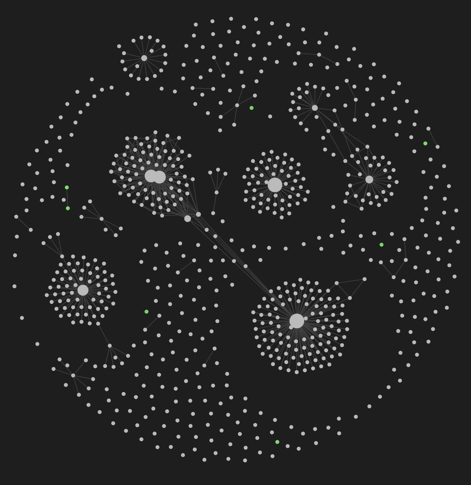

# Мой Zettelkasten

## Теги состояний
- #complete
- #inprogress
- #cancel

## Теги служебные
- #excalidraw
- #Дневник 
- #Здоровье 
- #Художественная 
- #Архив 
- #Диета 
- #Химия 
- #Кетоз 
- #Деньги 
- #История 
- #Мозг 
- #Образование 
- #Пожертвование 
- #Химия 
- #Тестестерон 

## Теги заметок
- #Саморазвитие - Развитие личных качеств
- #Книга - Мысли о книгах
- #Время - Как идёт темп жизни
- #Жизнь 
- #Психология 
- #Потребление 
- #Человек 
- #Культура 
- #Знания 
- #Неравенство 
- #Правда 
- #Цель 
- #Воспитание 
- #Добро 
- #Конфликт 
- #Население 
- #Политика 
- #Права 
- #Праздники 
- #Свобода 
- #Смерть 
- #Счастье 

