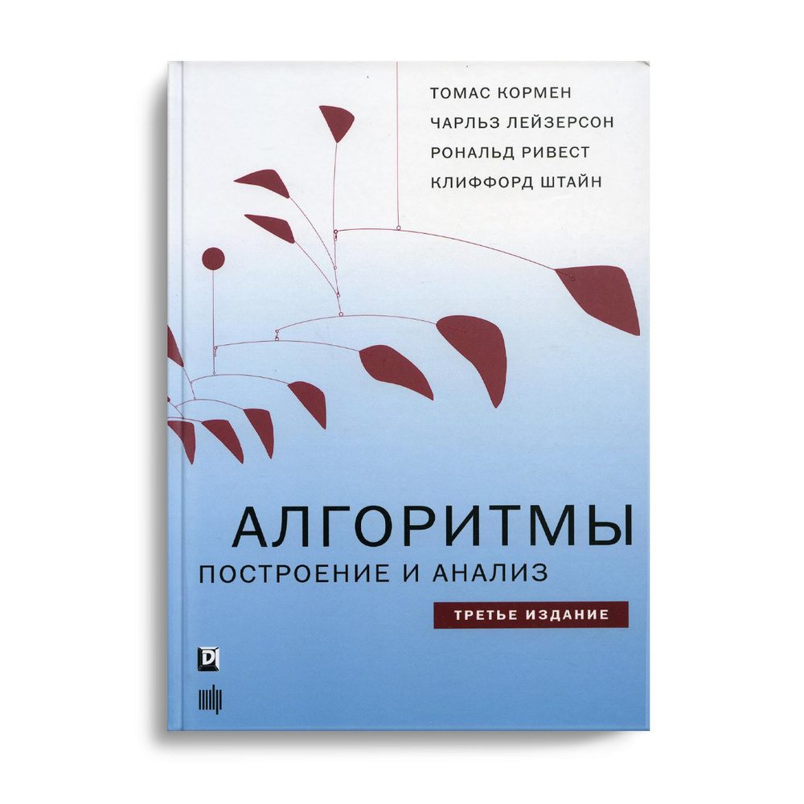

# LearningAlgorithms
Implementation and execution of the task from the book  Introduction to Algorithms, 3rd Edition Thomas H. Cormen. C ++ implementation. It is also possible there will be notes from other books related to algorithms. I will mark these notes with the appropriate tag. Algorithms are written in XCODE 12.0 LLVM.

# Progress
- [ ] [Basic 1](Basic%201/Chapter%202.md)
	- [ ] Chapter 1
	- [ ] Chapter 2
	- [ ] Chapter 3
	- [ ] Chapter 4
	- [ ] Chapter 5
- [ ] Sorting 2
	- [ ] Chapter 6
	- [ ] Chapter 7 
	- [ ] Chapter 8
	- [ ] Chapter 9
- [ ] Structure data 3
	- [ ] Chapter 10
	- [ ] Chapter 11
	- [ ] Chapter 12
	- [ ] Chapter 13
	- [ ] Chapter 14
- [ ] Advanced Development and Analysis Methods 4
	- [ ] Chapter 15
	- [ ] Chapter 16
	- [ ] Chapter 17
- [ ] Complex data structures 5
	- [ ] Chapter 18
	- [ ] Chapter 19
	- [ ] Chapter 20
	- [ ] Chapter 21
- [ ] Graph 6
	- [ ] Chapter 22
	- [ ] Chapter 23
	- [ ] Chapter 24
	- [ ] Chapter 25
	- [ ] Chapter 26
- [ ] Favourite topics 7
	- [ ] Chapter 27
	- [ ] Chapter 28
	- [ ] Chapter 29
	- [ ] Chapter 30
	- [ ] Chapter 31
	- [ ] Chapter 32
	- [ ] Chapter 33
	- [ ] Chapter 34
	- [ ] Chapter 35
- [ ] Apllication 8
	- [ ] Chapter A
	- [ ] Chapter Б
	- [ ] Chapter В
	- [ ] Chapter Г