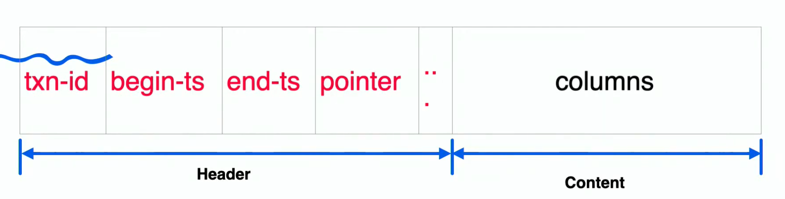

### Нормализация

1-ая форма:
	- В каждой ячейке таблицы только 1 значение
	- Нет повторяющихся строк
	- Порядок строк/столбцов не имеет значения

2-ая форма:
	- Выполняются условия первой нормальной формы
	- Все атрибутсы должны полностью зависеть от первичного ключа

### Инструменты визуализации
- PlantUML
Схемы данных
- Schema.org - Описание полей и их связи. Можно копировать и использовать

### Ускорение работы БД
O(1) - Hashmap, Dict (ключ значение)
O(logN) - Binary tree
O(N) - list, vector, array

### Особенности применения индексов
- Накладные расходы на поддержание
- Высокая селективность индекса
- Возможна фрагментация

### Обработка операций БД

Каждая операция - это **транзация**
Требования к транзакциям:
 1. Атомарность Atomcity - Транзакция должна пройти полностью
 2. Согласованность Consistency - После транзакции все изменненые данны должны быть сохранены в бд и согласованы. 
 3. Изоляция Isolation - Все изменения не должны влиять на изменение других данных
 4. Сохраняемость Durability - При последующем обращении к базе данных мы можем получить данные посел предыдущей данных
 

### Структура транзакции

#### Уровни изоляции транзакции.
**1.Read Uncommitted**

- Каждая транзакция видит незафиксированные изменения другой транзакции (проблема грязного чтения)
- Нельзя одновременно изменять одни и те же данные
- Максимальная скорость
- Потерянное изменения
**2. Read Committed** 

- Нельзя читать уже изменные данные, но еще не записанные данные
- Запрет "грязного чтения"
**3. Repeatable Read**

- Нельзя повторно читать измененные и записанные данные, если эти же самые данные уже были прочитаны до внесения в них изменений
- Фантомные записи
**4. Serializable**

- Нельзя повторно читать измененные и записанные данные, если эти же самые данные уже были прочитаны до внесения в них изменений.
- Полная изоляция траназкций
- Медленная скорость¨

>Расположены от самых эфективных до самых менее

#### Использование блокировки
Блокировка таблицы - вся таблица заблокирована. Пока одна транзакция что-то делает, другие ждут снятия блокировки
Блокировка записи - то же самое, только с отдельной записью. Блокировки могут быть на чтение и на запись. Может произойти дедлок. Ресурсы должны захватываться в одном порядке.