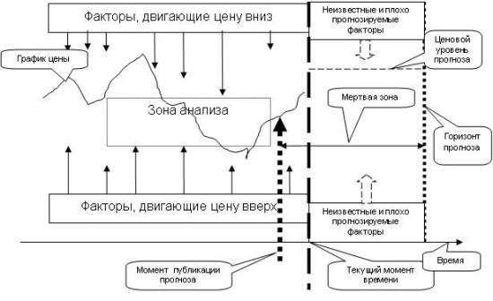
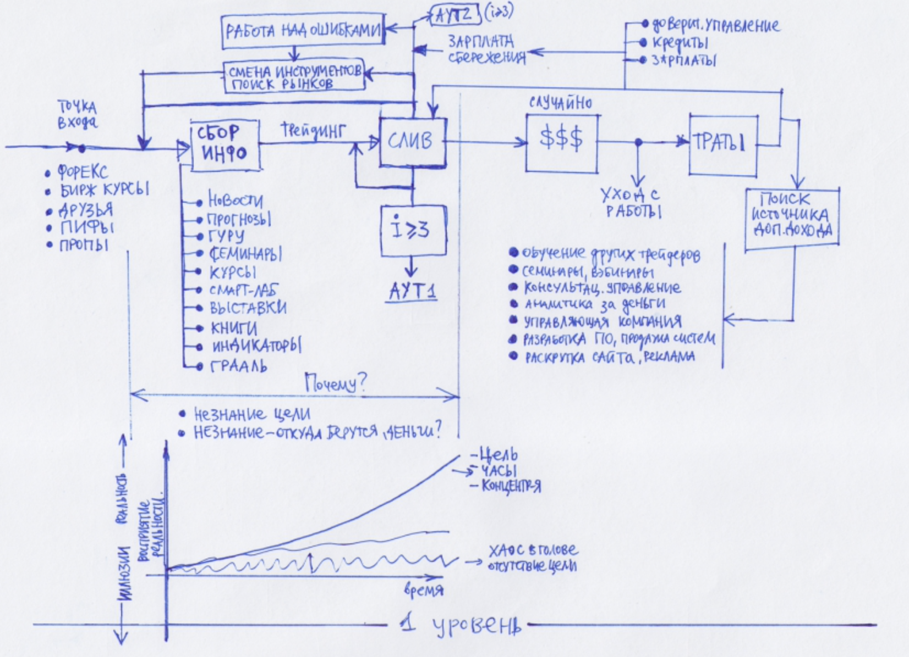
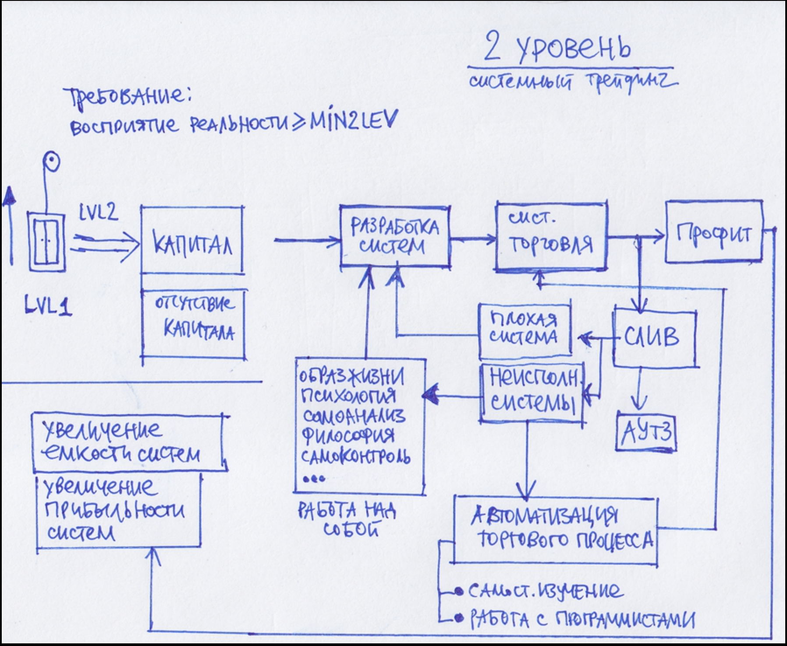
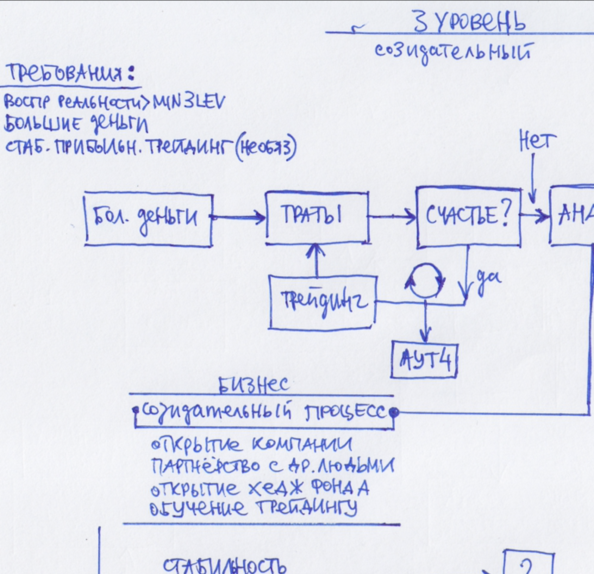

#### [Алготрейдинг](https://smart-lab.ru/blog/159151.php)

### Важно:
Чтобы добиться закономерного результата, вас необходимо постоянно отслеживать своё движение к цели. Планировать свою деятельность, контролировать себя гораздо сложнее, чем выполнять аналогичную рабрту по найму, когда вы несёте ответсвтенность передем другими людьми.

99% информации в любом СМИ – это «шум», который никак не помогает трейдеру, а точнее постоянно мешает. И уж если Вы используете ТА, то делайте его сами. 

### Мысли из книги:
Если у вас нет цели и плана, то есть вы не имеете вектора эффективного движения, то в таком случае результат ваших стараний в трейдинге никак не будет зависеть от вашего труда и от затраченных вами усилий.

Истина или, точнее, адекватное восприятие и понимание реальнотси, - необходимые фундамент для последовательного достижения желанных результатов.

> Попутный ветер дует только тому краблю, который знает свой пункт назначения

### Опорные тезисы:
1. Первичная цель человека - не деньги, а гармония и счастье. Деньги - это всего лишь ресурс.
2. Все люди совершенно разные. Нет универсальных рецептов успеха для любого человека
3. Ваше время является таким жзе ресусром, как и деньги! Время нашей жизни ограниченно. Именно поэтому оно представляет немалую ценность. Время необходимо беречь и эффективно использовать так же, как и деньги.
4. Биржа, финансовый рынок - сверхвысококонкурентный род деятельности. Рынки постоянно меняются из-за конкуренции.
5. На бирже нет ничего определённог. Динамика цен на бирже - это процесс, протекающий с большой долей неопределённости и случайности.

### Если торгуете один:
- Составлять персональную стратегию
- Следить за результатом (отчётность)
- Регулярно определить ошибки
- Постоянно следить за своей дисциплинной(соблюдать рабочий график)
- Быть отвественным за свои действия перед самим собой
- Контролировать своё эго

### Советы по трейдингу:
- Не нужно пытаться одновременно выступать в ролях внутридневного трейдера и долгосрочного инвестора
 
- Размер зоны анализа оптимизиурется по критерию максимум вероятности правильного прогноза для текущнго типа рынка.
- Селектируются только значимые факторы, влияющих на цену, и учитывается их синегетическое действие.
- Мёртвая зона отсутсвует, так как анализ выполняется непрерывно в реальнои времени, причем постоянно контроллируется зона последствия факторов, которая возникает вследсвтие инерционности рынка
- Прогноз становится динамическим, то есть зависящим от текущего времени и текущей рыночной ситуации.

### Алгоритм решения любой задачи:
1) Постановка цели
2) Сбор информации
3) Составление плана
4) Выполнение плана
5) Оценка результата и работа над ошибками
6) Корректировка плана и перезапуск

~~~ mermaid
graph TD

A[Сбор информации] --> B[План]

B --> C[Исполнение]

C --> D[Оценка]

D --> E[Цель]

D --> F{Работа над ошибками}

F --> A

F --> B

F --> C
~~~

### Как правильно ставить цели

### Мысли о рынке:
- **Маленьким деньгам проще работать с неэффективностью рынка, быстрее оборачивать на этом деньги, осуществлять мани менеджмент, чем долго и нудно управлять пакетом акций, в надежде заработать 40% годовых. Вот когда маленькие деньги станут большими…**  Более двух миллионов рублей, наверное, потребуют других правил торговли. Хотя по опыту скажу, многие из тех, кто привык торговать определенным капиталом (допустим 1-2 млн. рублей).

## Как правильно ставить цели(SMART-стандарт постановки целей):
1.  Конкретность. Цель должна быть максимально конкретной и ясной. Степень её прозрачности определяется однозначностью её восприятия.  
2. Измеримость. Цель должна быть измеримой, причем критерии измерения должны быть не только по конечному результату, но и по промежуточному.  
3. Достижимость. Необходимо адекватно оценивать ситуацию и понимать, что цель достижима с точки зрения внешних и внутренних ресурсов.  
4. Реалистичность. Цель должна быть реалистичной и уместной в данной ситуации, должна вписываться в нее и не нарушать баланс с другими целями и приоритетами.  
5. Временная ориентированность. Срок или точный период выполнения – одна из главных составляющих цели. Она может иметь как фиксированную дату, так и охватывать определенный период времени.
	
### Уровни трейдинга
- 1 уровень трейдинга (Интуитивный)

~~~ #
Тезисы первого этапа:  
-   самый короткий путь — работа над своими ошибками
-   важно не застрять навечно в процессе сбора информации
-   для это надо четко понимать цель — деньги
-   чтобы зарабатывать, надо иметь более ясное представление о реальности. Меньше иллюзий, больше адекватности — выше стабильность и заработок. Адекватность приобретается через долгие часы изучения самого рынка (а не новостей, семинаров, книг и т.п.).
-   первый заработок на 1 этапе зачастую приходит случайно, и как правило ведет к последующему сливу
-   Забавно, что при этом 90% скажут: «да так бывает, но со мной этого не произойдет. И окажутся неправы».
-   выживание на 1 этапе без стаб доп дохода почти невозможно
-   полное отсутствие стабильности 1-го этапа заставляет людей искать околорыночные способы заработка, чтобы выжить.
~~~
- 2 уровень трейдинга (Системный)

Тезисы 2 этапа:
-   Любые элементы системности добавляют стабильности в результаты.
-   [Системная торговля](https://smart-lab.ru/finansoviy-slovar/%D1%82%D0%BE%D1%80%D0%B3%D0%BE%D0%B2%D0%B0%D1%8F%20%D1%81%D0%B8%D1%81%D1%82%D0%B5%D0%BC%D0%B0) не избавляет от риска вылететь с рынка
-   Системный трейдинг имеет большую проблему — исполнение системы.
-   Тут упираемся в психологию, которая по утверждению некоторых может составлять до 90% успеха в трейдинге:)  
-   Проблему решает автоматизация ([торговый робот](https://smart-lab.ru/finansoviy-slovar/%D1%82%D0%BE%D1%80%D0%B3%D0%BE%D0%B2%D1%8B%D0%B5%20%D1%80%D0%BE%D0%B1%D0%BE%D1%82%D1%8B))

- 3 уровень трейдинга (Создание созидательных процессов)

~~~ #
Тезисы 3 этапа:
- Заработав большие деньги на трейдинге люди могут осознать, что это совершенно не сделало их счастливыми
- И вообще — цель трейдинга — деньги, цель жизни — счастье. А деньги не равно счастье. Поэтому лучше сразу определиться с тем, что делает вас счастливыми. Потому что трейдинг скорее всего сделает вас несчастными.
- Заработав, и не ощутив счастью, человек стремится в созиданию, к-е дает гораздо больше удовлетворения, чем просто деньги.
- В конце концов, человек стремится к стабильности
- В конце концов некогда успешный трейдер организует процесс так, чтобы больше не торговать.
~~~

Сущность научного метода:
-   Призводить наблюдения и извлекать из них общие правила или законы;
-   Формулировать гипотезу: выводить следствия из гипотезы и уже известных законов;
-   Ставить эксперименты для проверки этих следствий;
-   Если эксперимент подтверждает гипотезу, то её принимают за закон. В противном случае гипотеза отбрасывается.

Agile Results - это один из подходов к личной эффектинвости. Вместо того, чтобы перезагружать себя задачами, нужно определить только три результата:
- неделя;
- месяц;
- год.

