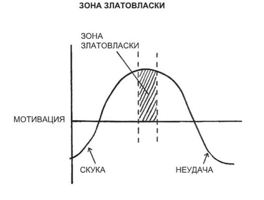

Создано: 2022-12-10 23:15
**Источник:** [_Атомные привычки](_Атомные%20привычки.md)
***
**Заметка:**  
Правило Златовласки гласит, что люди мотивированы сильнее всего, когда работают над задачами, которые находятся как раз на пределе их актуальных способностей. Не слиршком тяжелыми. Не слишком лёгкими. А теми, что по плечу.

***
**Ссылки:** 
**Тэги:** 

