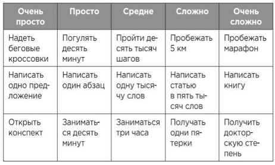

Создано: 2022-12-10 22:44
**Источник:** [_Атомные привычки](_Атомные%20привычки.md)
***
**Заметка:**  

Привычка должна устояться до того, как её можно будет улучшить. Другими словами, стандартизация должна предшествовать оптимизации. Лучше сделать меньше, чем хотелось бы, чем не сделать вообще ничего.
***
**Ссылки:** 
**Тэги:** #Саморазвитие 

