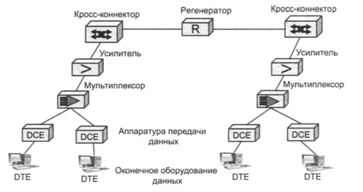
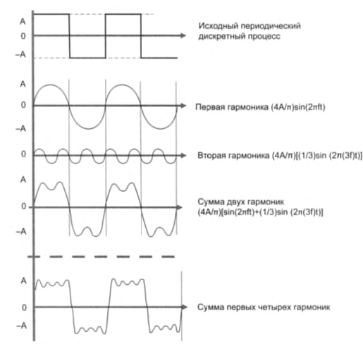
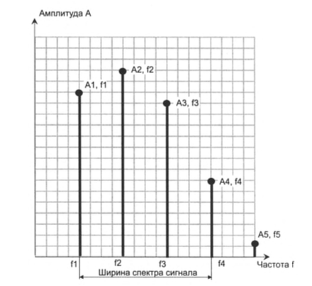
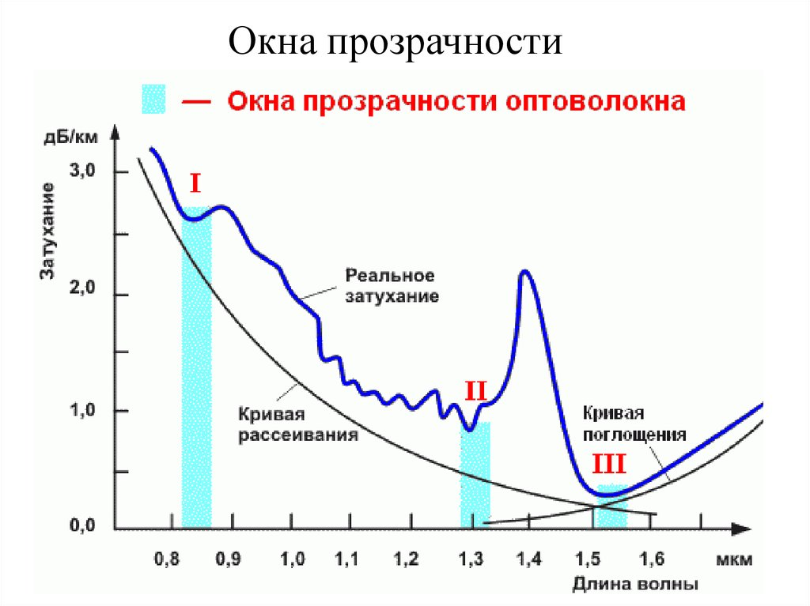
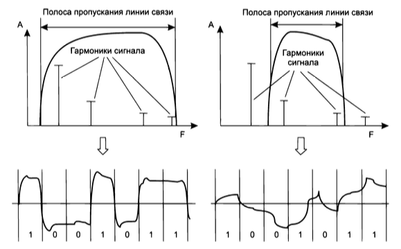
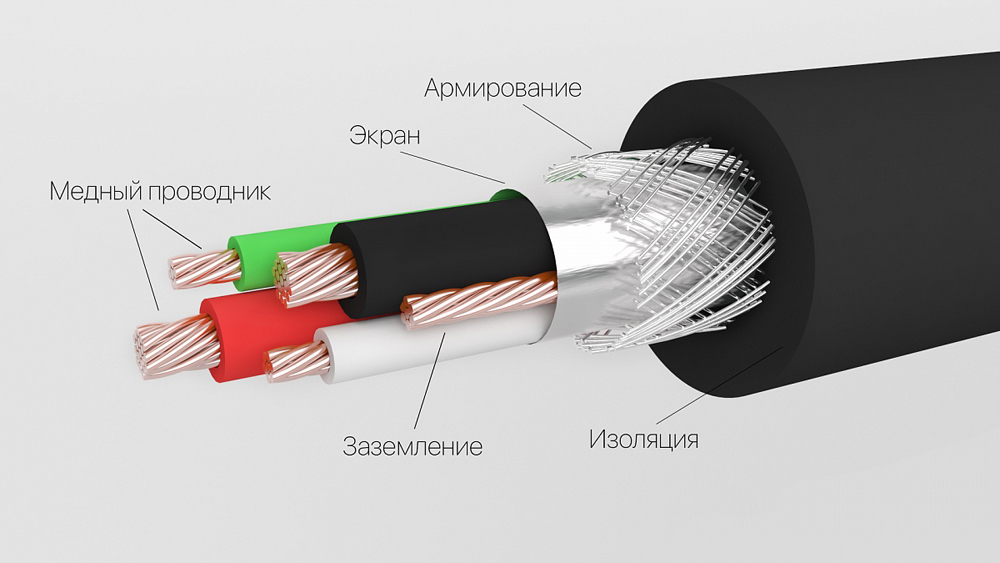
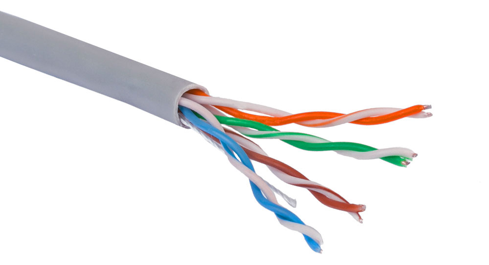
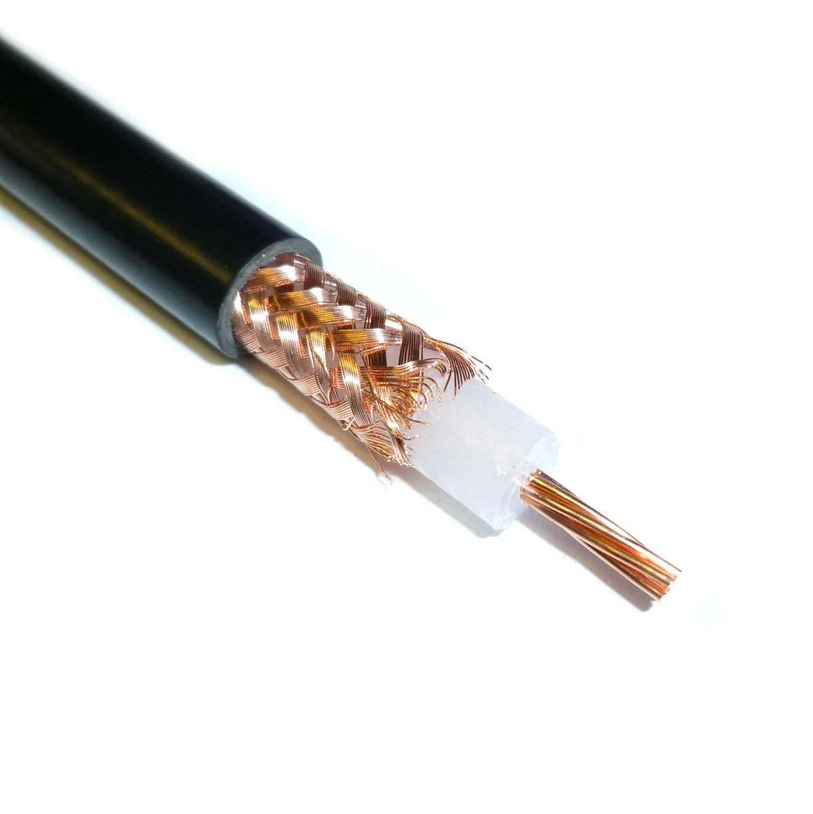
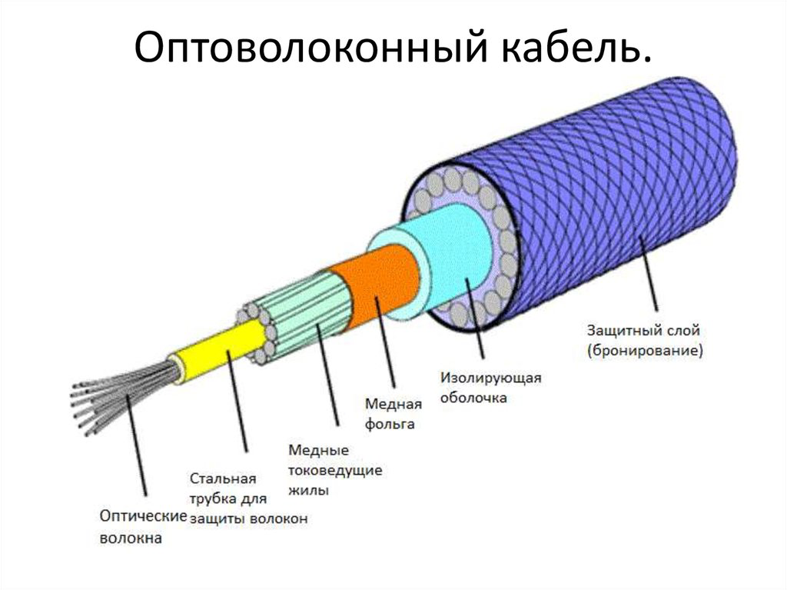

# Линии связи

- **Звено (link)** - это сегмент, обеспечивающий передачу данных между двумя соседними узлами сети
- **Канал (channel)** - часть пропускной способности звена, используемую независимо при коммутации.
- **Составной канал (circuit)** - это путь между двумя конечными узлами сети.
- **Линия связи** - синоним для выше терминов

### Первичная сеть

### Аппаратура передачи данных

**DCE (data cercuit-terminating equipment)** в компьютерных сетях посредственно присоединяет компьютеры или коммутаторы к линиям связи и является таким образом пограничным оборудованием линии связи. Работает на физическом уровне модели OSI. Примеры: модемы для телефонных линий и устройства для подключения к цифровым каналам первичных сетей.

**DTE (data terminal equipment)** - аппаратура пользовтеля, вырабатывающая данные для передачи по линии связи. Могут быть как мрашрутиазторы, так и компьютеры. Эти устройства не включают в состав линии связи.

**Промежуточная аппаратура**, которая:
- улучшает качество сигнала
- создание постоянного составного кнаала связи между двумя абонентами сети.
В локальных сетях: повторители, концентраторы
В глобальных сетях: усилители, регенераторы (исправление форм импульсов)

>Также: мультиплексоры, демультиплексоры, коммутаторы

В аналоговых линиях промежуточная аппаратура предназначена для усиления аналогового сигнала. Для созданая высокоскоротсных каналов, которыен мультиплексируют несколько низскоскоростных аналоговых каналов используется техник частотного мультплексирования (FDM frequency division multiplexing)

В цифровых лниях - регенераторы, которые улучшают форму импульсов и восстаналивают период их слеодвоания. Используют технику временного мультиплексирования каналов (TDM time division multiplexing)

## Характеристики линий связи

### Физическая среда передачи данных

Для передачи информации в компьютерных сетия используются *электромагнитные колебания* - взаимосвязанные колебания электрического и магнитного полей. Частным случаем электромагнитных колебаний являются электрические колебания, когда рассматриваются колебания только электрических величин: силы тока, напряжения, заряда.

- Направленные среды - медный проводник, оптоволокно, коаксиальный кабель
- Ненаправленные среды - земная атмосфера, космическое пространство и так далее.

### Спектральное представление сигнала

Синусоида - волнообразная кривая, которая вялется графиком периодической тригонометрической функции:
$$y=Asin(2\pi f + \phi)$$

Фаза - относительное значение аргумента t в пределах одного периода. РАзность двух синусоид называется сдвигом фаз. Начальное значение фазы показывает сдвиг синусоиды относительно начала точки отсчета времени. Влево: +, Вправо: -.

Длина волны - определяется как расстояние, на котрое перемещается волна за время, равное периоду T. 

>Из теории гармонического анализа Фурье известно, что любой периодический процесс можно представить в виде суммы бесконечного набора синусоидальных колебаний различных частот и различных амплитуд. Этот набор называют **спектральным разложением**, разложением Фурье или спектром, а синусоидальное колебание определенной частоты — **гармоникой**.

Обычно во внимание принимаются только несколько первых (*значимых гармоник*), так как вносят самый большой вклад. 
Самая первая частота спектра называется *основной гармоникой*

>Разность между максимальной и минимальной частотами значимого набора синусоид, которым представлен исходный сигнал, называется шириной **спектра сигнала**.

Непериодические процессы также можно представить в виде бесконечного ряда синусои­ дальных сигналов. Для сигналов произвольной формы, встречающихся на практике, спектр можно найти с помощью специальных приборов — **спектральных анализаторов**.

### Затухание и опорная мощность

Разложение произвольного информационного сигнала на гармоники дает нам возможность теоретически предсказать его изменение (искажение) при прохождении среды передачи дан­ных.

С повышением частоты сигнала затухание увеличивается. Отсюда проистекают проблемы передачи дискретных данных с высокой скоростью: при позрастании скорости передачи сигнала его частота увеличивается, что приводит к росту затухания.

>Это предсказание основывается на следующем замечательном свойстве синусоидального сигнала — при прохождении через однородную распределенную в пространстве среду он со­ храняет свою синусоидальную форму и частоту, а изменяются только его амплитуда и фаза. Зависимость амплитуды переда­ваемых гармоник от частоты для определенной среды должна быть найдена только один раз, а затем ее можно применять для анализа передачи различных типов сигналов этой средой.

Найденная зависимость изменения амплитуды сигнала после прохождения среды для ряда последовательных частот называется **амплитудно-частотной характеристикой среды**.

Построив амплитудно-частотную характеристику среды, можно применить ее к спек­ тральному разложению сигнала, то есть найти, какую амплитуду будет иметь каждая из составляющих нашего периодического сигнала после прохождения среды, а затем сложить все составляющие (гармоники), получив результирующий выходной сигнал.

Если фазы разных гармоник изменяются не одинаково, то надо знать **фазо-частотную характеристику** среды для анализа искажений сигнала.

**Затухание** показывает, насколько уменьшается мощность эталонного синусоидального сигнала на выходе линии связи по отношению к мощности сигнала на входе этой линии. Затухание (А) обычно измеряется в децибелах (дБ) и вычисляется по следующей формуле:

$$A=10lg(\frac{P_{out}}{P_{in}})$$

- $P_{out}$ - мощность сигнала на выходе линии
- $P_{in}$ - мощность сигнала на взоде линии

Затухание зависит от длины линии связи, поэтому в качестве характеристики линии связи используется так называемое **погонное затухание**, то есть затухание на линии связи опре­ деленной длины.

Чаще всего при описании параметров линии связи приводятся значения затухания всего для нескольких значений частот. Основная частота передаваемого сигнала, то есть та частота, гармоника которой имеет наибольшую амплитуду и мощность дает понять искажение передаваемого сигнала.

Для оптического кабеля сущесвует типичная зависимость затухания от длины волны, которая имеет при так называемых **окна проразчности**.

**Окно прозрачности (англ. Transmission Window, Telecom Window)** — диапазон длин волн оптического излучения, в котором имеет место меньшее, по сравнению с другими диапазонами, затухание излучения в среде, в частности — в оптическом волокне.

>Стандартное ступенчатое оптическое волокно (SMF) имеет три окна прозрачности: 850 нм, 1310 нм и 1550 нм. Каждое окно шириной 100 нм.
>

В качестве характеристика мощности сигнала используются абсолютный и относительный уровни мощности.
- Абсолютная мощность измеряется в ВТ
- Относительная мощность измеряется в Дб

>Затухание также явлется примерном относительной мощности, в этом случае мы сравниваем мощность сигнала на выходе и входе линии связи.

Частным случаем относительной мощности явялется опорная мощность:
$$p = \frac{10lgP}{1мВт} [дБм]$$
- $P$ - абсолютная мощность

#### Пример

Пусть требуется определить минимальную опорную мощность х (дБм) передатчика, доста­ точную для того, чтобы на выходе линии опорная мощность сигнала была не ниже некото­ рого порогового значения у (дБм). Затухание линии известно и равно А. Пусть X и Y — это абсолютные значения мощности сигнала, заданные в милливаттах на входе и выходе линии соответственно.

$A=10lg\frac{X}{Y} = \frac{10lgX}{1мВт} - \frac{10lgY}{1мВт}=x-y$

>где х — опорная мощность входного сигнала, а у — опорная мощность выходного сигнала.

Величина опорной мощности у выходного сигнала, являющаяся минимальной опорной мощностью сигнала на входе приемника, при котором он еще способен корректно распо­ знавать дискретную информацию, содержащуюся в сигнале, называется **порогом чувствительности приемника**. Для нормальной работы линии связи минимальная опорная мощность сигнала передатчика, даже ослабленная затуханием линии связи, долж­ на превосходить порог чувствительности приемника: х-А>у.

### Полоса пропускания

**Полоса пропускания (bandwidth)** - это непрерывнй диапозон частот, для которого затухание не превышает некоторый заранее заданный предел. То есть полоса пропускания определяет диапозон частот синусоидального сигнала, при которых этот сигнал передается по линии связи без значительных искажений. Полоса пропускания измеряется в герцах (Гц)

>Иногда используется как синоним термина "пропускная способность" и измеряется в битах в секунду.

Часто граничными частотами полосы пропускания считаются частоты, на которых мощность выходного сигнала уменьшается в два раза по отношению к входному, что соответствует затуханию в -3дб.

Искажение передающей линией связи синусоиды какой-либо частоты приводит, в конеч­ ном счете, к искажению амплитуды и формы передаваемого сигнала, так как гармоники различных частот искажаются *не одинаково*.

Искажение приводит к изменению амплитуды и формы передаваемого сигнала. 
- Сигнал аналоговый (передающий речь) - исажаются обертоны (боковые частоты)
- Сигнал цифровой - фронты импульсов теряют свою прямоугольную форму.

### Помехи

Волновое сопротивление - сопротивление, которое встречает электромагнитаня волна определенной частоты при распространении вдоль однородной линии. Зависит от 
- Активного сопротивления
- Погонной индуктивности
- Погонной ёмкости
- Частота сигнала

В том случае, когда результрующий сигнал может быть представлен в виде суммы исходного сигнала и помехи, помеху называют *аддитивной помехой* или *шумом*.

Параметр характеризующий такую линию - (SNR signal to noise) = $\frac{P_с}{P_ш}$. Чем меньше значвением, тем более сложным должно быть устройство приёмника.

### Параметры медного кабеля

Электрическая связь - определяется отношением наведенного тока в цепи, подверженной влиянию, к напряжению, действующему во влияющей цепи.

>Если значимые гармоники сигнала попадают в полосу пропускания линии, то такой сигнал будет хорошо передаваться данной линией связи, и применик сможет правильно распознать информацию, отправленную по линии передатчиком.
>

## Влияни способо кодирования на пропускную способность

Линейное кодирование - представление дискретной информации в виде сигналов.

### Параметры периодического электрического сигнала
- Информационные параметры - частота, амплитуда, фазы, уровень напряжения, уровень тока.
- Несущий сигнал - параметры подвергают изменениям.
- Модуляция (кодирование) - процесс изменения информационых параметров.
- Информационный сигнал - изменненный в результате модулаяци несущий сигнал.

Передача дискретной информации в телекоммуникационных сетях осуществляется тактированно, то есть изменение информационного параметра сигнала происходит через фиксированный интервал времени - *такт*.

**Скорость изменения инфоромационного сигнала** - авна количество тактов изменения информационного параметра периодического сигнала в секунду. Измеряется в **бодах**.

>Скорость передачи информации которая в данном случае является пропускной способностью, измеряемая в битах в секунду, может быть как выше (когда любое состояние сигнала несет условно 3 бита информации (8 различных состояний сигнала)), так и ниже.

Скорость не может расти неограниченно, так как при увеличении частоты периодического несущего сигнала увеличивается и ширина спектра сигнала. Линия передает данный спект с искажениями, которые определяются полосой пропускания. Чем больше несоответсвие между полосой пропускания линии и шириной спекта передаваемых информационных сигналов, тем больше сигналы искажаются и тем вероятнее ошибки. Это ограничивает число состояний сигнала. Например мы не всегда может увеличить пропускную способность линии за счёт увеличиния числа состояний, если амплитуда шума время от времени будет превышать разница между соседними уровнями сигнала. 

## Соотношение полосы пропускания и пропускной способности

Связь полосы пропускания и пропускной способности, внезависимости от способа физического кодирования:
Закон Клода Шеннона:
$$C = Flog_2(1+SNR)$$
- $C$ - пропускная способность биты в секунду
- $F$ - ширина полосы пропускания линии в герцах

Нельзя до бесконечности увеличивать. Уменьшение мощности шума контроллировать трудно. Увеличиние мощности сигнала довольно дорого

Близкое отношение, полученное Найквистом. Без учёта шума в линии:
$$C=2Flog_2M$$
- $M$ - количество различимых состояний информационного параметра.

## Проводнвые линии связи

### Экранированная и неэкранированная витая пара

Электрическая изоляция - непроводящая диэлектрический слой: бумага, полимер
Электромагнитная изоляция - электромагнитный экран

Кабелт на основе витой пары используемы для проводки внутри здания, разделются в международных стандартах на кате

#### Экрранированная витая пара

STP (Shielded Twisted Pair) - хорошо защищает от внешних помех. Экрранироваться может как кабель в целом, так и каждая отдельная пара для уменьшения перекрестных наводок.

#### Неэкранированная витая пара

UTP (Unshielded Twisted Pair)

### Коаксиальный кабель

### Волоконно-оптические кабели

# Кодирование и мультиплексирование данных

# Технологии первичных сетей PDH и SDH

# Технологии первичных сетей DWDM и OTN