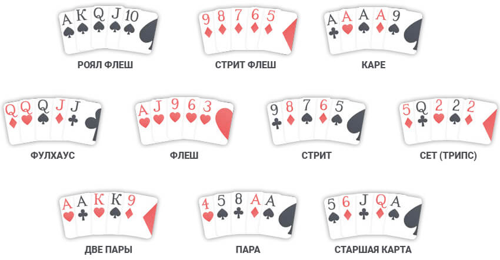

Чтобы понимать, как играть в покер, нужно запомнить старшинство данных покерных комбинаций:

1.  **«Роял Стрит Флеш»** – 5 самых старших одномастных карт.
2.  **«Стрит Флеш»** – 5 карт одной масти по порядку.
3.  **«Каре»** – 4 карты одного ранга.
4.  **«Фулл Хаус»** – комбинация, включающая в себя «Пару» и «Тройку» одновременно.
5.  **«Флеш»** – 5 одномастных карт.
6.  **«Стрит»** – 5 собранных по порядку карт любой масти.
7.  **«Сет»** или **«Тройка»** – 3 карты одного ранга.
8.  «**Две пары»** – 4 карты, среди которых собраны по 2 одинаковых по рангу.
9.  **«Пара»** – это 2 одинаковые карты.
10.  Самая младшая комбинация **«Старшая карта»** – это 1 карта. Чем она выше по рангу, тем вероятнее ее победа.
