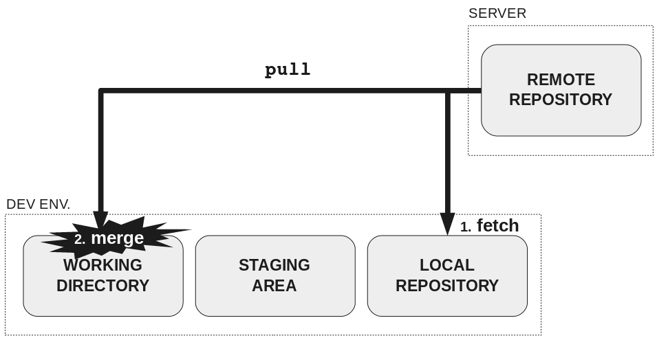

### Команды
- **commit** - Отправить файл в СКВ для учёта изменений версий файла.
  >git commit -m "Поправка"
- **push** - Загрузка на удалённый репозиторий существующего файла со всеми новыми изменениями.[Подбробнее](Возможная%20ошибка%20при%20push.md)
  >**git push -u *name_rempte_repos* *name_branch*** - Загрузка всех поправок на удалённый репозиторий
- **pull** - Скачивание с сервера обновленного файла для работы с ним.
  >При выполнении **git pull** данные из удалённого репозитория** перемещаются в две области: 
  > 1. В **локальный репозиторий fetch**   
  > 2. В **рабочий каталог merge**
  > 
- **add** - Добавление нового файла в удалённый репозиторий
  >git add . - Отслеживание всех файлов в нынешний директории
- **clone** - забрать с сервера католог.
  >git clone link folder - Скачивание репозитория в папку с именем folder
- **checkout** - Переключение файлов рабочей копии на другой коммит/переключение веток
- **branch** - Показывает все названия веток
  1. git branch -D *name_branch* - Удаление ветки
  2. git checout -b *name_branch* - Создание новой ветки и сразу переключение на неё
- **stash** - Временно спрятать изменения
- **abort** - Откатит состояние рабочего каталога
- **merge** - Объединение тестовой ветки и с главной, при условии что все изменения в тестовой ветки удовлетворяют программиста
- **fetch** - просмотр новых коммитов на сервере.
- **rebase** - все наработки "прикрепляет" к последнему коммиту, который был на удалённом репозитории. [Подбронее](Rebase.md)

### Обновление

1. **git revert _name_commit_ -m _number_** - делает коммит поверх текущей ветки при этои возвращается в состояние родителя номером number
2. **git remote add origin *link on remote repostitory*** - Подключение к репозиторию удалённому

### Параметры

1. **git log** - История коммитов
2. **git show _id_commit_** - Показывает изменения состояний репозитория
3. **git log --oneline -all --graph** - Просмотр ветвления репозитория
4. **git reset *mode* _id_commit_** - Возвращение к предыдущему состоянию
	1. **git reset --soft** - Возвращение к предыдущему состоянию файл остается, уже добавлены. Другими словами: Оставляет stage в текущем состоянии.  
	2. **git reset --mixed** - Возвращение к предыдущему состоянию файл остается, но не добавлен. Ресетит stage, но оставляет рабочую копию.
	3. **git resrt --hard** - Возвращение к предыдущему состоянию файла и при этом данные теряются. Ресетит рабочую копию и stage
		1. **git reset --hard HEAD~1** - Переводит указатель к первому родителю
		2. **git reset --hard HEAD^2~2** - переводит указатель ко второму родиетлю и еще на один ниже
5. **git diff *n1_commit* *n2_commit*** - Показывает разницу между коммитами

### Справочник
- fast forward - перестановка указателя, если нет потери данных
- Родители записываются в порядке вливания
- По умолчанию git pull --rebase=true
- .gitignore можно добавлять файлы и целые папки, которые не надо перемещать в репозиторий
  >/folder - добавление папки с именем folder
- Каждый коммит хранит ссылку на предыдущий

