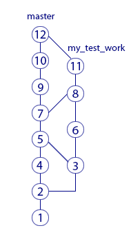

### Состояния
Перед тем, как сделать push (отправить коммиты в удалённый репозиторий origin), нужно обязательно сначала сделать pull (забрать последние изменения других людей, которые они отправили в origin). Если этого не сделать, система не даст вам выполнить push (появится сообщение об ошибке)

Процесс загрузки изменений файла:

В этот момент можно говорить о различных состояниях файла в среде разработки: **изменённом**, **промежуточном** (staged) и **зафиксированном** (commited).

-   как показать изменения файла в **рабочем каталоге**: `git diff`
-   как показать изменения файла в **промежуточной области**: `git diff --staged`
-   как изменить файл в **рабочем каталоге** после добавления в **промежуточную область**[^5]

### Экспериментальная работа над файлом
Перед началом экспериментальных изменений вы должны создать ветку. У ветки есть имя. Пусть она будет называться my_test_work. Теперь все ваши коммиты будут идти именно туда. До этого они шли в основную ветку разработки – будем называть её master.

После коммита «3» создана ветка и ваши новые коммиты «4»и «5» пошли в неё. А ваши коллеги остались в ветке master, поэтому их новые коммиты «6», «7», «8» добавляются в ветку master. История перестала быть линейной.

#### Объединение

Здесь коммит «8» – это специальный коммит, который называется merge-commit. Когда мы выполняем команду merge, система сама создает этот коммит. В нём объединены изменения ваших коллег из коммитов «5», «6», «7», а также ваша работа из коммитов «3», «4». Команда merge ничего не посылает в origin. Единственный ее результат – это merge-commit (на рисунке кружок с номером 8), который появится у вас на компьютере. Его нужно запушить, как и ваши обычные коммиты. Только после этого merge-commit отправится на origin – тогда коллеги увидят результат вашей работы, сделав pull.

>Мерж между ветками в обе стороны:

>Команда merge ничего не посылает в origin. Единственный ее результат – это merge-commit (на рисунке кружок с номером 8), который появится у вас на компьютере. Его нужно запушить,

### Указатели
Указатели используются не только для веток. Есть особый указатель head. Он указывает на коммит, который выступает состоянием вашего рабочего каталога. Вот пример так Git обозначает, что сейчас мы находимся в ветке master.

> На какой коммит показывает head, в таком состоянии и будут файлы в рабочем каталоге. Поэтому переставляя указатель head на другой коммит, мы тем самым заставим Git поменять файлы нашего рабочего каталога. Это может потребоваться, например, чтобы откатиться на старую версию рабочих  файлов и посмотреть, как там всё было.

Перестановка особого указателя head приводит к тому, что файлы рабочего каталога меняются на слепок этого коммита. Но только тогда, когда head указывает на указатель какой-то ветки, Git считает, что мы находимся в этой ветке. Если head указывает на какой-то коммит напрямую (хранит его хеш) это состояние называется **detached head**. В него можно переключиться на время, чтобы посмотреть, как выглядели файлы рабочего каталога на одном из коммитов в прошлом.

### Удалённый репозиторий 
Когда мы забираем свежие коммиты из origin командой pull, то вместе с коммитами скачиваются и копии указателей оттуда. Чтобы не путать наш указатель master и тот, который скачался с origin, второй из них отображается у нас, как origin/master. Нужно понимать, что origin/master не показывает текущее состояние указателя master в удаленном репозитории, это лишь его копия на момент выполнения команд fetch или pull.

>Здесь показана ситуация, когда мы забрали свежие коммиты (командой pull), сделали два новых коммита, но ещё не сделали push. В итоге наш локальный master показывает на последний  коммит. А origin/master – это последнее известное нам состояние указателя из удалённого репозитория.