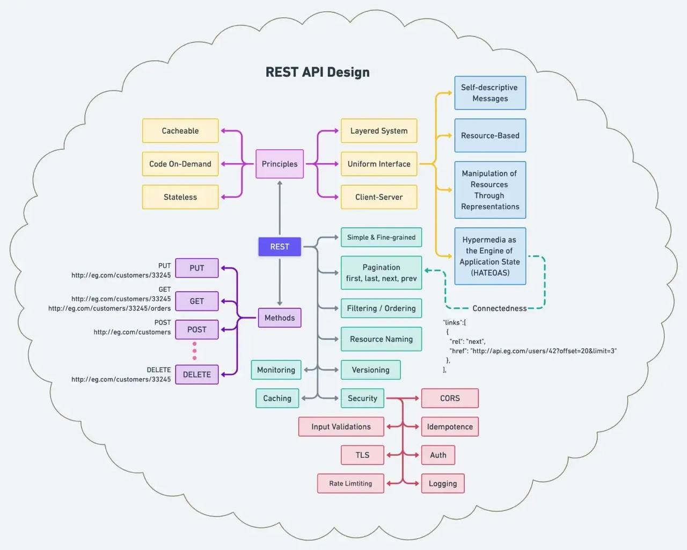

### Курс
1. https://stepik.org/lesson/526922/step/1?auth=login&unit=519641
2. https://stepik.org/lesson/228258/step/1?unit=200791
3. https://habr.com/ru/post/475390/¨
4. https://habr.com/ru/company/otus/blog/698140/
5. https://blog.tanmaysarkar.tech/build-sudoku-solver-engine-using-go
6. https://habr.com/ru/company/quadcode/blog/674302/
7. https://habr.com/ru/post/674596/
8. https://habr.com/ru/company/ncloudtech/blog/672906/
9. https://habr.com/ru/post/670974/#ctx
10. https://habr.com/ru/post/654569/
11. https://habr.com/ru/post/658623/
12. https://habr.com/ru/company/sbermarket/blog/676486/
13. https://golang.ch/the-ultimate-list-of-golang-gui-graphics-image-related-libraries/
14. https://golang.ch/how-to-do-image-processing-in-golang-with-some-fun/
15. https://practicum.yandex.ru/profile/algorithms-interview/?from=new_landing_algorithms-interview
16. https://go.dev/doc/effective_go
17. https://metanit.com/python/tutorial/1.1.php
18. https://devguide.python.org

### Задание на ООП
1.  Создать класс `Товар`_,_ имеющий переменные `имя`, `цена`, `рейтинг`_._ 
2.  Создать класс `Категория`, имеющий переменные `имя` и массив `товаров`. Создать несколько объектов класса `Категория`. 
3.  Создать класс `Basket`, содержащий массив купленных товаров. 
4.  Создать класс `User`, содержащий логин, пароль и объект класса `Basket`. Создать объект класса `User`.

### Материалы
- 
- [Курс по БД](https://learning.edx.org/course/course-v1:StanfordOnline+SOE.YDB-MDL_THEORY0001+2T2020/home)
- [github](https://github.com/Satan3/golangLessons)
- [metanit](https://metanit.com/go/)
- [JSON](https://developer.mozilla.org/ru/docs/Learn/JavaScript/Objects/JSON)
- [HTTP](https://developer.mozilla.org/ru/docs/Web/HTTP/Overview)
- [CLI](https://thoughtbot.com/upcase/videos/lets-build-a-cli)
- [CLI_documantation](https://pkg.go.dev/github.com/urfave/cli)
- [GoForCPPProgrammers](https://github.com/golang/go/wiki/GoForCPPProgrammers)
- [Разработк своего "демона" на сервере](https://www.opennet.ru/base/dev/daemon_example.txt.html)
- [Краш-курс по интерфейсам в Go](https://habr.com/ru/post/276981/)
- [C PHP на Go](https://habr.com/ru/company/agima/blog/591435/)
- **[Создание веб-сайта](https://habr.com/ru/post/273795/?ysclid=l5mmjxnhk0789126089)**
- **[Все механики Goland](https://www.youtube.com/watch?v=h0zxh2TPN_I)**
- [Спецификация](https://go.dev/ref/spec#Array_types)
- [CS50](https://cs50.harvard.edu/ai/2020/)
### План изучения

### Архитектура проекта

### Материалы доп по программированию
- https://humb1t.gitlab.io/calisthenics/
- https://humb1t.gitlab.io/2019-06-02-oop/
- [What every programmer should know about memory, Part 1](https://lwn.net/Articles/250967/)
- [Why Writing Correct Software Is Hard](https://pron.github.io/posts/correctness-and-complexity)
- [PHP документация}](https://www.php.net/docs.php)
- [PHP 7.0 github](https://github.com/igorsimdyanov/php7)
- [Сокеты](https://lecturesnet.readthedocs.io/net/low-level/ipc/socket/intro.html)
- [TCP и DCP](http://support.fastwel.ru/AppNotes/AN/AN-0001.html)
- [FastCGI](https://lectureswww.readthedocs.io/5.web.server/fcgi.html)
### Материалы
-  [Java алгоритмы](https://algs4.cs.princeton.edu/code/)  
-  [Работа в казино](https://www.datamation.com/applications/how-to-cheat-at-online-poker-a-study-in-software-security/)

### Вспомогательные инструменты
1. https://www.elastic.co/
2. https://www.consul.io/
3. https://github.com/spf13/cobra
4. https://github.com/go-telegram-bot-api/telegram-bot-api
5. https://pkg.go.dev/github.com/go-telegram-bot-api/telegram-bot-api/v5
6. https://github.com/go-kit/kit

### Фраймворки
1. [logrus](https://github.com/sirupsen/logrus) - Для эффективного логирования
2. [httpRouter](https://github.com/julienschmidt/httprouter) - Расширенные настройки для http роутера
3. [cleanv](https://github.com/ilyakaznacheev/cleanenv) - Тестирование
4. [viper](https://github.com/spf13/viper) - Обширный фреймворк
5. [goConvey](https://pkg.go.dev/github.com/smartystreets/goconvey#section-readme) - Тестирование

### Прочитать
1. https://habr.com/ru/company/infopulse/blog/140456/
2. https://habr.com/ru/company/otus/blog/653009/
3. https://blog.skillfactory.ru/glossary/rest-api/
4. https://mcs.mail.ru/blog/vvedenie-v-rest-api
5. https://en.wikipedia.org/wiki/SOAP
6. https://www.google.com/search?q=json+rpc
7. https://www.google.com/search?q=CI%2FCD
8. https://golangify.com/http-handler-interface
9. https://habr.com/ru/post/582370/
10. https://en.wikipedia.org/wiki/Stack_trace
11. https://qna.habr.com/q/564807
12. https://habr.com/ru/post/674694/
13. https://habr.com/ru/company/ru_mts/blog/680324/
14. https://gautamjha.hashnode.dev/functions-in-go
15. https://golang.ch/tricks-to-save-memory-in-golang/
16. https://golang.ch/how-to-use-atomic-pointers-in-golang-1-19/
17. https://habr.com/ru/company/ruvds/blog/680664/
18. https://kapbyte.hashnode.dev/how-to-build-a-book-application-with-golang-gin-and-mongodb
19. https://golang.ch/a-cloud-native-golang-microservices-framework/
20. https://habr.com/ru/company/vk/blog/314804/
21. https://www.bogotobogo.com/GoLang/GoLang_byte_and_rune.php
22. https://algs4.cs.princeton.edu/31elementary/
23. https://habr.com/ru/company/yandex_praktikum/blog/570024/
24. https://www.google.com/search?q=Agile%2C+Scrum%2C+Kanban%2C+Waterfall
25. https://restfulapi.net/http-methods/
26. https://inp.nsk.su/~bolkhov/teach/inpunix/shell.ru.html
27. https://habr.com/ru/company/infopulse/blog/345826/
28. https://habr.com/ru/post/106912/
29. https://git-man-page-generator.lokaltog.net/#cmVzcG9uZCQkbm90ZQ==
30. https://jwiegley.github.io/git-from-the-bottom-up/
31. https://learngitbranching.js.org/?locale=ru_RU
32. https://github.com/k88hudson/git-flight-rules
33. https://magit.vc/
34. https://cbea.ms/git-commit/
35. https://www.atlassian.com/git/tutorials
36. https://gitimmersion.com/lab_01.html
37. https://www.shortlyai.com/
38. https://blog.frankel.ch/
39. https://backgroundchecks.org/justdeleteme/#
40. https://www.thegamegal.com/2016/02/11/ok-gos-say-the-same-thing/
41. https://digitaldefynd.com/
42. https://www.designspiration.com/
43. https://paperswelove.org/
44. https://habr.com/ru/company/playrix/blog/345732/
45. https://habr.com/ru/post/112953/
46. https://habr.com/ru/post/252721/
47. https://bool.dev/blog/detail/gof-design-patterns
48. https://www.telerik.com/blogs/improve-your-debugging-skills-with-chrome-devtools
49. https://www.awwwards.com/PWA-ebook/\
50. https://web.dev/i18n/ru/use-lighthouse-for-performance-budgets/
51. https://sneakbug8.com/ru/cookies-js-storages/
52. https://medium.com/@stylesam/api-%D0%BA%D0%BE%D0%BC%D0%B0%D0%BD%D0%B4%D0%BD%D0%BE%D0%B9-%D1%81%D1%82%D1%80%D0%BE%D0%BA%D0%B8-%D0%BA%D0%BE%D0%BD%D1%81%D0%BE%D0%BB%D0%B8-%D1%81%D0%BF%D1%80%D0%B0%D0%B2%D0%BA%D0%B0-%D0%BA%D0%BE%D0%BC%D0%BC%D0%B0%D0%BD%D0%B4-d5b87608cbf1
53. https://habr.com/ru/company/vertdider/blog/403823/
54. https://losst.ru/kak-polzovatsya-ssh
55. https://habr.com/ru/company/ruvds/blog/547322/
56. https://habr.com/ru/post/547986/
57. https://www.vscodecandothat.com/
58. https://smart-lab.ru/finansoviy-slovar/happiness
59. https://www.pnas.org/doi/full/10.1073/pnas.1011492107
60. https://www.digitalocean.com/community/tutorials/building-go-applications-for-different-operating-systems-and-architectures
61. https://missing-semester-rus.github.io/
62. https://webhamster.ru/mytetrashare/index/mtb0/1620894860nkgjgxe8a9
63. https://compressionka.ru/?utm_source=vk&utm_medium=target
64. https://web.dev/patterns/layout/
65. https://habr.com/ru/company/skillbox/blog/684614/
66. https://alkesh26.hashnode.dev/leetcode-remove-duplicates-from-sorted-list-ii
67. https://golang.ch/how-to-create-an-automated-github-bot-in-golang/
68. https://golang.ch/how-to-create-an-automated-github-bot-in-golang/
69. https://golangbyexample.com/recover-binary-search-tree-golang/
70. https://abhik.hashnode.dev/designing-a-password-less-login-system-in-go-from-scratch
71. https://golang.ch/a-personal-information-dashboard-for-your-terminal-developed-in-golang/
72. https://golang.ch/a-lightweight-alternative-to-elasticsearch-written-in-golang/
73. https://proglib.io/p/27-puzzle-websites-to-sharpen-your-skills
74. https://habr.com/ru/post/269355/?ysclid=l4u3lp1hey247171894
75. https://happylifestyle.ru/150-affirmaczij-kotorye-izmenyat-vashu-zhizn/
76. https://basketball-training.org.ua/
77. https://github.com/goq/telegram-list
78. https://github.com/jtprogru/youtube-channels
79. https://github.com/DianaNeumann/Awesome-Internet-Puzzle-Quests/wiki
80. https://medium.com/golang-notes/%D0%BF%D0%B8%D1%88%D0%B5%D0%BC-%D0%B1%D0%BE%D1%82%D0%B0-%D0%B4%D0%BB%D1%8F-telegram-%D0%BD%D0%B0-go-71c9acd102d1
81. https://gist.github.com/zaz600/b377834ef863de563bb1
82. https://www.youtube.com/c/sentdex/videos
83. https://www.youtube.com/c/cloudnativefdn/videos
84. https://www.youtube.com/c/StrangeLoopConf
85. https://www.youtube.com/channel/UCKdGg6hZoUYnjyRUb08Kjbg/videos
86. https://www.youtube.com/c/%D0%9A%D0%BE%D0%BC%D0%BF%D1%8C%D1%8E%D1%82%D0%B5%D1%80%D0%BD%D1%8B%D0%B5%D0%BD%D0%B0%D1%83%D0%BA%D0%B8/videos
87. https://www.youtube.com/c/RussianOSINT/videos
88. https://www.youtube.com/c/LearningProgramming/videos
89. https://blog.devgenius.io/how-to-become-a-web3-developer-e1e76a23dcc7
90. https://tproger.ru/translations/yaml-za-5-minut-sintaksis-i-osnovnye-vozmozhnosti/
91. https://habr.com/ru/post/649363/
92. https://habr.com/ru/company/ozontech/blog/645173/
93. https://lwn.net/Articles/250967/
94. https://acm.khpnets.info/w/index.php?title=%D0%9A%D0%BD%D0%B8%D0%B3%D0%B8_%D0%B8_%D1%81%D0%B0%D0%B9%D1%82%D1%8B
95. https://authors.ietf.org/
96. https://pkg.go.dev/github.com/zhuharev/vk
97. https://vk.com/@pro.golang
98. https://go-telegram-bot-api.dev/
99. https://pkg.go.dev/github.com/go-telegram-bot-api/telegram-bot-api/v5#NewBotAPI
100. https://go.dev/doc/effective_go#semicolons
101. https://go.dev/doc/go1compat
102. https://habr.com/ru/post/155201/
103. https://github.com/learning-go-book

***

104. https://martinfowler.com/articles/microservices.html
105. https://developers.google.com/protocol-buffers
106. https://cloud.google.com/dotnet/docs/reference/Google.Protobuf/latest/Google.Protobuf.WellKnownTypes
107. https://github.com/protocolbuffers/protobuf/blob/main/docs/third_party.md
108. https://ru.wikipedia.org/wiki/HTTP/2
109. https://ru.wikipedia.org/wiki/HTTP
110. https://developers.googleblog.com/2015/02/introducing-grpc-new-open-source-http2.html
111. https://www.cncf.io/blog/2017/03/01/cloud-native-computing-foundation-host-grpc-google/
112. https://graphql.org/
113. https://habr.com/ru/post/499310/
114. https://pkg.go.dev/github.com/go-vk-api/vk
115. https://github.com/go-vk-api/vk
116. https://habr.com/ru/post/649161/
117. https://appliedgo.net/mantil/
118. https://golang.ch/icefiredb-decentralized-distributed-nosql-database-web3/
119. https://habr.com/ru/post/654645/
120. https://pkg.go.dev/text/template
121. https://habr.com/ru/company/dataart/blog/277419/
122. https://golangbyexample.com/add-one-integer-array-go/
123. https://www.jajaldoang.com/post/go-write-log-to-file/
124. https://gosamples.dev/remove-duplicates-slice/
125. https://cdn.changelog.com/uploads/gotime/215/go-time-215.mp3
126. https://www.ardanlabs.com/blog/2022/01/visualizations-in-go.html
127. https://habr.com/ru/company/oleg-bunin/blog/649553/
128. https://habr.com/ru/company/otus/blog/650435/
129. https://tproger.ru/video/dzheneriki-v-golang-1-18/
130. https://cdn.changelog.com/uploads/gotime/216/go-time-216.mp3
131. https://gosamples.dev/sort-slice-reverse/
132. https://tproger.ru/video/pattern-strategija-v-golang/
133. https://golangweekly.com/issues/399
134. https://arindol.hashnode.dev/8-ways-to-make-your-code-look-cleaner-and-better
135. https://wilson.husin.me/using-cryptographic-functions-for-verifications
136. https://alkesh26.hashnode.dev/leetcode-single-number
137. https://alkesh26.hashnode.dev/leetcode-single-number-ii
138. https://ioscript.org/introduction-to-concurrency-in-golang
139. https://habr.com/ru/post/651187/
140. https://habr.com/ru/post/651203/
141. https://geektech.codes/everything-you-need-to-know-about-go-lang-2
142. https://habr.com/ru/post/651453/
143. https://www.ardanlabs.com/blog/2022/02/blockchain-01-digital-accounts-signatures-verification.html
144. https://geek-up.hashnode.dev/pointers-in-go-ckzmu3hdb03tio2s11yem3x9o
145. https://pavangudiwada.hashnode.dev/host-your-golang-app-on-azure-app-services-using-docker
146. https://habr.com/ru/company/ispring/blog/650941/
147. https://habr.com/ru/company/ru_mts/blog/651663/
148. https://enofrank.hashnode.dev/understanding-basic-blockchain-terms
149. https://gosamples.dev/copy-map/
150. https://habr.com/ru/company/first/blog/650187/
151. https://habr.com/ru/post/651799/
152. https://hewi.hashnode.dev/concurrency-and-thread-synchronization-in-go
153. https://habr.com/ru/company/joom/blog/652103/
154. https://ghostmac.hashnode.dev/data-structures-and-algorithms-with-go-2-growing-your-go-skills-with-trees
155. https://ioscript.org/waitgroups-in-golang
156. https://ghostmac.hashnode.dev/blockchain-devops-on-aws-with-the-hyperledger-fabric-model-and-golang-1
157. https://ghostmac.hashnode.dev/using-aws-blockchain-templates-for-hyperledger-fabric-development-in-go-2
158. https://habr.com/ru/post/596411/
159. https://hashnode.stevemorgan.dev/solving-the-nth-value-of-the-fibonacci-sequence
160. https://gosamples.dev/do-while/
161. https://habr.com/ru/company/ozontech/blog/652707/
162. https://habr.com/ru/company/otus/blog/653009/
163. https://golangbyexample.com/length-last-word-golang/
164. https://cosiamo.hashnode.dev/quick-and-simple-programschallenges-using-golang
165. https://cdn.changelog.com/uploads/gotime/218/go-time-218.mp3
166. https://habr.com/ru/post/653449/
167. https://golangweekly.com/issues/401
168. https://blog.harishdurga.com/golang-how-slices-work
169. https://ioscript.org/race-condition-in-golang
170. https://hashnode.com/post/looking-for-go-open-source-idea-cl04z650008bovenv034ha2mq
171. https://habr.com/ru/company/otus/blog/653689/
172. https://gosamples.dev/print-http-request-response/
173. https://hashnode.com/post/creating-a-cli-tool-using-go-and-cobra-cli-framework-cl07xwhzb00o7a4nv1v5r026y
174. https://tproger.ru/articles/filtracija-v-rest-api-na-go-i-postgresql-chast-1/
175. https://habr.com/ru/post/653955/
176. https://akhilbomma.hashnode.dev/creating-a-cli-tool-using-go-and-cobra-cli-framework
177. https://carlosmv.hashnode.dev/building-a-simple-rest-api-in-go-with-gorillamux
178. https://hewi.hashnode.dev/a-dive-into-grpc-using-go
179. https://cdn.changelog.com/uploads/gotime/219/go-time-219.mp3
180. https://hashnode.com/post/crafting-middlewares-in-go-cl0be96pw006v2rnv0oui5jki
181. https://golangweekly.com/issues/402
182. https://ioscript.org/mutex-locks-in-golang
183. https://cosiamo.hashnode.dev/quick-guide-to-goroutines-with-examples
184. https://hashnode.com/post/how-to-use-protobuf-with-golang-and-kafka-cl0e1elcl04mgo5nv93et9uew
185. https://habr.com/ru/post/646025/
186. https://sahan.hashnode.dev/building-a-grpc-server-in-go
187. https://golangbyexample.com/same-binary-tree-golang/
188. https://blog.vojko.dev/introduction-to-go-create-your-first-rest-api-part-2
189. https://gosamples.dev/map-contains-key/
190. https://gosamples.dev/print-number-thousands-separator/
191. https://hashnode.com/post/content-based-chunking-algorithm-cl0i1agzt00ak2nnv6jpa1bp6
192. https://www.ardanlabs.com/blog/2022/03/blockchain-02-transaction-distribution-synchronization.html
193. https://habr.com/ru/post/654697/
194. https://golangbyexample.com/minimum-path-sum-golang/
195. https://aiu-brainless.hashnode.dev/what-is-asdf
196. https://cdn.changelog.com/uploads/gotime/220/go-time-220.mp3
197. https://golangbyexample.com/search-insert-position-golang/
198. https://golangbyexample.com/multiply-two-strings-golang/
199. https://golangbyexample.com/set-matrix-zero-golang/
200. https://golangbyexample.com/find-all-duplicates-array-golang/
201. https://golangbyexample.com/arithmetic-series-golang/
202. https://golangbyexample.com/number-words-sentence-golang/
203. https://golangbyexample.com/nth-digit-sequence-golang/
204. https://golangbyexample.com/maximum-words-group-sentences-go/
205. https://golangweekly.com/issues/403
206. https://jebitok.hashnode.dev/100daysofcode-geth-connecting-testnet-and-metamask-cl0nh5hal00bf2onv3ae1bdlr
207. https://sahan.hashnode.dev/building-a-grpc-client-in-go
208. https://www.jimmiebtlr.com/go-generics-powered-http-handlers
209. https://philippemoneda.hashnode.dev/ecdsa-asymmetric-signature-example-in-golang
210. https://gosamples.dev/wrap-unwrap-errors/
211. https://golangbyexample.com/unique-permutations-golang/
212. https://gosamples.dev/date-format-yyyy-mm-dd/
213. https://golangbyexample.com/house-robber-golang/
214. https://golangbyexample.com/kth-distinct-string-golang/
215. https://devlikeyou.com/how-to-connect-and-query-to-postgresql-golang-vs-rust
216. https://nexidian.hashnode.dev/writing-an-interactive-cli-menu-in-golang
217. https://habr.com/ru/post/655615/
218. https://blog.flexicondev.com/read-go-http-request-body-multiple-times
219. https://gosamples.dev/generics-min-max/
220. https://gosamples.dev/generics-slice-contains/
221. https://zhcalvin.hashnode.dev/scan-duplicated-and-similar-css
222. https://gosamples.dev/generics-map-keys/
223. https://gosamples.dev/generics-sort-slice/
224. https://gosamples.dev/generics-map-function/
225. https://gosamples.dev/generics-reduce/
226. https://gosamples.dev/generics-filter/
227. https://www.forehead.dev/implementing-stripe-workflow-with-golang-and-react
228. https://drsimplegraffiti.hashnode.dev/start-a-server-node-vs-golang
229. https://liamhieuvu.com/utilize-cpu-with-golang
230. https://golangweekly.com/issues/404
231. https://tobias-sample.co.uk/genponent-a-react-component-generator-written-in-go
232. https://vasanthkorada.hashnode.dev/send-an-email-through-aws-ses-with-golang
233. https://hashnode.com/post/leetcode-unique-binary-search-trees-cl0zcif060dhoj6nvdpw9dp0d
234. https://elewis.dev/are-we-wasm-yet-part-1
235. https://golangweekly.com/issues/405
236. https://philippemoneda.hashnode.dev/get-truly-random-numbers-in-go-in-1-minute
237. https://vasanthkorada.hashnode.dev/get-objects-from-aws-s3-bucket-with-golang
238. https://golangbyexample.com/two-furthest-houses-different-color-golang/
239. https://golangbyexample.com/maximum-difference-increasing-elements-in-an-array-golang/
240. https://golangbyexample.com/max-length-array-zero-one-golang/
241. https://tstark.hashnode.dev/introduction-to-the-go-programming-language-lets-go
242. https://hashnode.shubhamdeshmukh.com/instrumenting-any-application-for-custom-metric-using-prometheus
243. https://habr.com/ru/company/timeweb/blog/657277/
244. https://serverlessinc.hashnode.dev/serverless-framework-example-for-golang-and-lambda
245. https://www.youtube.com/watch?v=tL0K9MmSEKw
246. https://blog.notifyxf.com/introducing-interactive-command
247. https://habr.com/ru/company/ncloudtech/blog/657809/
248. https://habr.com/ru/company/skillfactory/blog/657853/
249. https://elewis.dev/are-we-wasm-yet-part-2
250. https://daml.hashnode.dev/privacy-even-stronger-protections-with-daml-20
251. https://techenthusiastic.hashnode.dev/best-practices-that-senior-golang-developers-offer-in-go-ci-cd-pipeline
252. https://habr.com/ru/company/piter/blog/656623/
253. https://habr.com/ru/post/656639/
254. https://canopas.hashnode.dev/automation-dynamic-sitemap-generation-with-golang-api
255. https://habr.com/ru/company/otus/blog/657017/
256. https://habr.com/ru/post/658085/
257. https://techenthusiastic.hashnode.dev/why-use-golang-for-mobile-app-development
258. https://blog.go-zero.dev/how-i-learned-a-programming-language
259. https://blog.weakpixel.com/hate-yaml-build-your-next-tool-with-hcl
260. https://golang.ch/1-min-guide-to-golang-development-best-practices-in-2022/
261. https://yuvrajblogs.tech/getting-started-with-kubescape-secure-your-k8s-cluster
262. https://blog.yongweilun.me/tekton-cicd-part-3-building-custom-interceptor-for-triggers
263. https://habr.com/ru/company/cloud_mts/blog/658427/
264. https://gosamples.dev/string-double-quotes/
265. https://go.dev/blog/supply-chain
266. https://tproger.ru/articles/shift-to-golang-ozon-roadmap/?utm_source=tg&utm_medium=post&utm_campaign=ozon_golang_roadmap&utm_content=go_in_action
267. https://gosamples.dev/ternary-operator/
268. https://golangweekly.com/issues/406
269. https://humanlytyped.hashnode.dev/encoding-sum-types-in-go-using-constraints
270. https://hewi.hashnode.dev/building-an-api-rate-limiter-using-go
271. https://blog.yongweilun.me/tekton-cicd-part-4-running-test-with-docker-compose-on-pipelines
272. https://habr.com/ru/post/658769/
273. https://blog.mahmoud-salem.net/the-theory-behind-memory-management-part-1
274. https://habr.com/ru/post/658863/
275. https://habr.com/ru/company/deliveryclub/blog/658569/
276. https://heyjtk.hashnode.dev/diving-into-etl-and-cqrs-developing-a-secret-message-encoder-with-serialized
277. https://gosamples.dev/delete-remove-file/
278. https://gosamples.dev/create-file/
279. https://blog.harishdurga.com/golang-custom-error-type-and-password-validation
280. https://go.dev/blog/get-familiar-with-workspaces
281. https://gosamples.dev/remove-non-printable-characters/
282. https://hashnode.com/post/the-symbol-for-goodbye-cl1o5itot037d9onveo1pay4m
283. https://hashnode.shubhamdeshmukh.com/instrumenting-any-application-for-custom-metric-using-prometheus
284. https://techenthusiastic.hashnode.dev/what-is-golang-used-for
285. https://gosamples.dev/calculate-mean/
286. https://golangweekly.com/issues/407
287. https://gosamples.dev/calculate-power/
288. https://techenthusiastic.hashnode.dev/what-are-difference-betweeen-best-programming-language-nodejs-vs-golang
289. https://digest.evrone.ru/go?utm_source=tg&utm_medium=go_in_action
290. https://meetups.evrone.ru/go-meetup-online?utm_source=tg&utm_medium=go_in_action
291. https://habr.com/ru/post/660007/
292. https://blog.weakpixel.com/part2-hate-yaml-build-your-next-tool-with-hcl
293. https://xuri.hashnode.dev/excelize-260-released-go-language-api-for-spreadsheet-excel-documents-cl1tip1v2089m0wnv2zr58wap
294. https://gosamples.dev/calculate-median/
295. https://habr.com/ru/company/otus/blog/660301/
296. https://gosamples.dev/get-hostname-domain/
297. https://go.dev/blog/when-generics
298. https://gosamples.dev/difference-between-dates/
299. https://gosamples.dev/int-min-max/
300. https://dipankarmedhi.hashnode.dev/build-a-todo-cli-using-go
301. https://melvin27.hashnode.dev/software-dev-internship-experienceweek-1
302. https://uptrace.hashnode.dev/fast-golang-router-with-error-handling
303. https://uptrace.hashnode.dev/monitoring-gin-and-gorm-with-opentelemetry
304. https://blog.quasarcommunity.org/go-simple-yet-powerful
305. https://blog.ediri.io/flux-with-buckets-is-this-still-gitops
306. https://habr.com/ru/company/avito/blog/658907/
307. https://habr.com/ru/company/deliveryclub/blog/661631/
308. https://cosiamo.hashnode.dev/search-on-google-or-bing-from-the-terminal-with-seaurchin
309. https://decode.hashnode.dev/project-setup
310. https://go.dev/blog/survey2021-results
311. https://decode.hashnode.dev/http-middlewares
312. https://decode.hashnode.dev/graphql-schema-definition
313. https://decode.hashnode.dev/database-setup-connecting-postgresql-with-go
314. https://uptrace.hashnode.dev/bun-sql-first-golang-orm
315. https://habr.com/ru/post/661645/
316. https://dev.kachamukabe.com/30-days-of-go-day-1
317. https://nayo_99.hashnode.dev/goroutines-and-iterations-cl29fc04r0167x5nv0r5shtpk
318. https://nayo_99.hashnode.dev/blog-02-goroutines-and-iterations-cl29fc04r0167x5nv0r5shtpk
319. https://gosamples.dev/random-string/
320. https://gosamples.dev/square-root/
321. https://gosamples.dev/cube-root/
322. https://golangweekly.com/issues/408
323. https://blog.cloudeasy.club/a-notification-architecture-for-social-networks-send-millions-of-notifications-per-day
324. https://habr.com/ru/post/662608/
325. https://blog.learningmoduleindia.in/wbswork-breakdown-structure
326. https://carlosmv.hashnode.dev/building-a-rest-api-with-go-gin-framework-and-gorm
327. https://habr.com/ru/company/quadcode/blog/662852/
328. https://habr.com/ru/post/662940/
329. https://blog.kubesimplify.com/api-response-in-go
330. https://habr.com/ru/company/avito/blog/653417/
331. https://ericlin.hashnode.dev/make-your-own-fastapi-in-go
332. https://habr.com/ru/company/ozontech/blog/662800/
333. https://bibekguptaweb.hashnode.dev/how-to-remove-golang-go-from-debianubuntupop-os-using-terminal
334. https://habr.com/ru/post/663332/
335. https://habr.com/ru/company/otus/blog/663118/
336. https://habr.com/ru/post/663526/
337. https://golangweekly.com/issues/409
338. https://prashant2018.hashnode.dev/consuming-rest-api-in-go
339. https://carlosmv.hashnode.dev/shellish-a-shell-ish-program-written-in-go-using-pterm-and-survey-packages
340. https://habr.com/ru/post/664124/
341. https://renatobogar.me/what-is-go-programming-language
342. https://code.zikani.me/go-embed-fs-with-rebed-fiber-web-framework
343. https://golangweekly.com/issues/410
344. https://ravitejanatchireddi.hashnode.dev/why-use-go
345. https://renatobogar.me/build-a-webserver-in-go-with-handle-and-handlefunc
346. https://habr.com/ru/post/664838/
347. https://renatobogar.me/better-way-to-share-content-with-client-in-go
348. https://habr.com/ru/post/664884/
349. https://kps.hashnode.dev/learn-go-the-complete-course
350. https://renatobogar.me/primitive-data-types-in-go
351. https://renatobogar.me/collections-in-go
352. https://ilango.hashnode.dev/writing-layouts-for-timeparse-in-go
353. https://kps.hashnode.dev/csp-vs-actor-model-for-concurrency
354. https://tproger.ru/articles/kak-iskat-dannye-v-prostranstve-neverojatno-bystro-r-tree-v-go/
355. https://habr.com/ru/company/karuna/blog/665344/
356. https://elewis.dev/charming-cobras-with-bubbletea-part-1
357. https://gokayburuc.hashnode.dev/golang-blogs
358. https://blog.rudra0x01.xyz/03-variables-and-constants
359. https://renatobogar.me/what-is-a-middleware-go
360. https://golangweekly.com/issues/411
361. https://renatobogar.me/build-a-webserver-in-go-with-handle-and-handlefunc
362. https://renatobogar.me/http-https-http2-server-push
363. https://thedevelopercafe.hashnode.dev/singleton-in-go
364. https://sandeepvura.hashnode.dev/day-1-golang
365. https://sandeepvura.hashnode.dev/day-2-variables-and-constants-in-go
366. https://alrdev.hashnode.dev/take-php-to-the-next-level-with-coroutines-event-loop-or-golang
367. https://sandeepvura.hashnode.dev/day-3-print-formatted-data-and-datatypes-in-golang
368. https://renatobogar.me/interacting-with-database-in-go
369. https://habr.com/ru/company/otus/blog/666004/
370. https://blog.soumendrak.com/python-vs-golang-vs-rust
371. https://habr.com/ru/company/oleg-bunin/blog/666154/
372. https://habr.com/ru/company/joom/blog/666440/
373. https://renatobogar.me/testing-in-go
374. https://gosamples.dev/remove-non-alphanumeric/
375. https://blog.kubesimplify.com/getting-started-with-ko-a-fast-container-image-builder-for-your-go-applications
376. https://golangweekly.com/issues/412
377. https://habr.com/ru/post/666904/
378. https://sandeepvura.hashnode.dev/day5-short-variables-declaration-and-naming-rules
379. https://code.zikani.me/embedding-a-pdf-viewer-in-a-wails-application
380. https://dpraizhub.hashnode.dev/relationship-matters
381. https://blog.justjordant.com/day-9-pulumi-testing
382. https://tproger.ru/books/sem-glavnyh-knig-dlja-golang-razrabotchika-ot-donovana-i-kernigana-do-makdaujella/
383. https://otus.ru/lessons/golang-professional/?utm_source=telegram&utm_medium=cpm&utm_campaign=go&utm_term=go_in_action&utm_content=lesson-25-05-2022
384. https://habr.com/ru/company/otus/blog/667308/
385. https://carlosmv.hashnode.dev/rester-a-cli-http-client-using-resty-survey-and-cobra
386. https://blog.justjordant.com/day-1-get-going-with-go
387. https://gosamples.dev/list-postgresql-drivers/
388. https://rezwanul-haque.hashnode.dev/generics-in-golang-118
389. https://rezwanul-haque.hashnode.dev/generics-in-golang-118
390. https://gosamples.dev/uppercase-first-letter/
391. https://kps.hashnode.dev/understand-context-in-go
392. https://hashnode.com/post/advanced-concurrency-patterns-in-go-cl3lags5f008ry7nv8n845xx2
393. https://habr.com/ru/post/667750/
394. https://jsonw.hashnode.dev/long-running-user-driven-tasks-in-the-cloud
395. https://rahmayasser.hashnode.dev/how-to-structure-your-go-app
396. https://blog.justjordant.com/day-2-packages-variables-and-functions-oh-my
397. https://samzhangjy.hashnode.dev/learning-go-web-development-from-zero
398. https://blog.jetbrains.com/go/2022/05/26/5-goland-shortcuts-to-boost-your-productivity/
399. https://tproger.ru/articles/kak-razrabotat-veb-prilozhenie-urovnja-enterprise-application-s-nulja/
400. https://habr.com/ru/post/668162/
401. https://habr.com/ru/post/351890/
402. https://www.youtube.com/watch?v=k1g2HSWyITY
403. https://habr.com/ru/post/668166/
404. https://golangweekly.com/issues/413
405. https://blog.kubesimplify.com/lets-simplify-golang-part-1
406. https://shula88.hashnode.dev/understand-how-type-conversion-works-in-golang
407. https://golangbyexample.com/binary-search-sorted-array-golang/
408. https://golang.ch/how-to-use-golang-generics-with-structs/
409. https://habr.com/ru/company/ozontech/blog/668254/
410. https://vietmle.hashnode.dev/5-concurrency-patterns-in-golang
411. https://dmytrokrasun.hashnode.dev/how-to-take-website-screenshots-with-go
412. https://go.dev/blog/survey2022-q2
413. https://golang.ch/how-to-structure-a-golang-project/
414. https://golang.ch/fixed-vs-dynamic-sized-data-collections-in-golang-1-18/
415. https://golangweekly.com/issues/414
416. https://golang.ch/writing-memory-efficient-and-cpu-optimized-golang-structs/
417. https://zamaan.hashnode.dev/whats-the-most-popular-go-web-library
418. https://golang.ch/mastering-concurrency-in-golang-with-select-goroutines-and-go-channels/
419. https://zamaan.hashnode.dev/go-what-exactly-should-you-work-on
420. https://hernanreyes.dev/how-the-strategy-pattern-works
421. https://golangbyexample.com/majority-element-array-golang/
422. https://zamaan.hashnode.dev/want-to-start-building-websites-and-gui-apps-in-go
423. https://zamaan.hashnode.dev/should-you-pass-by-value-or-pass-by-address
424. https://golang.ch/how-to-implement-a-basic-service-discovery-using-golang/
425. https://habr.com/ru/company/ozontech/blog/669518/
426. https://jarmosan.hashnode.dev/an-automated-and-modern-latex-workflow
427. https://zamaan.hashnode.dev/popular-use-cases-of-the-go-programming-language
428. https://zamaan.hashnode.dev/what-makes-gos-compiler-so-fast
429. https://habr.com/ru/company/skillfactory/blog/669818/
430. https://golang.ch/introduction-to-data-structures-in-golang/
431. https://habr.com/ru/company/joom/blog/670096/
432. https://habr.com/ru/company/otus/blog/669806/
433. https://www.ardanlabs.com/blog/2022/06/practical-uses-blockchain-technology.html
434. https://golang.ch/building-a-webcam-stream-service-with-golang/
435. https://zamaan.hashnode.dev/details-you-might-not-know-about-gomod-and-gosum
436. https://golang.ch/how-to-create-a-react-app-with-golang-support-using-webassembly/
437. https://getoutofthatgarden.hashnode.dev/backend-web-development-concepts-and-googles-feud-with-oracle-today-i-learned-wednesday-8-june-2022
438. https://golang.ch/writing-concurrent-programs-in-golang-with-goroutines-waitgroups/
439. https://golang.ch/how-to-do-web-scraping-with-golang/
440. https://golangweekly.com/issues/415
441. https://habr.com/ru/company/joom/blog/670832/
442. https://golang.ch/data-race-patterns-in-golang/
443. https://blog.rahuldev.in/how-to-implement-singleton-design-pattern-in-go
444. https://golang.ch/performance-of-coroutine-style-lexers-in-golang/
445. https://blog.rahuldev.in/simple-todo-app-in-go-for-beginners-demo
446. https://habr.com/ru/company/first/blog/669774/
447. https://hernanreyes.dev/how-the-n1-query-problem-can-burn-your-database
448. https://habr.com/ru/post/671048/
449. https://golang.ch/a-golang-based-no-code-api-testing-platform/
450. https://golang.ch/why-golang-and-not-rust/
451. https://golang.ch/grpc-with-a-golang-server-and-a-python-client/
452. https://golang.ch/why-golang-and-not-rust/
453. https://mosesaban.hashnode.dev/using-go-in-web-development
454. https://habr.com/ru/post/671556/
455. https://thomasnguyen.site/duck-typing-in-go
456. https://hernanreyes.dev/how-the-n1-query-problem-can-burn-your-database
457. https://golang.ch/how-to-avoid-race-conditions-in-golang/
458. https://ignorantsapient.hashnode.dev/how-to-run-go-debugger-in-vs-code
459. https://golang.ch/build-rest-apis-from-structs-using-golang-generics/
460. https://golangweekly.com/issues/416
461. https://siddhanttripathy.hashnode.dev/pointers-in-go-simplified
462. https://sergeystuff.hashnode.dev/find-golang-config
463. https://golang.ch/a-golang-based-flow-control-component-enabling-reliability-and-real-time-monitoring-for-microservices/
464. https://deadwin.hashnode.dev/how-to-install-golang-on-wsl-wsl2
465. https://golang.ch/use-golang-to-serve-a-single-page-application-in-a-single-binary-file/
466. https://habr.com/ru/post/672250/
467. https://sayedalesawy.hashnode.dev/concurrency-race-conditions-and-concurrency-control
468. https://blog.utkarsh.ninja/get-going-with-golang
469. https://golang.ch/best-practices-for-golang-application-containers-with-docker/
470. https://blog.rahuldev.in/how-to-implement-concurrency-and-parallelism-in-go
471. https://habr.com/ru/company/timeweb/blog/672128/
472. https://golang.ch/software-architecture-in-golang-orchestrator-pattern/
473. https://tproger.ru/translations/chto-delaet-go-takim-neobychnym/
474. https://blog.rahuldev.in/what-is-a-goroutine-find-the-right-way-to-implement-goroutine
475. https://golang.ch/mutable-and-immutable-data-types-with-golang/
476. https://dysfunctionalx.hashnode.dev/starting-development
477. https://habr.com/ru/company/ozontech/blog/672678/
478. https://golang.ch/how-to-build-a-ci-pipeline-for-a-golang-library/
479. https://habr.com/ru/company/scalablesolutions/blog/672840/
480. https://golang.ch/how-to-maximize-your-golang-applications-performance/
481. https://habr.com/ru/company/barsgroup/blog/673008/
482. https://franciscobaze.hashnode.dev/dying-languages-to-avoid-in-the-coming-years
483. https://nanacoder.hashnode.dev/refactoring-part-3
484. https://golang.ch/golang-based-cloud-edge-native-dbms/
485. https://habr.com/ru/company/yandex_praktikum/blog/673256/
486. https://golangweekly.com/issues/417
487. https://hashnode.shubhamdeshmukh.com/implementing-custom-telemetry-using-aws-cloudwatch-sdk
488. https://golang.ch/deploy-a-golang-web-application-to-the-cloud-with-docker-swarm/
489. https://golang.ch/a-reliable-simple-efficient-distributed-task-queue-in-golang/
490. https://monotykamary.hashnode.dev/a-merge-upsert-pattern-for-timescaledb
491. https://devlog.blakes.dev/the-making-of-passcard-go-and-halite
492. https://dysfunctionalx.hashnode.dev/fyne-go-vs-flutter
493. https://nanacoder.hashnode.dev/cool-tricks-with-goroutine
494. https://golang.ch/how-uber-halved-golang-monorepo-ci-build-time/
495. https://golang.ch/how-to-create-a-serverless-rest-api-in-golang-with-aws-sst/
496. https://habr.com/ru/company/southbridge/blog/673656/
497. https://kapbyte.hashnode.dev/getting-started-with-golang
498. https://golang.ch/golang-generics-for-advanced-golang-developers/
498. https://golang.ch/golang-generics-for-advanced-golang-developers/
499. https://golang.ch/a-rest-graphql-api-framework-for-golang-with-openapi-3/
500. https://golang.ch/read-publish-and-proxy-video-and-audio-streams-with-golang-based-rtsp-rtmp-ll-hls/
501. https://bognov.tech/introduction-to-golang-build-a-mini-twitter-clone
502. https://habr.com/ru/company/ozontech/blog/674190/
503. https://golang.ch/a-fresh-modular-golang-web-framework/
504. https://monotykamary.hashnode.dev/implementing-nested-modal-transducers-in-golang
505. https://prog-bytes.hashnode.dev/intro-go-generics
506. https://rexdivakar.hashnode.dev/go-vs-python
507. https://sheelbedi.com/the-javascript-golang-and-the-importance-of-dialectic-in-open-source
508. https://golangweekly.com/issues/418
509. https://golang.ch/use-golang-with-aws-lambda-and-s3/
510. https://helbing.hashnode.dev/why-gin-context-is-not-concurrency-safety-cl53c02tc01v2ownvh0creea4
511. https://habr.com/ru/post/674694/
512. https://tcltkscripts.com/multiset-combinations-part-3
513. https://golang.ch/golang-and-python-implementations-of-linked-lists/
514. https://alkesh26.hashnode.dev/leetcode-rotate-array
515. https://blog.vivekkaushik.com/getting-started-with-go
516. https://opsinsights.dev/my-first-go-program
517. https://carlosmv.hashnode.dev/cockroachdb-as-a-database-with-gorillamux-or-go
518. https://blog.rahuldev.in/develop-a-todo-graphql-server-in-golang
519. https://habr.com/ru/company/quadcode/blog/674302/
520. https://golang.ch/golang-prototype-factory-design-pattern/
521. https://tech-insights.hashnode.dev/the-mysterious-case-of-the-failing-aws-elastic-beanstalk-instance
522. https://priyanshiiit.hashnode.dev/build-tags
523. https://blog.vivekkaushik.com/variables-and-data-types-in-go
524. https://lr.hashnode.dev/learning-experience-with-golang
525. https://habr.com/ru/company/constanta/blog/675408/
526. https://blog.cloudnativefolks.org/introduction-to-golang-part-2
527. https://thecloudodyssey.com/news-app-platform-digitalocean
528. https://blog.dotenx.com/parse-a-json-file-into-struct
529. https://septrabbit.hashnode.dev/how-to-install-go-on-mac
530. https://golangweekly.com/issues/419
531. https://shula88.hashnode.dev/how-to-build-a-concurrent-program-in-gocreate-a-grep-clone
532. https://hashnode.abser.top/how-cloud-develop-kit-from-google-designed-the-docstore-interface
533. https://septrabbit.hashnode.dev/learning-go-1-variables-declaration
534. https://septrabbit.hashnode.dev/learning-go-1-variables-declaration
534. https://quique.hashnode.dev/go-structs-and-the-zero-value
535. https://chaitanyaagarwal.hashnode.dev/golang-101-first-steps-in-golang
536. https://golang.ch/writing-clean-golang-services/
537. https://blog.frenky.id/introduction-to-webassembly-with-go
538. https://habr.com/ru/company/ncloudtech/blog/675390/
539. https://golang.ch/improve-googles-b-tree-implementation-with-golang-generics/
540. https://gosamples.dev/date-time-format-cheatsheet/
541. https://siddhesh-dev.co/getting-started-with-clis-using-golang
542. https://blog.slingdata.io/introduction-to-sling
543. https://yashdhasmana.hashnode.dev/golang-2
544. https://go4fun.fun/should-go-language-die
545. https://go.dev/blog/13years
546. https://golangbyexample.com/convert-an-iota-or-enum-to-a-string-in-go-golang/
547. https://golangbyexample.com/enum-in-golang/
548. https://blog.golang.llc/caching-in-golang-using-redis
549. https://blog.golang.llc/grpc-golang-server
550. https://go4fun.fun/currying-in-go
551. https://blog.mokiat.com/understanding-the-color-type-in-go
552. https://hiept.com/solving-cors-errors
553. https://habr.com/ru/post/694090/
554. https://habr.com/ru/post/697542/
555. https://habr.com/ru/post/697496/
556. https://habr.com/ru/post/697692/
557. https://reprintsev.hashnode.dev/how-to-limit-the-number-of-simultaneously-running-goroutines-and-wait-for-their-completion
558. https://habr.com/ru/post/697590/
559. https://habr.com/ru/post/697538/
560. https://www.jajaldoang.com/post/simple-rate-limiter-redis/
561. https://habr.com/ru/post/697500/
562. https://canopas.hashnode.dev/how-to-use-google-sheets-using-golang
563. https://blog.mokiat.com/proper-http-shutdown-in-go
564. https://blog.golang.llc/github-actions
565. https://blog.golang.llc/migrations-in-golang
566. https://blog.golang.llc/managing-environment-with-golang
567. https://go4fun.fun/partial-application-in-go
568. https://blog.golang.llc/basic-server-in-golang
569. https://habr.com/ru/post/676994/
570. https://blog.cloudnativefolks.org/introduction-to-golang-part-3
571. https://habr.com/ru/company/yandex/blog/676702/
572. https://golang.ch/writing-ansible-modules-using-golang/
573. https://golangbyexample.com/number-array-once-golang/
574. https://blog.mokiat.com/beware-of-gos-interfaces
575. https://habr.com/ru/company/kaspersky/blog/696724/
576. https://blog.mokiat.com/gos-true-can-be-false
577. https://pixwire.hashnode.dev/salta-lightweight-reverse-geocoder
578. https://habr.com/ru/post/697028/
579. https://go4fun.fun/memoization-in-go
580. https://faridyusof.hashnode.dev/go-notes-chain-link
581. https://faridyusof.hashnode.dev/go-notes-using-singleton-in-go
582. https://faridyusof.hashnode.dev/go-notes-deadlock-using-waitgroup-and-chan
583. https://abgeo.hashnode.dev/cli-client-for-mailtm-disposable-mail-service
584. https://www.jajaldoang.com/post/can-programming-be-self-taught/
585. https://permify.hashnode.dev/google-zanzibar-in-a-nutshell
586. https://o-ifeanyi.hashnode.dev/100-days-of-go
587. https://answerdev.hashnode.dev/answerdev-trending-at-1-on-github
588. https://habr.com/ru/company/oleg-bunin/blog/695400/
589. https://blog.tanmaysarkar.tech/deploy-your-containerized-go-web-application
590. https://go4fun.fun/being-lazy-in-go
591. https://otus.ru/lessons/golang-professional/assessment/?utm_source=telegram&utm_term=go_in_action&utm_medium=cpm&utm_campaign=go&utm_content=quest
592. https://otus.ru/lessons/golang-professional/?utm_source=telegram&utm_term=go_in_action&utm_medium=cpm&utm_campaign=go&utm_content=lesson-09-11-2022
593. https://habr.com/ru/post/695098/
594. https://habr.com/ru/company/mvideo/blog/695088/
595. https://noradomi.hashnode.dev/ep-channel-trong-go-part-1
596. https://devmentat.com/devops-journey-week-6-7-db-packages-cloud
597. https://habr.com/ru/company/domclick/blog/692814/
598. https://gitayush.hashnode.dev/create-a-crud-app-using-golang
599. https://habr.com/ru/company/ozontech/blog/693740/
600. https://dataflowkit.hashnode.dev/postgresql-change-data-capture-cdc-golang-sample-code-cl9d9zdzc000709mmbjen2leo
601. https://blog.mblessed.tech/deploy-go-api-to-koyeb
602. https://blog.dzarsky.eu/introducing-ingoreinit-a-cli-tool-for-creating-gitignores
603. https://digitebs.hashnode.dev/setting-up-ide-in-golang
604. https://oakes.hashnode.dev/concurrent-programming-in-go
605. https://golangweekly.com/issues/432
606. https://golangbyexample.com/sort-slice-asc-desc-golang/
607. https://tproger.ru/articles/kak-sozdat-mvp-bjekenda/
608. https://habr.com/ru/company/vk/blog/692062/
609. https://gosamples.dev/read-user-input/
610. https://gosamples.dev/postgresql-intro/
611. https://blog.redrat.com.br/gerenciando-as-variaveis-de-ambiente-do-seu-projeto-golang
612. https://golang.ch/improve-json-performance-of-unstructured-structs-in-golang/
613. https://mmajewski.hashnode.dev/go-vs-java-comparison
614. https://golang.ch/golang-or-nodejs-which-one-to-choose-for-your-next-project/
615. https://septrabbit.hashnode.dev/learning-go-2-package-and-receiver-function
616. https://golangweekly.com/issues/420
617. https://golangbyexample.com/count-unreachable-pair-nodes-golang/
618. https://golang.ch/a-golang-based-firebase-alternativ/
619. https://renatobogar.me/concurrent-programming-in-go
620. https://golang.ch/an-extendable-markdown-parser-written-in-golang/
621. https://habr.com/ru/post/677332/
622. https://hashnode.abser.top/open-source-history-of-dapr-project
623. https://www.frenky.id/introduction-to-webassembly-with-go
624. https://mmajewski.hashnode.dev/go-vs-java-comparison
625. https://abdfnx.hashnode.dev/botway
626. https://golangbyexample.com/rotting-oranges-program-go/
627. https://golangbyexample.com/detonate-maximum-bombs-golang/
628. https://kaushikcodes.hashnode.dev/a-backend-as-a-service-to-get-your-apps-up-in-15-minutes
629. https://raka.hashnode.dev/best-way-to-use-environment-variables-in-golang
630. https://chaitanyaagarwal.hashnode.dev/golang-102-variables-in-golang
631. https://alkesh26.hashnode.dev/leetcode-search-in-rotated-sorted-array-ii
632. https://sanskargoyal.hashnode.dev/1-devops-linux-weekly-blog
633. https://golang.ch/rewriting-a-golang-library-with-generics/
634. https://tproger.ru/quiz/10-big-data-facts/?utm_source=go
635. https://blogs.pacholoamit.com/one-of-the-coolest-features-of-go-embed-reactjs-into-a-binary-with-go
636. https://blogs.pacholoamit.com/one-of-the-coolest-features-of-go-embed-reactjs-into-a-binary-with-go
637. https://habr.com/ru/post/677444/
638. https://habr.com/ru/company/ncloudtech/blog/676960/
639. https://raka.hashnode.dev/build-minimized-docker-images-in-golang
640. https://habr.com/ru/company/ozontech/blog/675114/
641. https://golang.ch/whats-new-in-golang-1-19/
642. https://golangbyexample.com/matrix-rotation-target-golang/
643. https://golang.ch/a-golang-based-cron-alternative-with-a-web-ui/
644. https://golangbyexample.com/reverse-vowels-string-golang/
645. https://gosamples.dev/repeat-string/
646. https://golang.ch/relational-databases-and-orms-with-golang/
647. https://hernanreyes.dev/managing-private-files-with-aws-s3
648. https://hashnode.com/post/the-end-of-poison-messages-cl5to1x44026gkunv3qqbgnh4
649. https://golangbyexample.com/print-all-binary-tree-paths-go/
650. https://blog.mchirico.io/go-track-aws-charges
651. https://habr.com/ru/post/677642/
652. https://golang.ch/highly-scalable-real-time-messaging-library-for-golang/
653. https://gokayburuc.hashnode.dev/varyadik-fonksiyonlar-variadic-functions
654. https://indrivertech.hashnode.dev/how-we-switched-to-regular-mobile-app-releases
655. https://kiransatyaraj.hashnode.dev/go-basics
656. https://habr.com/ru/company/sbermarket/blog/676486/
657. https://blog.jetbrains.com/go/2022/07/21/hidden-gems-in-goland/
658. https://golangbyexample.com/longest-consecutive-sequence-golang/
659. https://minehart.dev/introducing-scribe-code-driven-ci-pipelines
660. https://habr.com/ru/post/678298/
661. https://golangweekly.com/issues/421
662. https://golang.ch/a-cleaner-way-to-shutdown-a-golang-application/
663. https://golang.ch/working-with-go-interfaces/
664. https://hashnode.shubhamdeshmukh.com/getting-started-developing-an-api-with-go-and-gin
665. https://golang.ch/how-to-use-pub-sub-in-golang/
666. https://aryav.hashnode.dev/what-is-go
667. https://alkesh26.hashnode.dev/leetcode-find-minimum-in-rotated-sorted-array
668. https://bheem.hashnode.dev/going-generics
669. https://sluongng.hashnode.dev/generating-bazel-build-files-it-should-be-easy
670. https://habr.com/ru/post/678552/
671. https://sanskargoyal.hashnode.dev/2-devops-twilio-namaste-javascript-weekly-blog
672. https://golang.ch/database-migration-with-golang-tutorial/
673. https://golangbyexample.com/program-pascal-triangle-golang/
674. https://golangbyexample.com/number-double-golang/
675. https://golang.ch/how-to-create-a-proper-golang-project-layout/
676. https://canopas.hashnode.dev/golang-unit-tests-with-test-gin-context
677. https://golangbyexample.com/income-tax-bracket-program-golang/
678. https://golang.ch/how-to-apply-concurrency-in-golang/
679. https://raka.hashnode.dev/run-golang-app-in-browser-using-web-assembly
680. https://raka.hashnode.dev/run-golang-app-in-browser-using-web-assembly
681. https://golang.ch/hire-golang-developers-software-architects/
682. https://golang.ch/golang-opensource-project-and-libraries-poll/
683. https://habr.com/ru/company/ozontech/blog/677690/
684. https://gosamples.dev/check-go-version/
685. https://golang.ch/a-golang-based-monitoring-solution-and-time-series-database/
686. https://blog.kubesimplify.com/diy-how-to-build-a-kubernetes-policy-engine
687. https://golangbyexample.com/sort-characters-frequency-go/
688. https://golang.ch/how-to-build-a-universal-crypto-candlestick-iterator-in-golang/
689. https://golangweekly.com/issues/422
690. https://golangbyexample.com/binary-tree-maximum-path-sum-golang/
691. https://golang.ch/how-to-build-and-test-a-rest-api-in-golang-with-postgresql/
692. https://my2cents.hashnode.dev/concurrency-in-go-101-goroutine-and-channels
693. https://golang.ch/a-website-screenshot-utility-written-in-golang/
694. https://ultra-dev.hashnode.dev/voxtube-the-video-streaming-platform
695. https://alkesh26.hashnode.dev/leetcode-combination-sum
696. https://golangbyexample.com/graph-bipartite-golang/
697. https://golang.ch/golang-project-mysql-proxy-helping-with-distributed-transactions/
698. https://gosamples.dev/exit/
699. https://foretecher.hashnode.dev/autogendrivers
700. https://golang.ch/a-graphql-server-in-golang-tutorial/
701. https://habr.com/ru/company/ru_mts/blog/680324/
702. https://oinations.hashnode.dev/golang-for-blockchain-developers-gnolang-on-gnoland
703. https://gautamjha.hashnode.dev/functions-in-go
704. https://gosamples.dev/strings-compare/
705. https://habr.com/ru/post/698818/
706. https://sanjanablogs.hashnode.dev/basics-of-go-to-get-started
707. https://golang.ch/how-to-create-linter-rules-for-golang/
708. https://hashnode.shubhamdeshmukh.com/writing-go-based-function-handler-for-aws-lambda
709. https://golang.ch/tricks-to-save-memory-in-golang/
710. https://blog.jetbrains.com/go/2022/08/04/goland-roadmap-2022-3/
711. https://sanjanablogs.hashnode.dev/variables-and-values-in-go
712. https://golang.ch/golang-project-with-git-like-capabilities-for-object-storage/
713. https://blog.kubesimplify.com/lets-simplify-golang-part-3
714. https://golang.ch/a-golang-server-websocket-for-real-time-messaging/
715. https://iogohary.hashnode.dev/ddd-aggregates
716. https://golang.ch/how-to-use-atomic-pointers-in-golang-1-19/
717. https://alkesh26.hashnode.dev/leetcode-combination-sum-ii
718. https://pragmatik.tech/tinygo-channels-on-the-pico
719. https://golang.ch/functional-programming-concepts-in-golang/
720. https://habr.com/ru/company/ruvds/blog/680664/
721. https://kapbyte.hashnode.dev/how-to-build-a-book-application-with-golang-gin-and-mongodb
722. https://golang.ch/a-cloud-native-golang-microservices-framework/
723. https://anikety.hashnode.dev/very-basic-gorilla-mux-tutorial-in-go
724. https://tproger.ru/articles/obrabotka-oshibok-v-go/
725. https://zoro.hashnode.dev/introduction-to-golang
726. https://golang.ch/minimal-memory-usage-in-golang-with-large-stream-processing/
727. https://golang.ch/a-golang-open-source-low-code-messaging-platform/
728. https://golang.ch/error-handling-tutorial-with-golang/
729. https://ibilalkayy.hashnode.dev/create-a-golang-web-app-without-using-any-framework
730. https://golang.ch/a-golang-based-mongodb-alternative/
731. https://golangbyexample.com/ugly-number-golang/
732. https://ibilalkayy.hashnode.dev/create-a-golang-web-app-without-using-any-framework
733. https://matteotorromacco.com/puntatori-in-go
734. https://golangweekly.com/issues/424
735. https://golang.ch/how-to-fix-memory-exhaustion-bugs-in-my-golang-web-app/
736. https://golang.ch/some-great-golang-books-for-beginners/
737. https://golangbyexample.com/program-for-ugly-number-2-in-go-golang/
738. https://kidxs.hashnode.dev/how-to-retrieve-parameter-values-in-golang-using-nethttp
739. https://golang.ch/distributed-context-propagation-with-golang-grpc/
740. https://alkesh26.hashnode.dev/leetcode-combination-sum-iii
741. https://thedevelopercafe.hashnode.dev/print-all-routes-in-chi-router-golang
742. https://golang.ch/a-basic-real-time-app-built-with-golang%EF%BF%BC/
743. https://habr.com/ru/company/geekfactor/blog/682084/
744. https://habr.com/ru/post/682618/
745. https://ibilalkayy.hashnode.dev/use-mysql-database-in-golang
746. https://golang.ch/a-golang-based-proxy/
747. https://habr.com/ru/company/otus/blog/682808/
748. https://habr.com/ru/post/682980/
749. https://vchiranjeeviak.hashnode.dev/go-variables-constants-and-datatypes
750. https://golang.ch/an-example-event-driven-application-written-in-golang/
751. https://slurm.io/intensive-service-mesh?utm_source=tg&utm_medium=social&utm_campaign=intensive-service-mesh&utm_content=post_17-08-2022&utm_term=go_in_action
752. https://golang.ch/how-to-write-a-rest-api-with-go-and-postgresql/
753. https://golang.ch/golang-tutorial-build-a-go-application-with-the-ent-orm/
754. https://alkesh26.hashnode.dev/leetcode-combination-sum-iv
755. https://vchiranjeeviak.hashnode.dev/go-pointers-user-input
756. https://golang.ch/a-lightweight-alternative-to-elasticsearch-written-in-golang/
757. https://oky31.hashnode.dev/go-map-struktur-data
758. https://blog.rewanthtammana.com/kubernetes-crd-validation-with-cel-and-kubebuilder-marker-comments
759. https://rwiteshbera.hashnode.dev/getting-started-backend-development-with-golang
760. https://oky31.hashnode.dev/go-map-struktur-data
761. https://abhik.hashnode.dev/designing-a-password-less-login-system-in-go-from-scratch
762. https://golang.ch/a-personal-information-dashboard-for-your-terminal-developed-in-golang/
763. https://golangbyexample.com/recover-binary-search-tree-golang/
764. https://golang.ch/how-to-create-an-automated-github-bot-in-golang/
765. https://spdeepak.hashnode.dev/golang-gin-tutorial-2
766. https://alkesh26.hashnode.dev/leetcode-remove-duplicates-from-sorted-list-ii
767. https://dguerri.hashnode.dev/mocking-filesystem-file-and-fileinfo-in-golang-unit-tests
768. https://golang.ch/a-comparison-of-object-oriented-golang-c-and-carbon/
769. https://alkesh26.hashnode.dev/leetcode-pascals-triangle-ii
770. https://golang.ch/a-golang-based-distributed-tracing-tool-opentelemetry-that-monitors-performance-errors-and-logs/
771. https://salemzii.hashnode.dev/sending-e-mails-with-go
772. https://golang.ch/intro-and-practice-of-golang-context/
773. https://habr.com/ru/post/683920/
774. https://spdeepak.hashnode.dev/golang-gin-tutorial-4
775. https://habr.com/ru/company/otus/blog/683988/
776. https://golang.ch/a-performant-atomic-counter-for-concurrent-write-more-read-less-scenario-in-golang/
777. https://golang.ch/substrings-vs-regular-expressions-benchmarking-in-golang/
778. https://gosamples.dev/recover/
779. https://golang.ch/a-golang-low-code-engine-to-create-web-services-and-dashboards/
780. https://devmentat.com/devops-journey-day-3-more-golang
781. https://noradomi.hashnode.dev/ep0-go-roadmap
782. https://golang.ch/a-golang-based-simple-and-lightweight-static-site-generator/
783. https://alkesh26.hashnode.dev/leetcode-permutations
784. https://habr.com/ru/company/skillbox/blog/684614/
785. https://devmentat.com/devops-journey-day-4-golang-projects
786. https://golang.ch/send-emails-with-golang/
787. https://mario-lemus.hashnode.dev/i-will-code-a-tiktok-video-scrapper-so-let-me-tell-you-why
788. https://golang.ch/a-golang-framework-to-build-a-data-admin-panel-visualization-panel-in-10-minutes/
789. https://habr.com/ru/company/ozontech/blog/684422/
790. https://golangweekly.com/issues/426
791. https://devmentat.com/devops-journey-day-5-golang-pratice
792. https://joroutines.com/contributing-to-open-source-with-business-value
793. https://ozy.hashnode.dev/how-to-make-a-simple-twitter-bot-in-go
794. https://golang.ch/a-fast-and-scalable-golang-http-microservice-for-high-level-image-processing/
795. https://golang.ch/how-to-implement-grpc-with-golang/
796. https://golang.ch/how-to-do-jwt-authentication-in-golang/
797. https://golang.ch/a-portable-serverless-event-driven-runtime-not-only-for-golang-developers/
798. https://alkesh26.hashnode.dev/leetcode-two-sum-ii-input-array-is-sorted
799. https://alkesh26.hashnode.dev/leetcode-minimum-path-sum
800. https://vchiranjeeviak.hashnode.dev/go-conditionals-and-loops
801. https://golang.ch/golang-based-open-source-decoupled-access-control-for-your-software/
802. https://blog.artpav.dev/go-pointers-and-memory
803. https://gosamples.dev/http-client-timeout/
804. https://habr.com/ru/company/ruvds/blog/684300/
805. https://golang.ch/how-to-do-continuous-integration-with-golang-and-github-actions/
806. https://golang.ch/how-to-do-continuous-integration-with-golang-and-github-actions/
807. https://sapronov.dev/go-vendoring-is-dead-long-live-the-vendoring
808. https://golang.ch/how-to-do-debugging-golang-by-using-delve/
809. https://habr.com/ru/company/avito/blog/679560/
810. https://golang.ch/usage-of-waitgroup-in-golang-over-the-time/
811. https://blog.customct.com/building-bulletin-board
812. https://oakes.hashnode.dev/beginner-strings-go
813. https://habr.com/ru/post/684904/
814. https://golang.ch/complete-free-golang-course-from-basics-to-advanced-topics/
815. https://alkesh26.hashnode.dev/leetcode-unique-path-ii
816. https://blog.kubesimplify.com/about-my-pdf-editor-project
817. https://go.mohamedallam.tech/golang-bad-file-descriptor-how-to-append-to-a-file-in-go
818. https://golang.ch/how-to-capture-a-screenshot-of-a-page-with-dynamic-content-and-login-using-golang/
819. https://ibilalkayy.hashnode.dev/define-cobra-library-and-make-an-application-from-it
820. https://golangweekly.com/issues/426
821. https://golang.ch/tutorial-code-a-simple-game-in-golang/
822. https://golang.ch/golang-tutorial-to-setup-a-restful-api-project-with-postgres-and-gorm/
823. https://alkesh26.hashnode.dev/leetcode-path-sum
824. https://gokayburuc.hashnode.dev/iota-nedir-golang-yazi-dizisi
825. https://golang.ch/a-golang-based-open-source-low-code-platform/
826. https://joroutines.com/golang-handling-user-friendly-errors
827. https://alkesh26.hashnode.dev/leetcode-path-sum-ii
828. https://golang.ch/a-golang-based-open-source-authorization-service/
829. https://golang.ch/golang-tutorial-ho-to-do-dependency-injection-with-go/
830. https://golang.ch/a-performant-self-hosted-backend-api-for-your-web-mobile-apps-done-in-golang/
831. https://go.mohamedallam.tech/multiplication-addition-tables-to-print-out
832. https://gbemiga.hashnode.dev/from-localhost-to-production-without-deploying
833. https://golang.ch/fast-and-feature-rich-golang-redis-resp3-client/
834. https://golang.ch/a-practical-tutorial-about-end-to-end-testing-with-golang/
835. https://go.dev/blog/vuln
836. https://habr.com/ru/company/vk/blog/686758/
837. https://golang.ch/golang-tutorial-on-how-to-use-websockets/
838. https://code-harmony.hashnode.dev/cancelable-web-socket-in-go
839. https://golang.ch/how-to-make-golang-packages-thread-safe/
840. https://go.mohamedallam.tech/golang-jump-search-algorithm-jump-your-go-skills
841. https://golang.ch/kubernetes-native-workflow-automation-platform-for-complex-mission-critical-data-and-ml-processes-at-scale/
842. https://akku.hashnode.dev/golang-download-setup-for-linux
843. https://go.dev/blog/survey2022-q2-results
844. https://go.mohamedallam.tech/golang-jump-search-algorithm-jump-your-go-skills
845. https://golangweekly.com/issues/427
846. https://golang.ch/better-error-handling-with-golang/
847. https://amalpaul.hashnode.dev/gsoc22-canasta
848. https://blog.customct.com/adding-a-bubbletea-cli-interface
849. https://golang.ch/golang-tutorial-working-with-go-channels/
850. https://gravityfargo.hashnode.dev/hide-the-go-folder-from-the-home-directory
851. https://golang.ch/an-advanced-starter-golang-repository-template/
852. https://alkesh26.hashnode.dev/leetcode-house-robber-ii
853. https://alkesh26.hashnode.dev/leetcode-house-robber-iii
854. https://durlabhsharma.com/a-crash-course-on-pointers-in-go
855. https://humanlytyped.hashnode.dev/variadic-type-parameters-and-tuples-golang
856. https://golang.ch/a-golang-tutorial-about-a-standard-project-structure-with-grpc-sql-and-dependency-injection/
857. https://habr.com/ru/post/687692/
858. https://habr.com/ru/company/ruvds/blog/686812/
859. https://salemzii.hashnode.dev/message-brokers-a-brief-walk-through
860. https://buildstupidstuff.com/building-stupid-stuff
861. https://golang.ch/a-cli-tool-for-ci-cd-pipelines-to-prevent-golang-spaghetti-code/
862. https://golang.ch/how-to-use-buffalo-a-golang-rapid-web-development-framework/
863. https://golang.ch/how-to-write-a-golang-micros-service-for-kubernetes/
864. https://thekodetalkative.hashnode.dev/some-programming-languages-gaining-prominence
865. https://golang.ch/example-of-a-modular-monolithic-codebase-in-golang-using-hooks-and-dependency-injection/
866. https://golangbyexample.com/remove-linked-list-elements-golang/
867. https://blogs.lakshaymanchanda.com/whygolang
868. https://golangweekly.com/issues/428
869. https://golang.ch/a-simple-fast-embeddable-persistent-key-value-store-written-in-pure-golang/
870. https://habr.com/ru/post/688756/
871. https://golang.ch/a-production-ready-restful-json-api-written-in-golang-sql-swagger-first/
872. https://xue1.top/an-implementation-to-priority-queue-based-on-linked-heapby-golang
873. https://golang.ch/how-to-implement-a-graphql-server-in-golang-using-the-schema-first-approach/
874. https://golang.ch/how-to-build-a-secure-note-sharing-service-in-golang/
875. https://alkesh26.hashnode.dev/leetcode-jump-game-ii
876. https://alkesh26.hashnode.dev/leetcode-jump-game-iii
877. https://blog.jetbrains.com/go/2022/06/10/goland-2022-2-eap-4-is-out-with-support-for-fuzz-testing-and-new-documentation-features/
878. https://blog.jetbrains.com/go/2022/06/17/goland-2022-2-eap-5-is-out-with-automatic-sql-injection-support-for-websockets-and-graphql-endpoints-and-more/
879. https://blog.jetbrains.com/go/2022/06/24/the-run-anything-action-quick-fix-for-grouping-multiple-use-directives-and-more-in-goland-2022-2-eap-6/
880. https://blog.jetbrains.com/go/2022/07/01/support-for-fmt-appendf-resolve-modes-for-databases-and-more-in-goland-2022-2-eap-7/
881. https://blog.jetbrains.com/go/2022/07/07/goland-2022-2-goes-beta/
882. https://habr.com/ru/post/688964/
883. https://blog.anjalbam.com.np/what-the-heck-is-go-lets-go
884. https://golang.ch/a-golang-generics-use-case-html-table-extraction-case-study/
885. https://xue1.top/an-implementation-to-general-hashmap-based-crc64by-golang
886. https://golang.ch/golang-tutorial-how-to-process-file-uploads-in-go/
887. https://golang.ch/a-lightweight-high-performance-mqtt-server-in-golang/
888. https://habr.com/ru/post/689356/
889. https://golang.ch/a-simple-fast-container-image-builder-for-golang-applications/
890. https://golang.ch/which-golang-router-to-use-for-what-cases/
891. https://golang.ch/how-to-build-a-nosql-database-with-golang-from-scratch/
892. https://canopas.hashnode.dev/integrate-google-recaptcha-enterprise-using-vuejs-and-golang
892. https://habr.com/ru/company/evrone/blog/689606/
893. https://ahdeyy.hashnode.dev/converting-csv-data-to-sqlite-in-golang
894. https://canopas.hashnode.dev/golang-serverless-deployment-using-aws-cloudformation
895. https://golangweekly.com/issues/429
896. https://blog.sylver.dev/build-a-custom-go-linter-in-5-minutes
897. https://alkesh26.hashnode.dev/leetcode-search-a-2d-matrix
898. https://fulldeveloper.hashnode.dev/go-error-handling-with-panic-recovery-and-defer
899. https://alkesh26.hashnode.dev/leetcode-compare-version-numbers
900. https://sshivlal.hashnode.dev/day-6-programming-languages-for-devops
901. https://go.dev/blog/go119runtime
902. https://sshivlal.hashnode.dev/day-7-lets-go
903. https://sshivlal.hashnode.dev/day-9-variables-and-constants-in-go
904. https://habr.com/ru/company/inDrive/blog/690088/
905. https://blog.customct.com/bubbletea-input-reuse
906. https://rayfrompsu.hashnode.dev/go-deep-dive-1-sqlc-a-different-approach-to-working-with-databases-in-go
907. https://ibilalkayy.hashnode.dev/golang-case-study
908. https://golangweekly.com/issues/430
909. https://sshivlal.hashnode.dev/day-10-output-formatcomments-user-input-in-go
910. https://golangbyexample.com/longest-word-dictionary-go/
911. https://sheelbedi.com/gos-concurrency-in-conversation
912. https://thecodeway.hashnode.dev/building-a-lightweight-web-server-with-golang
913. https://alkesh26.hashnode.dev/leetcode-evaluate-reverse-polish-notation
914. https://andyeff.hashnode.dev/fixing-the-no-such-file-or-directory-patherror-error-with-aws-lambda-and-golang
915. https://jgroeneveld.hashnode.dev/about-naming-things
916. https://keshavbist.com.np/implementing-lru-cache-in-go
917. https://keshavbist.com.np/implementing-lru-cache-in-go
918. https://manket.hashnode.dev/learning-go-programming-language
919. https://codao.hashnode.dev/talking-agile-are-you-sure-your-team-is-practicing-agile-properly
920. https://codao.hashnode.dev/golang-in-action-how-to-quickly-implement-a-minimal-task-scheduling-system
921. https://driops.hashnode.dev/arrays-in-go
922. https://habr.com/ru/post/691340/
923. https://go4fun.fun/go-for-functional-programming
924. https://go4fun.fun/option-monad-in-go
925. https://habr.com/ru/company/southbridge/blog/691562/
926. https://habr.com/ru/company/oleg-bunin/blog/679546/
927. https://carlosmv.hashnode.dev/how-to-deploy-a-go-app-on-railway-go
928. https://openziti.io/golang-aha-moments-generics
929. https://habr.com/ru/post/691956/
930. https://mailtrapblog.hashnode.dev/how-to-send-emails-in-go
931. https://keshavbist.com.np/adding-two-numbers-represented-as-reversed-linked-list
932. https://ayush-raj-blogs.hashnode.dev/goroutines-over-therads
933. https://golangweekly.com/issues/431
934. https://keshavbist.com.np/finding-the-median-of-two-sorted-arrays
935. https://habr.com/ru/post/692214/
936. https://brenoalves.hashnode.dev/live-reload-on-golang-applications
937. https://alkesh26.hashnode.dev/leetcode-rectangle-area
938. https://thecodeway.hashnode.dev/working-with-strings-effectively-with-golang
939. https://alkesh26.hashnode.dev/leetcode-longest-common-subsequence
940. https://golangbyexample.com/next-previous-char-golang/
941. https://golangbyexample.com/repeat-string-golang/
942. https://gitayush.hashnode.dev/how-to-create-a-static-go-lang-server
943. https://go4fun.fun/trampoline-and-safe-tail-recursion-in-go
944. https://soosweb3.hashnode.dev/install-go-lang-on-ubuntu
945. https://tproger.ru/articles/rabota-s-geodannymi-v-go-kak-obojti-ogranichenija-openstreetmaps-v-kommercheskoj-razrabotke/
946. https://xue1.top/an-implementation-to-avl-tree-using-golang
947. https://habr.com/ru/post/700440/
948. https://habr.com/ru/post/698960/
949. https://keshav0905.hashnode.dev/going-with-golang
950. https://blog.oleggulevskyy.dev/wails-you-dont-need-clis-anymore
951. https://habr.com/ru/post/699090/
952. https://habr.com/ru/post/699188/
953. https://habr.com/ru/company/ruvds/blog/698740/
954. https://habr.com/ru/company/otus/blog/699096/
955. https://carlosmv.hashnode.dev/jwt-authentication-with-gin-go
956. https://habr.com/ru/post/699396/
957. https://habr.com/ru/company/constanta/blog/699440/
958. https://habr.com/ru/post/699538/
959. https://answerdev.hashnode.dev/answerdev-v030-released
960. https://prnvtripathi.hashnode.dev/golang
961. https://programmingeeksclub.com/gui-calculator-in-golang-with-fyne/
962. https://opendev.hashnode.dev/golang-multiple-type-in-struct
963. https://habr.com/ru/post/701488/?utm_campaign=701488
964. https://blog.artpav.dev/working-with-postgresql-in-go-raw-notes
965. https://github.com/nikoksr/notify
966. https://www.baeldung.com/swagger-apis-in-postman
967. https://github.com/ericlagergren/decimal
968. https://habr.com/ru/post/702918/
969. https://habr.com/ru/company/southbridge/blog/702776/
970. https://stackoverflow.blog/2022/11/28/when-to-use-grpc-vs-graphql/
971. https://www.rahulbagal.software/docker-tutorial-quick-easy-effective-guide-to-get-started-developing-go-apps
972. https://habr.com/ru/post/702420/
973. https://clickhouse.com/?source=tableau_metrika
974. https://www.postman.com/
975. https://cilium.io
976. https://prometheus.io/
977. https://kafka.apache.org/
978. https://blog.yannickmeeus.com/learning-go-working-with-files
979. https://tech.craveiro.pt/go-for-dart-with-protocol-buffers
980. в облаке была задача на Go с корутинами каналами и прочей конкурентностью, потом допрос с пристрастием про БД, MVCC, как vacuum в постгре работает, как это все с транзакциями уживается и тд
981. https://blog.absyah.dev/getting-started-with-elasticsearch
982. https://shahidyousuf.com/convert-png-to-pdf-in-golang
983. https://shahidyousuf.com/database-connection-pooling-example-in-golang
984. https://go.mohamedallam.tech/trees-data-structure-with-types-and-use-cases
985. https://blog.absyah.dev/getting-started-with-elasticsearch
986. https://habr.com/ru/post/704730/
987. https://blog.flemzord.fr/how-to-manage-permission-in-github-like-a-boss
988. https://habr.com/ru/post/704796/
989. https://habr.com/ru/post/704802/
990. https://daysoftware.hashnode.dev/intro-go-and-docker
991. https://www.ardanlabs.com/blog/2022/12/ultimate-go-advanced-engineering-episode-1.html
992. https://golangify.com/go/web-app-go
993. https://yandex.ru/search/?text=%D0%BF%D1%80%D0%BE%D1%82%D0%BE%D0%BA%D0%BE%D0%BB+OIDC&from=os&clid=1836587&lr=14
994. https://habr.com/ru/post/704798/?utm_source=telegram_habr&utm_medium=social&utm_campaign=%2Fru%2Fpost%2F704798%2F
995. https://uptrace.hashnode.dev/golang-zero-downtime-restarts-and-deploys-using-systemd
996. https://gosamples.dev/generics-count/
997. https://jwt.io/introduction
998. https://learn.javascript.ru/cookie
999. https://habr.com/ru/company/otus/blog/706942/
1000. https://www.ardanlabs.com/blog/2022/12/smart-contract-solidity-go-basic.html
1001. https://blog.coinademia.com/creating-a-custom-logger-in-go-with-zerolog-a-step-by-step-guide
1002. https://marioarias.hashnode.dev/comparing-implementations-of-the-monkey-language-x-an-update-on-performance-for-go-kotlin-crystal-python-and-ruby
1003. https://codekyng.hashnode.dev/methods-in-go-part-1
1004. https://0xbee.me/a-network-programming-guide-for-new-gophers
1005. https://www.ardanlabs.com/blog/2022/12/ultimate-go-advanced-engineering-episode-8.html
1006. https://gosamples.dev/generics-cheatsheet/
1007. https://yandex.ru/search/?text=jira&from=os&clid=1836587&lr=14
1008. https://www.vagrantup.com/
1009. https://codekyng.hashnode.dev/methods-in-go-part-2
1010. https://habr.com/ru/company/ozontech/blog/707092/
1011. https://alkesh26.hashnode.dev/leetcode-longest-consecutive-subsequence
1012. https://blog.soumendrak.com/go-lets-start
1013. https://achrefothmani.tech/concurrency-in-go
1014. https://habr.com/ru/post/707054/?utm_campaign=707054
1015. https://alkesh26.hashnode.dev/leetcode-single-number-iii
1016. https://habr.com/ru/post/708000/?utm_campaign=708000
1017. https://blog.ediri.io/panic-with-sense-error-handling-in-rust
1018. https://habr.com/ru/post/708030/?utm_campaign=708030
1019. https://habr.com/ru/post/708230/?utm_campaign=708230
1020. https://habr.com/ru/post/708170/?utm_campaign=708170
1021. https://achrefothmani.tech/datatypes-in-go
1022. https://jkratz.hashnode.dev/does-go-need-optiont-in-standard-library
1023. https://getcode.hashnode.dev/a-nibble-of-geohashes-in-go
1024. https://www.selenium.dev
1025. https://flask.palletsprojects.com/en/2.2.x/
1026. https://explainshell.com/#
1027. https://vk.com/@nuancesprog-pravilo-3-h-chasov-skolko-vremeni-v-den-otvodit-dlya-raboty
1028. https://habr.com/ru/post/490336/
1029. https://sanjayrajpoot.hashnode.dev/adding-json-validation-to-structs-in-go-lang
1030. https://blog.prathameshchari.com/go-programming-tutorial-2023
1031. https://blog.prathameshchari.com/all-data-types-in-golang-with-examples
1032. https://blog.prathameshchari.com/all-data-types-in-golang-with-examples-1
1033. https://golangbyexample.com/delete-key-map-golang/
1034. https://code-harmony.hashnode.dev/go-01-convert-temperatures
1035. https://code-harmony.hashnode.dev/go-02-parse-command-line-flags
1036. https://code-harmony.hashnode.dev/go-03-http-server
1037. https://code-harmony.hashnode.dev/go-04-using-chi-router
1038. https://me.p11r.dev/fireql
1039. https://blog.prathameshchari.com/comma-ok-syntax-and-packages-in-go-with-examples-2
1040. https://www.ardanlabs.com/blog/2023/01/ultimate-go-advanced-engineering-episode-10.html
1041. https://www.ardanlabs.com/blog/2023/01/ultimate-go-advanced-engineering-episode-11.html
1042. https://marvell.hashnode.dev/understanding-structs-and-methods-by-building-a-really-simple-store-management-tool-using-go
1043. https://blog.prathameshchari.com/user-input-in-golang-with-example-3
1044. https://hsingh.hashnode.dev/setup-a-mock-aws-locally-using-localstack
1045. https://blog.prathameshchari.com/date-and-time-in-golang-with-example-4
1046. https://blog.prathameshchari.com/pointers-in-golang-with-examples-5
1047. https://www.ardanlabs.com/blog/2023/01/ultimate-go-advanced-engineering-episode-12.html
1048. https://habr.com/ru/post/682932/
1049. https://habr.com/ru/post/682306/
1050. https://thomascherickal.hashnode.dev/source-code-for-a-tdd-telephone-directory-in-golang
1051. https://blog.fuadolatunji.me/implementing-oop-concepts-in-golang
1052. https://blog.prathameshchari.com/arrays-in-golang-with-example-6
1053. https://habr.com/ru/post/700140/
1054. https://alkesh26.hashnode.dev/leetcode-binary-tree-level-order-traversal-ii
1055. https://siddhesh-dev.co/oauth-2-implementation-in-golang
1056. https://habr.com/ru/post/709438/?utm_campaign=709438
1057. https://omara.hashnode.dev/3-ways-to-call-your-code-in-golang
1058. https://alkesh26.hashnode.dev/leetcode-minimum-size-subarray-sum
1059. https://arakunrinola.hashnode.dev/js-and-go-comparing-and-contrasting-intro
1060. https://amitshekhar.hashnode.dev/go-backend-clean-architecture
1061. https://aminu.tech/code-evolution-a-journey-towards-better-design
1062. https://blog.cloudnativefolks.org/oauth-20-implementation-in-golang
1063. https://nuancesprog.ru/p/16630/
1064. https://redhoyasa.hashnode.dev/setting-value-to-null-in-gorm-using-struct
1065. https://redhoyasa.hashnode.dev/updating-database-field-to-null-in-gorm-using-struct
1066. https://behindtextdev.hashnode.dev/code-refactoring-my-personal-experience-and-lessons-learned
1067. https://christomesh.hashnode.dev/constructing-a-command-line-interface-management-system-for-an-auto-shop-using-go
1068. https://ceee.hashnode.dev/creating-my-store-johns-auto-shop
1069. https://devlongs.hashnode.dev/the-refactoring-of-a-car-inventory-system-using-go-programming-language
1070. https://matthias.hashnode.dev/how-to-use-the-flag-package-in-go
1071. https://amitshekhar.hashnode.dev/go-jwt-authentication-middleware
1072. https://habr.com/ru/post/710124/?utm_campaign=710124
1073. https://blog.cloudnativefolks.org/oauth-20-implementation-in-golang
1074. https://nuancesprog.ru/p/16630/
1075. https://redhoyasa.hashnode.dev/updating-database-field-to-null-in-gorm-using-struct
1076. https://habr.com/ru/post/710028/?utm_campaign=710028
1077. https://www.ardanlabs.com/blog/2023/01/ultimate-go-advanced-engineering-episode-13.html
1078. https://www.ardanlabs.com/blog/2023/01/ultimate-go-advanced-engineering-episode-14.html
1079. https://www.ardanlabs.com/blog/2023/01/ultimate-go-advanced-engineering-episode-15.html
1080. https://www.ardanlabs.com/blog/2023/01/writing-testable-examples-in-go.html
1081. https://tirasundara.hashnode.dev/how-we-migrated-millions-of-data-without-downtime
1082. https://habr.com/ru/post/710152/?utm_campaign=710152
1083. https://habr.com/ru/post/710008/?utm_campaign=710008
1084. https://xrick.hashnode.dev/in-a-hole-in-the-ground-there-lived-a-developer
1085. https://habr.com/ru/company/postgrespro/blog/710104/
1086. https://aaronsim.notion.site/Generative-AI-Database-Types-Models-Sector-URL-API-more-b5196c870594498fb1e0d979428add2d
1087. https://habr.com/ru/post/710588/?utm_campaign=710588
1088. https://alkesh26.hashnode.dev/leetcode-unique-binary-search-trees
1089. https://alkesh26.hashnode.dev/leetcode-search-in-rotated-sorted-array
1090. https://alkesh26.hashnode.dev/leetcode-house-robber
1091. https://alkesh26.hashnode.dev/leetcode-factorial-trailing-zeroes
1092. https://alkesh26.hashnode.dev/leetcode-partition-list
1093. https://habr.com/ru/post/710644/?utm_campaign=710644
1094. https://nuancesprog.ru/p/16667/
1095. https://tanmay-vaish.hashnode.dev/why-golang-is-a-good-choice-for-developers-in-2023
1096. https://veeblogs.hashnode.dev/a-sneak-peak-into-the-unix-underworld
1097. https://alkesh26.hashnode.dev/leetcode-remove-nodes-from-linked-list
1098. https://xrick.hashnode.dev/how-i-hid-my-keys-from-you
1099. https://amitshekhar.hashnode.dev/test-with-testify-and-mockery-in-go
1100. https://blog.neelvikmani.com/build-cross-platform-executables-in-go
1101. https://blog.ritwikjain.com/a-library-for-working-with-rtsp-in-go
1102. https://habr.com/ru/post/710746/?utm_campaign=710746
1103. https://amitshekhar.hashnode.dev/configuration-with-viper-in-go
1104. https://hada.hashnode.dev/streamlining-data-processing-with-go-kafka
1105. https://blog.ritwikjain.com/a-fast-and-simple-logger-dedicated-to-json-output
1106. https://xrick.hashnode.dev/going-for-a-ride
1107. https://esoterictech.hashnode.dev/interfaces-in-go
1108. https://mohanj.hashnode.dev/learn-go
1109. https://codekyng.hashnode.dev/how-to-scrap-the-web-in-go
1110. https://habr.com/ru/post/711186/?utm_campaign=711186
1111. https://habr.com/ru/post/709988/?utm_campaign=709988
1112. https://taiwodevlab.hashnode.dev/defer-to-the-rescue-cld0l0rc7000008ky9dms1q70
1113. https://www.ardanlabs.com/blog/2023/01/ultimate-go-advanced-engineering-episode-16.html
1114. https://www.ardanlabs.com/blog/2023/01/writing-an-http-handler-function-in-go.html
1115. https://arakunrinola.hashnode.dev/js-and-go-comparing-and-contrasting-setup-and-syntax
1116. https://habr.com/ru/post/709248/?utm_campaign=709248
1117. https://habr.com/ru/post/711428/?utm_campaign=711428
1118. https://surajincloud.com/installing-setting-up-golang
1119. https://mdkhairultonu.hashnode.dev/golang-getting-alert-into-the-slack-channel
1120. https://blogs.lakshaymanchanda.com/tips-and-tricks-for-writing-efficient-and-maintainable-code-in-golang
1121. https://blog.yahya-abulhaj.dev/the-technology-titan-go-language
1122. https://habr.com/ru/company/vk/blog/711126/?utm_source=telegram_habr&utm_medium=social&utm_campaign=/ru/company/vk/blog/711126/
1123. https://www.youtube.com/watch?v=42UP1fxi2SY&feature=youtu.be
1124. https://alkesh26.hashnode.dev/leetcode-path-sum-iii
1125. https://mdkhairultonu.hashnode.dev/golang-getting-alerts-into-the-slack-channel
1126. https://mdkhairultonu.hashnode.dev/go-getting-alerts-into-the-slack-channel
1127. https://habr.com/ru/post/707488/?utm_campaign=707488
1128. https://alkesh26.hashnode.dev/leetcode-binary-tree-right-side-view
1129. https://habr.com/ru/post/712186/?utm_campaign=712186'
1130. https://www.ardanlabs.com/blog/2023/01/ultimate-go-advanced-engineering-episode-17.html
1131. https://blogs.lakshaymanchanda.com/advanced-concepts-in-golang
1132. https://devshailesh.hashnode.dev/how-to-install-and-start-programming-with-golang
1133. https://mdrdani.my.id/docker-practice-session-2
1134. https://wagslane.hashnode.dev/cryptography-course-released-on-bootdev
1135. https://wagslane.hashnode.dev/cryptography-course-released-on-bootdev
1136. https://www.ardanlabs.com/blog/2023/01/ultimate-go-advanced-engineering-episode-19.html
1137. https://mohanj.hashnode.dev/golang-arrays
1138. https://theswarnim.hashnode.dev/concurrency-in-golang
1139. https://habr.com/ru/post/699994/?utm_campaign=699994
1140. https://bontus.hashnode.dev/building-a-domain-name-generator-using-golang
1141. https://blog.rwiteshbera.com/how-to-perform-database-migrations-using-go-migrate
1142. https://blogs.avash.in/preventing-goroutine-leaks-best-practices-and-tips-for-go-developers
1143. https://www.ardanlabs.com/blog/2023/01/ultimate-go-advanced-engineering-episode-20.html
1144. https://habr.com/ru/post/713422/?utm_campaign=713422
1145. https://habr.com/ru/post/713392/?utm_campaign=713392
1146. https://sanjayrajpoot.hashnode.dev/what-is-grpc-and-how-it-works
1147. https://alkesh26.hashnode.dev/leetcode-gray-code
1148. https://habr.com/ru/post/713482/?utm_campaign=713482
1149. https://mdrdani.my.id/deploy-docker-container-with-github-actions-session-2
1150. https://vasanthkorada.hashnode.dev/how-can-i-merge-two-maps-in-go
1151. https://nuancesprog.ru/p/16802/
1152. https://habr.com/ru/post/713190/?utm_campaign=713190
1153. https://vk.com/market-188874765?w=product-188874765_7894456
1154. https://habr.com/ru/post/709052/
1155. https://habr.com/ru/post/319604/
1156. https://yandex.ru/search/?clid=1906725&text=MPLS&lr=14&redircnt=1675360376.1
1157. https://yandex.ru/search/?clid=1906725&text=%D0%A2%D0%B5%D1%85%D0%BD%D0%BE%D0%BB%D0%BE%D0%B3%D0%B8%D1%8F+X.25&lr=14&redircnt=1675360367.1
1158. https://raka.hashnode.dev/complete-guide-for-using-golang-template
1159. https://blog.azanulhaque.tech/the-case-of-missing-message-id
1160. https://ianonjuguna.hashnode.dev/could-not-import-rscioquote
1161. https://svix.hashnode.dev/sending-webhooks-with-go
1162. https://habr.com/ru/post/714050/?utm_campaign=714050
1163. https://habr.com/ru/post/714044/?utm_campaign=714044
1164. https://habr.com/ru/post/714036/?utm_campaign=714036
1165. https://tproger.ru/articles/mts-perevela-shhelkunchika-na-pjat-jazykov-programmirovanija/
1166. https://www.ardanlabs.com/blog/2023/01/interfaces-101-implementing-generics-with-interfaces.html
1167. https://go.dev/blog/go1.20
1168. https://blog.omeir.dev/building-a-serverless-rest-api-with-go-aws-lambda-and-api-gateway
1169. https://www.ardanlabs.com/blog/2023/02/achieving-polymorphism-with-generics.html
1170. https://minghsu.hashnode.dev/scalable-chat-application-in-a-microservices-architecture
1171. https://uptrace.hashnode.dev/go-120-memory-arenas
1172. https://tanmay-vaish.hashnode.dev/how-to-implement-authentication-and-authorization-in-golang
1173. https://alkesh26.hashnode.dev/leetcode-sum-root-to-leaf-numbers
1174. https://boodyvo.hashnode.dev/learn-how-to-scrape-trustpilot-reviews-using-go
1175. https://raufhm.hashnode.dev/commit-generation-with-go
1176. https://alkesh26.hashnode.dev/leetcode-lowest-common-ancestor-of-a-binary-search-tree
1177. https://blog.cloudnativefolks.org/web-scraping-in-golang
1178. https://habr.com/ru/post/715006/?utm_campaign=715006
1179. https://siddhesh-dev.co/web-scraping-in-golang
1180. https://habr.com/ru/post/714800/?utm_campaign=714800
1181. https://golangbyexample.com/create-string-golang/
1182. https://busta.hashnode.dev/goroutines-understanding-concurrency-in-go
1183. https://blog.pragmaticengineer.com/shipping-to-production/
1184. https://github.com/lencx/ChatGPT
1185. https://ayaacodes.hashnode.dev/creating-a-scalable-api-with-go-gin-and-mongodb-atlas
1186. https://ayaacodes.hashnode.dev/merging-maps-in-go-a-step-by-step-guide
1187. https://go.dev/blog/pgo-preview
1188. https://www.ardanlabs.com/blog/2023/02/interfaces-101-heap-escape.html
1189. https://habr.com/ru/post/715744/?utm_campaign=715744
1190. https://mohanj.hashnode.dev/golang-maps
1191. https://pieces.hashnode.dev/understanding-reflection-and-interfaces-in-the-go-programming-language
1192. https://blog.gkomninos.com/fosdem-2023-my-top-highlights-from-the-open-source-conference
1193. https://alkesh26.hashnode.dev/leetcode-merge-nodes-in-between-zeros
1194. https://dzakyputra.com/optimize-your-go-code-using-singleflight
1195. https://alkesh26.hashnode.dev/leetcode-find-the-original-array-of-prefix-xor
1196. https://nuancesprog.ru/p/16880/
1197. https://raka.hashnode.dev/create-random-number-pure-random-number-in-golang
1198. https://habr.com/ru/post/716512/?utm_campaign=716512
1199. https://habr.com/ru/post/716652/?utm_campaign=716652
1200. https://contest.yandex.ru/contest/45468/enter/
1201. https://contest.yandex.ru/contest/45469/enter/
1202. https://www.ardanlabs.com/blog/2023/02/interfaces-101-error-handling-with-go.html
1203. https://neo-femo.hashnode.dev/deploying-a-golang-app-to-heroku
1204. https://habr.com/ru/post/716848/?utm_campaign=716848
1205. https://mohanj.hashnode.dev/golang-structs
1206. https://rnubel.hashnode.dev/refactoring-with-github-copilot
1207. https://boodyvo.hashnode.dev/deploy-go-aws-lambda-function-using-terraform
1208. https://habr.com/ru/post/717184/?utm_campaign=717184
1209. https://habr.com/ru/post/715886/
1210. https://alkesh26.hashnode.dev/leetcode-rearrange-array-elements-by-sign
1211. https://habr.com/ru/post/716634/?utm_campaign=716634
1212. https://canopas.hashnode.dev/what-is-concurrency-in-golang-key-terms-and-examples
1213. https://www.youtube.com/@LiveGamesIT/playlists - скачать полезные видео
1214. https://studopedia.ru/9_89854_algoritm-vedra-markerov.html?ysclid=le8ns3entm897730083
1215. https://habr.com/ru/post/717716/?utm_campaign=717716
1216. https://go.dev/blog/comparable
1217. https://habr.com/ru/post/717724/?utm_campaign=717724
1218. https://blog.soumendrak.com/multiple-return-values-from-a-function
1219. https://alkesh26.hashnode.dev/leetcode-difference-between-ones-and-zeros-in-row-and-column
1220. https://opendev.hashnode.dev/golang-test-performance-2
1221. https://blog.soumendrak.com/concurrency-and-parallelism-in-go
1222. https://habr.com/ru/company/selectel/blog/717100/?utm_source=telegram_habr&utm_medium=social&utm_campaign=/ru/company/selectel/blog/717100/
1223. https://gauravvpnd.hashnode.dev/go-supremacy-go-vs-other-languages
1224. https://rayash.hashnode.dev/the-pointer-guide-for-a-gopher
1225. https://habr.com/ru/post/715298/?utm_campaign=715298
1226. https://kamil.sh/retrieving-a-list-of-all-iam-users-and-attached-policies-using-go-and-aws-sdk
1227. https://amitbiswas.me/disjoint-set-union-in-go
1228. https://zaitech.blog/exploring-array-iteration-in-go
1229. https://indianstudent.hashnode.dev/golang-for-beginners
1230. https://habr.com/ru/post/718186/?utm_campaign=718186
1231. https://pratikjagrut.hashnode.dev/go-maps
1232. https://ichebykin.hashnode.dev/how-to-build-a-restful-api-service-in-go-without-repetitive-boilerplate
1233. https://psj.codes/map-in-go
1234. 
1235. https://opsinsights.dev/golang-cheatsheet
1236. https://habr.com/ru/post/718388/?utm_campaign=718388
1237. https://alkesh26.hashnode.dev/leetcode-rearrange-array-elements-by-sign-1
1238. https://alkesh26.hashnode.dev/leetcode-rearrange-array-elements-by-sign-1
1239. https://habr.com/ru/post/718340/?utm_campaign=718340
1240. https://envitab.hashnode.dev/documenting-my-learning-journey
1241. https://rishabhgupta.hashnode.dev/building-a-question-answers-bot-using-gpt-api-and-golang
1242. https://yesicbap.hashnode.dev/the-best-ide-for-go-developer
1243. https://levene.me/counting-serviceç
1244. https://habr.com/ru/post/718898/?utm_campaign=718898
1245. https://chaoskyle.com/cloud-identity-and-access-managementiam
1246. https://habr.com/ru/post/718972/?utm_campaign=718972
1247. https://alkesh26.hashnode.dev/leetcode-minimum-operations-to-make-array-equal
1248. https://blog.francescociulla.com/build-a-crud-rest-api-in-go-using-mux-postgres-docker-and-docker-compose
1249. https://cartwild.hashnode.dev/writing-a-simple-grpc-application-in-golang-from-scratch
1250. https://0xdvvid.hashnode.dev/from-python-to-golang
1251. https://gosamples.dev/range-over-ticker/
1252. https://habr.com/ru/post/719262/?utm_campaign=719262
1253. https://adam-szpilewicz.pl/how-to-start-with-golang
1254. https://habr.com/ru/post/718360/?utm_campaign=718360
1255. https://adam-szpilewicz.pl/cdc-replication-from-mysql-using-go-golang
1256. https://coderj001.hashnode.dev/learn-concurrency-in-go-by-building-a-download-manager-part-1
1257. https://gosamples.dev/time-to-string/
1258. https://ichebykin.hashnode.dev/building-api-service-with-mify-part-2-adding-postgres
1259. https://blog.matthiasbruns.com/golang-the-ultimate-guide-to-dependency-injection
1260. https://chrisentechnology.hashnode.dev/creating-a-simple-crud-create-read-update-delete-app-with-go-lang
1261. https://gosamples.dev/generate-uuid/
1262. https://habr.com/ru/post/720382/?utm_campaign=720382
1263. https://coderj001.hashnode.dev/learn-concurrency-in-go-by-building-a-download-manager-part-2
1264. https://coderj001.hashnode.dev/learn-concurrency-in-go-by-building-a-download-manager-part-2
1265. https://alkesh26.hashnode.dev/leetcode-kth-smallest-element-in-a-sorted-matrix
1266. https://alkesh26.hashnode.dev/leetcode-count-good-nodes-in-binary-tree
1267. https://blog.rayspock.com/unleashing-the-power-of-go-how-to-unmarshal-dynamic-json
1268. https://habr.com/ru/post/720544/?utm_campaign=720544
1269. https://aryansharma.hashnode.dev/2023s-top-programming-languages-what-you-need-to-know
1270. https://habr.com/ru/post/720286/?utm_campaign=720286
1271. https://habr.com/ru/post/720582/?utm_campaign=720582
1272. https://blog.matthiasbruns.com/golang-patterns-singleton
1273. https://habr.com/ru/post/720490/?utm_campaign=720490
1274. https://chedim.com/hey-google-why-go-is
1275. https://golangbyexample.com/array-int-string-golang/

Скачать:
- https://www.youtube.com/watch?v=ZTJcaP4G4JM
- https://www.youtube.com/@nikolay_tuzov/videos
- https://www.youtube.com/watch?v=Lsh3ylmXdJ8
- https://www.youtube.com/watch?v=FY6DSw--8e0
- https://www.youtube.com/watch?v=lL_j7ilk7rc
- https://www.youtube.com/watch?v=8OLOJWaYMP4
- https://www.youtube.com/watch?v=IoncleTgQ9g
- https://www.youtube.com/watch?v=3GKaT-rUwF4

Telegram
- https://t.me/streetbasketrussia
- https://t.me/shadow_group_tg
- https://t.me/database_design
- https://t.me/CyberSec_tg
- https://t.me/botalkaaa
- https://t.me/postypashki_old_chat
- https://t.me/sns_graduate
- https://t.me/rucodechat
- https://t.me/theartofdevel
- https://t.me/gogolang

Каналы
- https://www.youtube.com/@arhecenter
- https://www.youtube.com/@lectory_fpmi
- https://www.youtube.com/@Zefar91
- https://www.youtube.com/@user-mh7go6xp6f
- https://www.youtube.com/@ThreeAL
- https://www.youtube.com/@super-uralov
- https://www.youtube.com/@thisisit7267
- https://www.youtube.com/@MrSomarte
- https://www.youtube.com/@que_tourist
- https://www.youtube.com/@DmitryKetov/videos
- https://www.youtube.com/@spezialist
- https://www.youtube.com/@CryptFunIT
- https://www.youtube.com/@tkhirianov
- https://www.youtube.com/@pavelmavrin

https://yandex.ru/yaintern/algorithm-training_2?utm_campaign=academy&utm_content=algorithm_training&utm_medium=internal&utm_source=vk
https://yandex.ru/yaintern/algorithm-training_1?utm_campaign=academy&utm_content=algorithm_training&utm_medium=internal&utm_source=vk

Прочитать goland, python, с++ документацию

  

[https://githowto.com/ru/setup](https://githowto.com/ru/setup)

[https://habr.com/ru/post/310460/](https://habr.com/ru/post/310460/)

[https://computers.tutsplus.com/ru/tutorials/vim----cms-21118](https://computers.tutsplus.com/ru/tutorials/vim----cms-21118)

[https://www.tarantool.io/en/doc/latest/getting_started/getting_started_imcp/](https://www.tarantool.io/en/doc/latest/getting_started/getting_started_imcp/)

[https://stepik.org/learn/courses](https://stepik.org/learn/courses)

[https://vim.is/#exercise](https://vim.is/#exercise)

  

[https://vk.com/wall-51126445_120031](https://vk.com/wall-51126445_120031)

[https://vk.com/wall-152990965_2119](https://vk.com/wall-152990965_2119)

[https://vk.com/wall-46465252_56499](https://vk.com/wall-46465252_56499)

QA тесты на Python
Знание PHP

https://vk.com/note13718575_12539280

https://habr.com/ru/post/705852/
В процессе получения данных (по протоколу TCP) с удаленного сервера у него пропало питание. Как обработать это в языке Go?
Что дает рефлексия (reflect) в Go?
Что дает кеширование HTTP соединений?
Что такое Service Discovery?
https://www.youtube.com/@Zefar91/playlists
https://habr.com/ru/post/399451/

REST API
HTTP
Базы данных
Многопоточность
Профилирование
Стилизация
Документация
Дженерики
Кодогенерация
TCP/UDP
gRPC
Паттерны

cmd - точка входа в приложение
internal - сожержать внутренную кухню сервера. Специфичный для нашего сервиса
pkg - Реюзуабельный, общий (клиент Postgre, логгирование) код для сервиса.

6 тезисов REST API построен поверху HTTP кодов. Если нет сушности - ошибка 
1. Кеширование
2. Инде

GET /users -- list of users 200,404,500
GET /usesr/:id -- list by id -- 200,404, 500
POST /users/:id  -- create user -- 204, 4xx,
PUY /users/:id  --fully update user -- 204/200, 404, 500,500
PATCH /users/:id -- partially update user -- 204/200, 404, 400, 500
DELETE /users/:id -- delete user by id -- 204,404,500
200 - полезная инофрмация есть
204 - тело пустое (вообще никакой информации нет)

// kafka -- info, debug
// file -- error, trace
// stdout -- warning, critical

Распределение по уровням. На каждый врайтер свой уровень логирования.

Fire - используется когда будем куда-то писать
418 ошибку можно использовать для того чтобы понять что ошибка именно в коде находится

Мы будем брать пользовательские данные, упакованные в пользовательскую структуру (DTO), структуру спускать до сервиса. В сервисе превращать данную структуру в модель. Модель отдавать в storage

Вместо * лучше писать конкретные переменные которые возвращает запрос
Если поля могут быть NULL то нужно ставить ссылку в модели на данный атрибут

Сделать папку с бахгелтером, где будут методы для получения файла
Для интовых выражений ?field=operator:value
operator:
1. lt
2. gt
3. lte
4. gte
5. eq

?sort_by+age&sort_order=asc