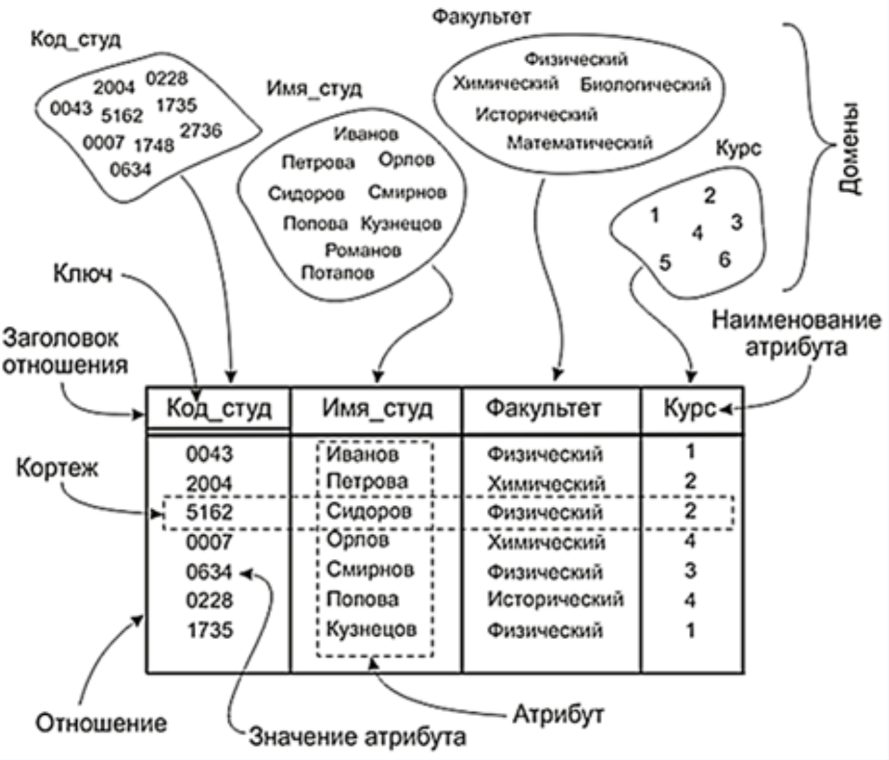
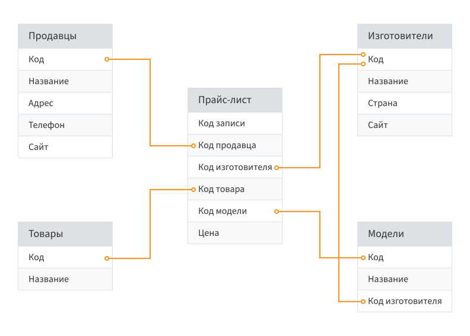
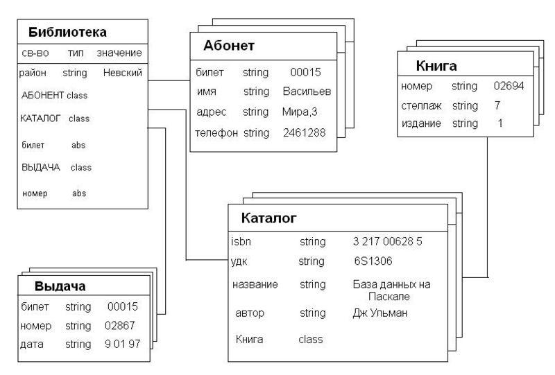

### Основные функции СУБД
#### Контроль за целлостность данных
В БД данные вводятся, обрабатываются, обновляются, выгружаются. На каждом из перечисленных этапов могут возникнуть ошибки разного рода:
1. Не соотвествие типу. Пример: ввод значение **STRING** в столбец с типом **INT**
2. Не соотвествие формату или размеру
3. Дублирование первичных **PRIMARY** **KEY** и уникальных ключей **UNIQUE**, CANDIDATE
4. Нарушение *бизнес* логики при удалении записей в связанных таблица с внешними ключами **FOREIGN** **KEY**
5. Нарушение правил проверки **CHECK**

#### Выделение вычислительных мощностей
Для работы с БД необходимо выделиь СУБД файловые группы, их максимальные размеры и буфер инкремент. СУБД контролирует указанные параметры и применяет дополнительные меры при критической нехватке памяти. Например: очистка логов файла.

#### Синхронизация работы нескольких пользователей(сессией)
В СУБД предусмотрено сессионное подключение **Session Connection** и система контролирует одновременные команды.
Ядро СУБД устаналивает различные блокировки **LOCK**, которые не допускают одновременное обращения/изменения:
1. К таблице целиком **TABLOCK**
2. К конкретной странице таблицы в памяти **PAGELOCK**
3. К конкретной строке **ROWLOCK**

При возникновении такой ситуации СУБД пропускает первую транзакцию, которая занимает и блокирует ресурс (таблица, страница, строка) и ожидает её выполнения COMMIT, только после этого СУБД разблокирует ресурс.

#### Контроль дотсупа
1. Предоставление доступа к БД **GRANT**
2. Ограничение или прекращение доступа к БД **DENY**

>Как к БД в целом, так и к конкретным объектам этой БД.

Администратор создаёт нужные роли **ROLES**, где указаны списки доступных объектов БД. Затем каждому пользователю **USER** можно будет предоставить необходимые для выполнения работы ранее созданные роли.

#### Резервное копирование и восстановление
При правильном создании резервных копий БД можно будет восстановить данные после многих видов сбоев:
1. Сбой носителя
2. Удаление таблицы по ошибке
3. Повреждение физического накопителя, безвозвратная потеря данных на сервере

Резервные копии таакже использются для копирования БД с одного сервера на другого, архирования.

#### Загрузка, обработка, выгрузка данных
СУБД позволяет загружать, перекодировать и выгружать большие объемы данных.
Поддерживаемые форматы:
1. TXT 
2. XLS, XLSX
3. CSV
4. XML
5. JSON

#### Обеспечение логической и физической независимости прикладных программ
Обеспечение логической независимости данных предоставляет возможность изменения логического представления БД без необходимости изменения физических структур хранения данных. Обеспечение физической независимости данных предоставляет возможность изменять способы организации базы данных в памяти ЭВМ, не вызывая необходимости изменения логического представления данных. Таким образом, изменение способов организации базы данных не приводит к изменению прикладных программ.

### Классификация моделей СУБД
#### Иерархические
~~~ mermaid
graph

A[A] --> B[B]
A[A] --> C[C]
A[A] --> D[D]
B[B] --> E[E]
B[B] --> F[F]
C[C] --> G[G]
D[D] --> H[H]
D[D] --> I[I]
D[D] --> J[J]
~~~

#### Сетевые
~~~ mermaid
graph

A[A] --> B[B]
A[A] --> C[C]
A[A] --> D[D]
B[B] --> E[E]
B[B] --> F[F]
C[C] --> B[B]
C[C] --> G[G]
C[C] --> J[J]
C[C] --> D[D]
D[D] --> G[G]
D[D] --> H[H]
D[D] --> I[I]
D[D] --> J[J]
~~~
#### Реляционные
Основой структурой данных в реляционной модели являются таблицы, называется в релационной теории отношениями (relation).

1. Таблица - **отношение**
2. Строки - **кортежи**
3. Столбцы - **атрибуты**
4. Количество кортежей  - **кардинальное число**
5. Количество атрибутов - **степень отношения**
6. Уникальный индификатор кортежей - **ключ**
7. Множество значений, из которого могут браться значения конкретного атрибута - **домен**
Пример:

#### Объектно-ориентированные
Информация представлена в виде объектов, как в объектно-ориентированных языках программирования. 

>Работают все принципы ООП

#### Объектно-реляционная
Реляционная СУБД нужно дополнить средствами доступа к сложным данным, при этом ядро СУБД не требует переработки, и сохраняет все присущие реляционным системам достоинства.
>Добавление функции к БД

### Инфомация и данные. Объекты базы данных

Информация - это результат преобразования и анализа данных. Отличие информации от даннных состоит в том, что данные - это фиксированные сведения о событиях и явлениях, которые хранятся на определенных носителях, а информация появлется в результате обработки данных при решение конкретных задач.

Объекты базы данных:
1. Таблицы
2. Представления
3. Хранимые процедуры
4. Функции
5. Триггеры
6. Индексы
7. Ключи
8. Пользовательские типы данных
9. Пользовательские процедуры
10. Системные представления
11. Системные функции
12. Глобальные переменные состояния.

### Элементы системы БД
#### Данные
1. **Интегрированные данные** можно представить как объединение некольких отдельных файлов, полностью или частично неперекрывающихся
2. **Общие данные** отдельные области можно использовать несколькими различными пользователями
#### Пользователи
1. Прикладные программисты
2. Пользователе
3. Администраторы БД

#### Аппаратное обеспечение
Накопители для хранения информации вместе с устройтсвами ввода/вывода. Процессор вместе с основной памятью, которая используется для поддержки работы ПО системы.

#### Программное обеспечение
Основная часть ПО - это СУБД
Основная функция СУБД - предоставление пользователю возможности работать с БД, не вникая в детали на уровне аппаратуры.

### Этапы построения БД

Процесс анализа и проектирования базы данных предсталвяет собой последовтаельность переходов от неформального словесного описания информационнной структуры предментйо области к формализованному описанию объектов предметной области в терминах некоторой модели.
Фазы проектирования:
1. Анализ предметной области (Системный анализ) и словесное описание информационных объектов предметной области.
2. Информационное-логическое проектирование (Концептуальное) - проектирование инфоологической модели предметной области в терминах некоторой семантической модели.
3. Логическое проектированое реализации - выбор системы управления базами данных СУБД и описание БД в терминах принятой СУБД.
4. Физическое проектирование - выбор эффективного размещения БД на внешних носителях для обеспечения наиболее эффективной работы приложения.

### Клиент-серверная архитектура

~~~mermaid
graph
A[Компьютер] --> B[Клиентское приложение]
B[Клиентское приложение] --> |SQL-запросы|C[Данные БД]
C[БД] --> |Результаты|B[Клиентское приложение]
D[Сервер] --> C[Данные БД]
C[Данные БД] --> E[СУБД]
E[СУБД] --> C[Данные БД]
~~~

### Команды
1. Подключение к базе данных
	**\c database_name**
2. Создание таблиц с помощью оператора **CREATE**:
    **DROP TABLE IF EXISTS** *table*
   ** CREATE [local][TEMPORARY]TABLE** *table* **[спецификация][опция] ON COMMIT DROP**
3. Модицифкация таблицы командой **ALTER**:
	**AlTER TABLE** *table_name alter_spec*;
Основные преобразования, выполняемые оператором **ALTER TABLE**:
	1. **ADD** create definition **[FIRST|AFTER column_name]**
	2. **ADD INDEX [index_name] (index_col_name)**
	3. **ADD PRIMARY KEY (index_col_name)**
	4. **REBANE** *old_col_name new_col_name* type
	5. **DROP** *col_name* - Удаление столбца с именем *col_name*
	6. **DROP PRIMARY KEY** - Удаление первичного ключа таблицы
	7. **DROP INDEX** *index_name* - Удаление индекса *index_name*
4. Удаление таблицы из БД
	**DROP TABLE [IF EXISTS]** *table*
5. Удаление БД
	**DROP DATABASE** *database_name*