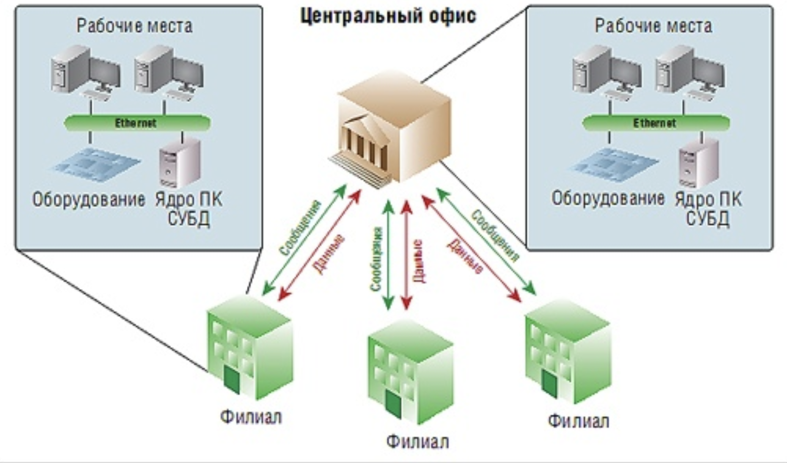

### Основы реляционной алгебры
Реляционная алгебра базируется на **теории множества** и явлеятся основой логики работы баз данных.
Реляционной базой данных называется **совокупность отношений**, содержащих всю информацию, которая должна хранится в базе.

В реляционной БД таблицы взаимосвязаны и соотносятся друг с другом как родительские(главные) и дочерние(подчинённые) таблицы.

### Операции реляционной алгебры
Основные 8 операций реляционной алгебры были предложены Э.Коддом
1. Объединение - UNION
2. Пересечение - INTERSECT (или условие WHERE EXISTS)
3. Вычитание - EXCEPT (Результатом вычитания будет отношени. состоящее из кортежей, которые являются корежами первого отношения и не являются кортежами второго отношения; Можно использовать условие WHERE NOT EXISTS)
4. Декартово произведение - JOIN CROSS
5. Выборка - SELECT
6. Проекция - SELECT список_атрибутов FROM таблица
7. Соединеие JOIN
8. Деление - /

Результатом любой операции алгебры над отношениями является еще одно отношение, которое можно потом также использовать в других операциях. 

### Уровни моделей данных
Цель трёхуровневой архитектуры заключается в отделении пользовательского представления БД от её физического представления.
Причины:
- Каждый пользователь должен иметь возможность обращаться к одним и тем же данным, реализуя своё представление о данных, причем это изменение не должно оказывать влияния на других пользователей.
- Внутренняя структура БД не должна зависеть от таких изменений физических аспектов хранения информации, как переключени на новое устройство хранения.
- Пользователи не должны непосредственно иметь дело с такими подробностями физического хранения данных в базе, как индексирование и хеширование. Иначе говоря, взаимодействеи пользователя с базой не должно зависеть от особенностией хранения в ней данных.
- Администратор БД должен иметь возможности изменять структуры хранения данных в базе на своё усмотрение, не оказывая влияния на пользовательское представление.
- Администратор БД должен иметь возможность модернизировать концептуальную структуру БД без какого-либо влияния на всех пользователей.

1. Внешний уровень - содержит только те сущности, атрибуты и связи, которые интересны пользователю.
2. Концептуальный уровень - содержит логическую структуру всей БД(с точки зраения администратора БД).
3. Внутренний уровень - СУБД и операционная система.

~~~ mermaid
flowchart

A[Пользователь 1] --> D
B[Пользователь 2] --> E
C[Пользователь 3] --> E
D[Внещнее представление 1] --> F
E[Внещнее представление 2] --> F
F[Концептуальное представление] --> G[Внутренний уровень]
~~~

### БД по среде физического хранения
~~~mermaid
flowchart
A[По среде физического хранения] --> B[БД во вторичной памяти]
A[По среде физического хранения] --> C[БД в третичной памяти]
A[По среде физического хранения] --> D[БД в оперативной памяти]
~~~

#### БД во вторичной памяти
Средой постоянного хранения является периферийная энергозависимая память (вторичная память) - как правило, жёсткий диск. В оперативную память СУБД помещает лишь кэш и данные для текущей обработки

#### БД в оперативной памяти
Все данные находятся в оперативной памяти.

#### БД в третичной памяти
Средой постоянного хранения является **отсоединяемое** от сервера устройство массового хранения (третичная память). Как правило, на основе оптических дисков или магнитных лент. Во вторичной памяти сервера хранится лишь каталог данных третичной памяти, файловый кэш и данные текущей обработки.
Загрузка самих данных требует специально процедуры.

### БД по наполняемости
~~~mermaid
graph
A[По наполняемости] --> B[Географические]
A[По наполняемости] --> C[Научные]
A[По наполняемости] --> D[Исторические]
~~~

### По степени распределённости
~~~mermaid
graph
A[По степени распределённости] --> B[Централизованные]
A[По степени распределённости] --> C[Временные]
A[По степени распределённости] --> D[Распределённые]
A[По степени распределённости] --> E[Пространственные]
A[По степени распределённости] --> F[Простравенно-временные]
~~~

#### Централизованные

#### Пространственные БД
БД оптимизированная для хранения и выполнения запросов к данным о пространтсвенных объектах, представленных некоторыми абстракциями: точка, линия, полигон...
В то время, как традиционные БД могут хранить и обрабатывать числовую и символическую информацию, простраственные БД позволяют выполнять аналитические запросы, содержащие пространственные операторы для анализа пространственно-логических отношений объектов.

#### Распределённые БД
DDB(Distributed DataBase) - совокупность логических взаимосвязанных баз данных, распределённых в компьютерной сети. Для каждого узла имеется собственная основная и внешняя память, установлена собственная операционная память. Узлы связаны компьютерной сетью, а не входят в мультипроцессорную конфигурацию.
При наличии схемы реляционной базы данных каждое отношение фрагментируется на горизонтальные или вертикальные разделы. Горизонатльная фрагментация реализуется при помощи операции селекции, которая направляет каждый кортеж отношения в одинн из разделов, руководствуясь предикато фрагментации. Засчёт фрагментации данные приближаются к месту их наболии интенсивного использования, что потенциально снижает затраты на пересылки; уменьшаются также размеры отношения, участвующих в пользовательских запросах.

#### Временные БД
Темпоральные даннные - это произвольные данные, которые явно или неявно связаны с определёнными **датами или промежутками времени**.
Темпоральные базы данных - это базы данных, хранящие темпоральные данные.

#### Пространство-временные БД
База данных, которая хранит инфомрация о движущихся объектах, то её статическое представление малоинтересно, поскольку основной интерес представляет именно изменение местоположения наблюдаемых объектов с течением времени. В подобных системах невозможно игнорировать темпораьную составляющую, поэтому мы приходим к понятию простраственно-временной БД.
Пример: информация о перемещниях и местонахождении автомобилей, получаемых с помощью GPS-систем.
