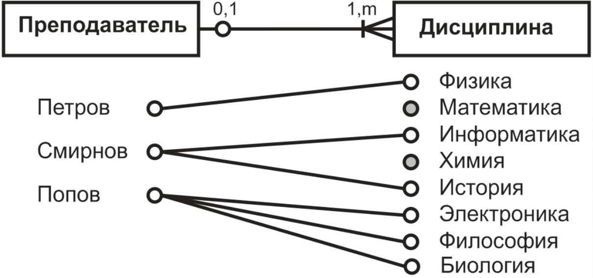
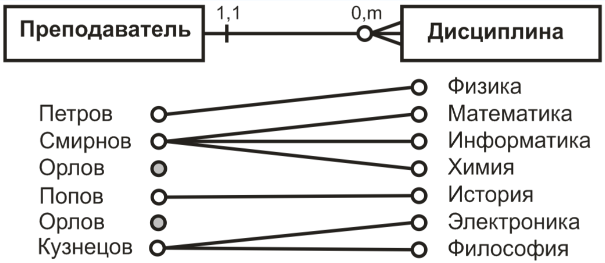

### Реляционная модель
Реляционная модель состоит из трёх частей:
- Структурная часть
- Целостная часть
- Манипуляционная часть

#### Структурная часть
Описывает, какие объекты рассматриваются реляционной моделью. Постулируется, что единсвтенной структурой данных, используемой в реляционной модели, являются нормализованные n-арные отношения.

#### Целостная часть
Описывает ограничения специального вида, которые должны выполняться для любых отношений в любых реляционных базах данных.
1. Primary key
2. Alternate key - это потенциальный ключ, не ставший первичным. Это атрибут (группа атрибутов) несовпадающих с первичным ключом и уникально идентифицирующий экземпляр сущности.
3. Foreign key - это столбец или сочетания столбцов, которые применяются для принудительного установления связи между данными в двух таблицах.

#### Манипуляционная часть
Описывает два эквивалентных способа манипулирования реляционными данными - реляционную алгебру и реляционное исчисление.

### Правила ссылочной целостности
Ссылочная целостнотсь - это ограничение базы данных, гарантирующее, что ссылку между данными являются действительно правомерными и неповрежденными. Она должна жестко контролироваться при выполнеии любых операций с данными таблиц.
Всего 4 операции:
1. SELECT
2. INSERT (не может нарушить целостность)
3. DELETE
4. UPDATE

>Операция вставки критична только для подчинённой таблицы. Пример: можно добавить нового клиента у которого нет телефона, но нельзя добавить телефон несуществуещго клиента. Вставка новых строк в подчинённую таблицу должна проверяться на согласованноть значений внешнего ключа.

Удалаение строк подчиненной таблицы абсолютно безопасно. Однако, удаление строк главной таблицы при наличи связанных строк в подчинённой таблице приведет неприменно к нарушению ссылочной целостности. Существуют компенсирующие операции
1. RESTRICT - Запрет удаления строк, которые связанные с подчиненной 
2. CASCADE - Удаление строки главной таблицы вместе со всеми связанными строками подчинённой таблицы.

### Типы связей
#### Связи один ко многим
Каждый преподаватель может преподавать любое количество учебных дисциплин, но каждая дисциплина преподается не более чем одни преподавателем.

#### Связи многие ко многим
Каждый преподаватель может преподавать любое количество учебных дисципли, и каждая дисциплина может преподаваться любым количество преподавателей.

#### Связи один к одному
Каждый преподаватель преподает не более одной дисциплины, и каждая дисциплина преподается не болеее чем одним преподавателем.

### ER диаграммы
1. Каждый преподаватель преподает не более одной(то есть может и не преподавать ни одной) дисциплины
~~~ mermaid
flowchart LR
A[Преподаватель] --- |0,1|B[Учбеная дисциплина]
~~~
2. Преподаватель принадлежит одной и только одной дисциплине
~~~ mermaid
flowchart LR 
A[Преподаватель] --- |1,1|B[Учбеная дисциплина]
~~~
3. Каждый преподаватель может преподавать любое число учебных дисциплин(в том числе и не преподавать ни однйо из них)
~~~ mermaid
flowchart LR
A[Преподаватель] --- |0,m|B[Учбеная дисциплина]
~~~
>Преподаватель может быть связан с любым числом дисциплин (от 0 до m)

4. Каждый преподаватель обязательно преподает хотя бы одну учебную дисциплину
~~~ mermaid
flowchart LR
A[Преподаватель] --- |1,m|B[Учбеная дисциплина]
~~~
>Преподаватель обязательно должен быть связае с одной или несколькими дисциплинами (от 1 до m)

5. Каждый преподаватель обязательно должен преподавать одну или несколько дисциплин (1,m). Конкретная дисциплина может преподаваться не более чем одни преподавателем.
   
6. Преподаватель может вести любое число дисциплин, в том числе и ни одной (0,m). Каждая дисциплина обязательно должна преподваться только одним преподавателем.
   

### Операторы SQL
#### DCL (Data Control Language)
Группа операторов определения доступа к данным. Операторы для управления разрешениями, с помощью них мы можем разрешать или запрещать выполнение определённых операций над объектами БД.
1. GRANT - добавить привелегии
	1. Предоставление доступа добавления данных всем пользователям к таблице films:
	   GRANT INSERT ON films TO PUBLIC;
	2. Предоставление доступа всех скриптов мануэлю к таблице kinds:
	   GRANT ALL PRIVILEGES ON kinds TO manuel;
	3. Добавление к группе админов joe
	   GRANT admins TO joe;
2. REVOKE - забрать привелегии
	1. Забрать доступ добавления данных всем пользователям к таблице films:
	   REVOKE INSERT ON films TO PUBLIC;
	2. Забрать доступ всех скриптов мануэлю к таблице kinds:
	   REVOKE ALL PRIVILEGES ON kinds TO manuel;
	3. Удаление из группы админов joe
	   REVOKE admins TO joe;
#### DDL (Data Definition Language )
Набор SQL-операторов для определения данных.
1. CREATE TABLE|DATABASE|INDEX - создание
2. DROP TABLE|DATABASE|INDEX - удаление
3. ALTER TABLE|DATABASE|INDEX - редактирование
