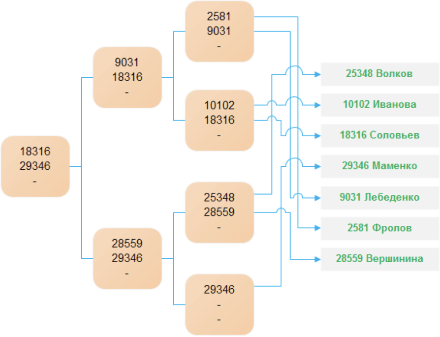
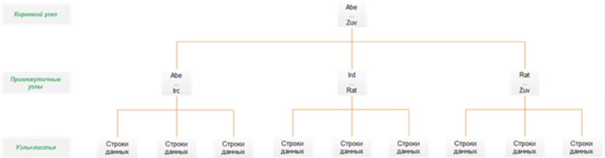

### Индексы. Общие сведения
СУБД обычно используют индексы для обеспечеия быстрого доступа к реляционным данным. Индекс представляет собой отдельную физическую структуру данных, которая позволят получать быстрый доступ к одной или нескольки строкам данных. Таким образом правилная настройка индексов является ключевым аспектом улучешния производительности запросов. При поиске определённой строки таблицы 
компонент Database Engine обращается к индексу, чтобы узнать её физическое местонахождение.

Если для таблицы отсутсвует подходящий индекс, для выборки строк система использует **метод сканирования таблицы**. Система последовательно извлекат и исследует каждую строку таблицы (от первой до последней), и помещает строку в результрующий набор, если для нее удовлетвория условие поиска.

Индексы сохраняются в дополнительных структурах базы данных, называющихся **страницами индексов**. Для каждому индексируемой строки имеется элемент индекс, который сохраняется на страние индекса. 
>Каждый элемент индекса состоит из ключа индекса и указателя.

#### Древовидная структура
Самые нижние узлы находятся на расстоянии одинакового количества уровне от корневого узнала дерева.

>Альтренативным эквивалентным подходом будет поиск меньшего или равного значения индекса.

Индексированный поиск обычно является предпочтительным методом поиска в таблицах с большим количеством строк по причине его очевидного преимущества. Используя индексированным поиск, мы можем найти люубю строку в таблица за очень короткое время, применив лишь несколько операций ввода/вывода.

###  Кластерные индексы
Кластерный индекс определяет **физический порядок данных** в таблице. Для таблицы может быть лишь  **один кластеризованный индекс**, так как строки таблицы нельзя упорядочить физически более чем одним способом. 

Поиск с ипользованием кластеризованного индекса выполняется от корневого узла дерева по направлению к узлам дерева, которые связаны между собой в двунаправленным связанный список.

>Узлы дерева содрежат страницы данных

Таблицы, для которой определён кластеризованный индекс, называется **кластеризованной таблицей**. 

Структура дерева кластеризованного индекса: 

### Некластеризованные индексы
Структура некластеризованного индекса точно такая же, как и кластеризованного, но с двумя важными отличиями:
1.  Некластеризованный индекс не изменяет физичеаское упорядочивание строк таблицы
2. Страницы узлов некластеризованного индекса состоят из ключей индекса и закладок.

>Если для таблицы определить один или более некластеризованных индексов, физический порядок строк этой таблицы не будет изменён.

Для каждого некластеризованного индекса компонент Database Engine создаёт дополнительную индексную структуру, которая сохраняется в индексных страницах.

#### Рекомендации при планировании стратегии индексирования
1. Для таблиц, которые часто обновляются используйте как можно меньше индексов.
2. Если таблица содержит большое количество данных, но их изменения незначительны, тогда используйте столько индексов, соклько необходимо для улучшения проивзодительности ваших запросов.
>При использование индексов на небольших таблицах может занять больше времени, недели просто сканирование всех строк.

3. Для кластеризованных индексов стараться использовать настолько коротки поля, насколько это возможно. Наилучшим образом будет применение кластеризованного индекса на столбцах с уникальными значениями и не позволюяющим использовать NULL. Вот почему **первичный ключ** часто используется как кластериованный индекс.
4. Уникальность значений в столбце влияет на производительности индекса. В общем случае, чем больше у вас дубликатов в столбце, тем хуже работает индекс.
5. Для составного индекса нужно брать во внимаеи **порядок столбцов** в индекск. Столбцы с самым высоким количество уникальных знаачений идут первыми.

>**Почему таблица не может иметь два кластеризованных индекса?**
> Когда вы создаёте кластеризованный индекс у таблицы, СУБД сортирует все строки в таблице в порядке возрастания или убывания, согдасно определению индекса. Мы не можем отсортировать на "физическом уровне" одну и ту же таблицу разными атрибутами.

#### Итог
|                                               | Кластеризованный индекс                     | Некластеризованный индекс                                                 | Кластерный-некластерный индексы                                                                     |
| --------------------------------------------- | ------------------------------------------- | ------------------------------------------------------------------------- | --------------------------------------------------------------------------------------------------- |
| Количество индексов в таблице                 | 0-1                                         | 0-m                                                                       | Кластерный: 1 Некластерный: 1-m                                                                     |
| Простой/Состаной атрибут                      | Да/да                                       | Да/да                                                                     | Да/да                                                                                               |
| Допустимость значения NULL                    | Нет                                         | Да                                                                        | Кластерный: нет  Некластерный: да                                                                   |
| Изменяется физический порядок строк в таблице | Да                                          | Нет                                                                       | Кластерный: да  Некластерный: нет                                                                   |
| Состояние таблицы                             | Кластеризованная таблица                    | Куча                                                                      | Кластеризованная таблица                                                                            |
| Поиск                                         | По дереву. Страницы индекса содержат данные | По дереву. Страницы индекса содержат ссылку на нужную строку **"ROWNUM"** | По дереву. Страницы некластерного индекса содержат индефикатор кластерного индекса на нужную строку |
| Порядо создания                               | В первую очерель                            | Если нет кластерного индекса, тогда нет никакого порядка создания         | Создаётся сначала кластерный индекс, а затем остальные не кластерные                                |

>**Можно ли создать кластеризованный индекс на столбце, содеращем дубликаты?**
>Нет. Если создавать неуникальный кластерный индекс на столбце, сто СУБД добавляет к дублирующему значению целочисленно значение, чтобы удостовериться в уникальности, и соотвественно, обеспечить возможность идентифицировать каждую строку в кластеризованной таблице.

>**Как хранится таблица, если не был создан кластеризованный индекс?**
>Различаем два типа таблиц: кластеризованные таблицы, имеющие кластеризованный индекс и таблицы-кучи или просто кучи. В отличие от кластеризованных таблиц данные в куче не сортированы никаким образом. Если добавить строку к такой таблице, то СУБД просто добавет её к концу страниц. Когда страница заполнится данными, то они будут добавлены на новую страницу.

>**Если индексы настолько замечательны, то почему бы просто не создать их на каждый столбец?**

>**Можно ли создать некластеризованный индекс только для определённого подмножества данных ключевого столбца?**

