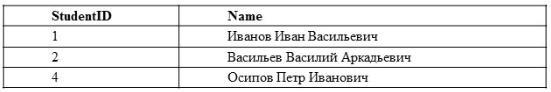
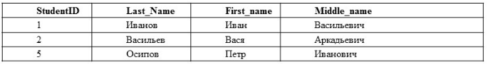
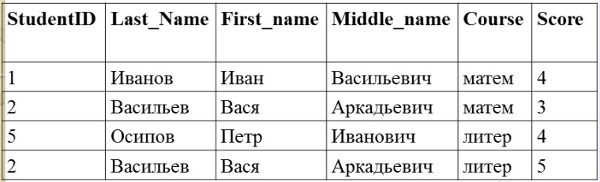
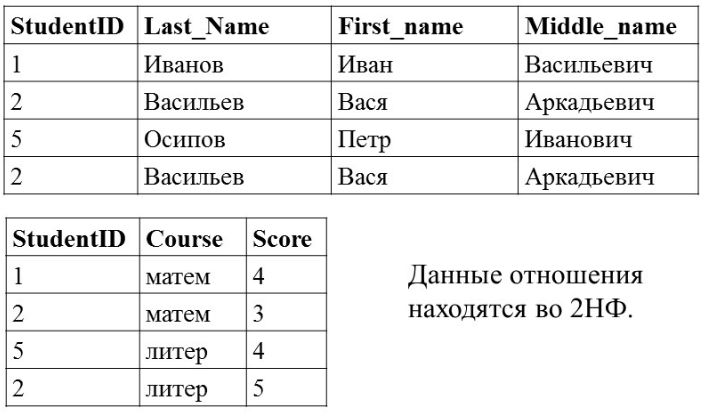
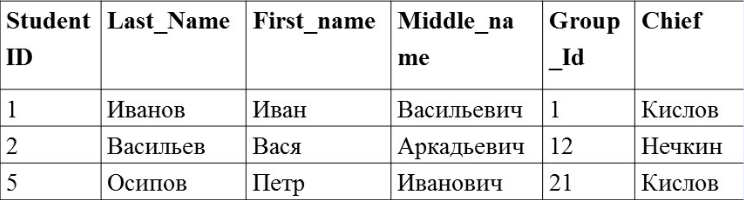
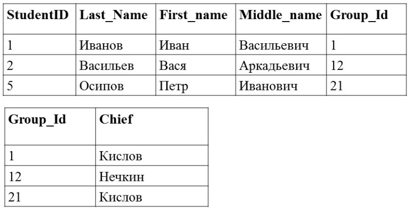
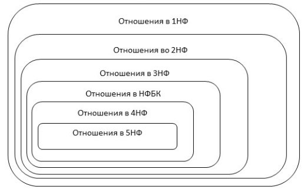

### Различают следующие виды аномалий:
1. Аномалии вставки **INSERT**
2. Аномалии обновления **UPDATE**
3. Аномалии удаления  **DELETE**

### Нормализация БД
**Нормализация** - это разбиение таблицы на две или более, обладающих лучшими свойствами при добавлении, изменении и удалении данных. 
**Цель нормализации** сводится к получению такого проекта базы данных, где исключена избыточность информации. Делается для исключения возможной противоречивости хранмых данных.

Процесс нормализации основывается на концепции **нормальных форм**.
Отношение находится в определённой нормальной форме, если оно удовлетворяет заданному набору условий.

#### Последовательности нормальных форм:
##### 1. Первая нормальная форма **1NF**
   Отношение находится в 1НФ тогда и толко тогда, когда все используемые домены содержат только скалярные значения, то есть значения всех полей отношения должны быть неделимы логически.
   Исходная таблица:
   
   После нормализации таблица:
   
   **Свойства:**
   1. В отношении нет одинаковых кортежей
   2. Кортежи не упорядочены
   3. Атрибуты не упорядочены и различаются по наименованию
   4. Все значения атрибутов атомарны

##### 2. Вторая нормальняа форма **2NF**
   Отношение находится в 2НФ тогда и только тогда, когда оно находится в 1НФ и нет ключевых атрибутов, зависящих от части сложного ключа.
   - **Неключевой атрибут** - это атрибут, не входящий в состав никого потенциального ключа.
   >Если потенциальный ключ отношения является простым, то отношение автоматически находится в 2НФ
   Если допустить наличие нескольких ключей, то определение примет следующий вид:
   Отношение R находится во второй нормальной форме 2НФ в том и только в том случае, когда оно находится в 1НФ, и каждый неключевой атрибут полностью зависит от каждого ключа R.
   Исходная таблиц:
   
   После декомпозиции:
   
   
##### 3. Третья нормальная форма **3NF**
   Атрибуты называются **взаимно независимыми**, если ни один из них не явлется функционально зависимым от другого. 
   Отношение находится в 3НФ тогда и только тогда, когда оно находится в 2НФ и все неключевые атрибуты взаимно независимы.
   Отношение R находится во второй нормальной форме 2НФ в том и только в том случае, когда оно находится в 1НФ, и каждый неключевой атрибут нетранзитивно зависит от первичного ключа.
   Исходная таблица:
   
   Существует ФЗ:
   1. StudentID -> GroupID
   2. GroupID -> Chief
   Значитт Chief **транзитивно зависит** от первичного ключа StudentID. Отношение не в 3НФ.
   Приведённая к 3НФ:
   
   Неключевые атрибуты, которые являются зависимыми, выносятся в отдельное отношение. 
##### 4. Нормальная форма Бойса-Кодда **BCNF**
##### 5. Четвёртая нормальная форма **4NF**
##### 6. Пятая нормальная форма **5NF**/нормальная форма проекции-соединения **PJ/NF**

#### Основные свойства нормальных форм:
1. Каждая следующая нормальная форма в некотором смысле лучше предыдущей
2. При переходе к следующей нормальной форме свойства предыдущих нормальных свойств сохраняются.
#### Алгоритм нормализации
1. **Приведение к 1НФ**. Задаётся одно или несколько отношений, отображающих понятия предметной области. По модели предметной области (не по внешнему виду полученных отношений) выписываются обнаруженные функциональные зависимости.
2. **Приведение к 2НФ**. Если в некоторых отношениях обнаружена зависимость атрибутов от части сложного ключа, о проводим декомпозицию этих отношений на несколько отношений. Те атрибуты, которые зависят от части сложного ключа вносятся в отдельное отношение вместе с этой частью ключа. В исходном отношении остаются все ключевые атрибуты.
3. **Приведение к 3НФ**. Если в некоторых отношениях обнаружена зависимость некоторых неключевых атрибутов от других неключевых атрибутов, то проводим декомпозицию этих отношени. Те неключевые атрибуты, которые зависят от других неключевых атрибутов выносятся в отдельное отношение. В новом отношении ключом становится детерминант функциональной зависимости.