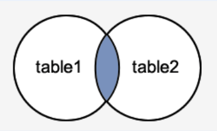
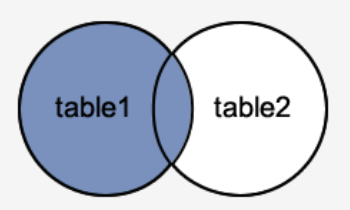
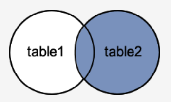
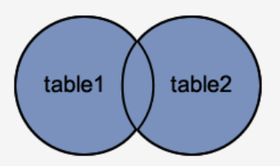

### Выборка данных из нескольких таблиц
Выборка данных преполагает соединение нескольких таблиц для получения единого набора результатов, включающих записи и поля каждой таблицы. Соединение позволяет собрать данные, разделённые в процессе нормализации.

Для соединения таблиц с одноименными столбцами или таблицы с самой собой используются **алиасы (псевдонимы таблиц)**.

#### Виды соединеия

##### 1.INNER JOIN

- Порядок таблиц для оператора неважен, поскольку оператор является симметричным.
- Заголовк таблицы-результата явлеяется объединием заголовков соединямемых таблиц.
- Каждая строка одной таблицы сопоставляется с каждой строкой второй таблицы, после чего для полученной строки проверяется условие соединения (вычисляется предикат соединения). Если условие истинно, в таблицу-результат добавляется соотвествующая строка.
##### 2. LEFT JOIN

- Порядок таблиц для операторв важно, поскольку оператор не явлется симметричным.
- Заголовок таблицы-результата является объединием заголовком соединямых таблиц.
- Пусть выполняется соединие левой и правой таблиц по предикату $p$. В результате включается INNER JOIN левой и правой таблиц по предикату $p$. Затем в результат добавляются те записи левой таблицы, которые не вошли во внутреннее соединение на шаге 1. Для таких записей поля, соотвествующие правой таблице, заполяются значениями NULL.
##### 3. RIGHT JOIN

- Порядок таблиц для операторв важно, поскольку оператор не явлется симметричным.
- Заголовок таблицы-результата является объединием заголовком соединямых таблиц.
- Пусть выполняется соединие левой и правой таблиц по предикату $p$. В результате включается INNER JOIN левой и правой таблиц по предикату $p$. Затем в результат добавляются те записи правой таблицы, которые не вошли во внутреннее соединение на шаге 1. Для таких записей поля, соотвествующие левой таблице, заполяются значениями NULL.
##### 4. FULL JOIN

- Порядок таблиц для оператора неважен, поскольку оператор является симметричным.
- Заголовк таблицы-результата явлеяется объединием заголовков соединямемых таблиц.
- Пусть выполняется соединение первой и второй таблиц по предикату $p$.
	1. Сначала включается внутреннее соединене INNER JOIN первой и второй таблиц по предикату $p$.
	2. В результат добавляются те записи первой таблицы, которые не вошли во внутреннее соединение в 1 пункте. Для таких записей поля, соответствующие второй таблице, заполняются значениями NULL.
	3. В результат добавляются те записи первой второй, которые не вошли во внутреннее соединение в 1 пункте. Для таких записей поля, соответствующие первой таблице, заполняются значениями NULL.
