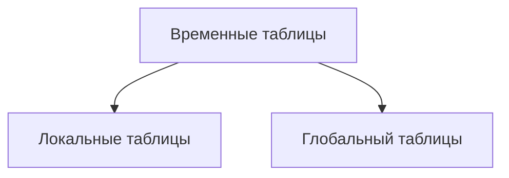
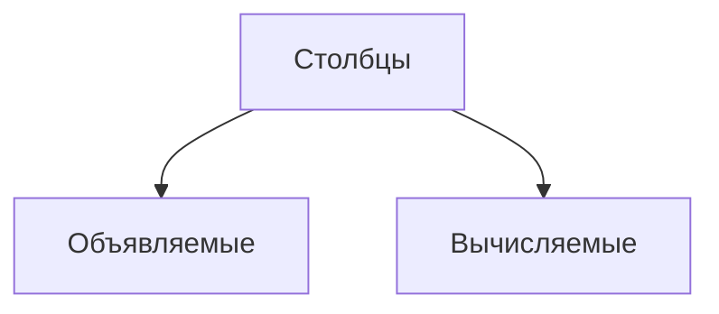
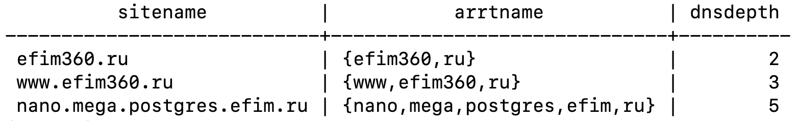

#### Локальные таблицы
1. Создаются с оператором LOCAL
2. Они видны только текущему соединению пользователя
3. Удаляются, когда пользователь отключается от эксземпляра PostgreSQL

#### Глобальные таблицы
1. Видны любому пользователю
2. Удаляются только тогда, когда все пользователи, которые на них ссылаются, отчключаются от экземпляра PostgreSQL

|                                  | Сессионная временная таблица                                                                                    | Глобальная временная таблица                                                  |
| -------------------------------- | --------------------------------------------------------------------------------------------------------------- | ----------------------------------------------------------------------------- |
| Доступность на уровне сессий     | В текущей сессии, для других нет доступпа                                                                       | Доступа всем ссесссий                                                         |
| Проверка существования OBJECT_ID | В рамках одной сесии, если пользователь запускает еще другие сесии, то он сможет создать в них такую же таблицу | Таблицы может существовать только в одном экземпляре для всех открытых сессий |
| Создание индексов                | На любом этапе работы с таблицей                                                                                | На любом этапе работы с таблицей                                              |

#### pg_database
[Системные таблицы](https://postgrespro.ru/docs/postgrespro/10/catalogs). Данные из системных таблицы доступны через системные представления. 

#### Секционированные таблицы
PostgreSQL поддерживает секционирование таблицы. Данные секционированных таблицы подразделяются на блоки, которые могут быть распределены по нескольким файловым группам в базе даных. Данные секционируются горизонтально, поэтому группы строк сопоставляются с отдельными секциями. Все секции таблицы должны находиться в одной и той же базе данных. Таблицы рассматривается как единая логическая сущность при выполнении над данными запросов или обновлений.

``` SQL
CREATE TABLE measurement_y2006m02 PARTITION OF measurement
FOR VALUES FROM ("2006-02-1") TO ("2006-03-01");
```

### CTE (Common Table Expression)
Задаётся временно именованный результирующий набор, называемы обобщенным табличным выражением CTE. Он извлекается при выполнении простого запроса и определяется в области выполнения одиночной инструкции: **SELECT, INSERT, UPDATE, DELETE.** Это предложение может использоваться также в нструкции **CREATE VIEW**, как часть определяющей её инструкции **SELECT**.
Обобщеное табличное выражение может включать ссылки на само себя. Такое выражение называется рекурсивным обощенным табличным выражением.

#### Зачем использовать CTE выражение
1. CTE делает код более читабельным и структурированным
2. CTE позволяет не применять временные таблицы, так как оно содержит уже нужную выборку
3. CTE отлично подходит для выполнения опрации рекурсии или создании деревьев в формате таблицы БД.



#### Свойства объявляемых столбцов
1. **Имя** - отображает имы выбранного солбца
2. Разрешить значения **NULL**
3. Тип данных
4. Значение по умолчанию **DEFAULT** или привязка
5. **Длина** - указывает число символов, допустимых для символьным типов данных. Данное свойство доступно только для символьных типовь данных.
6. Масштаб - отображает максимальное количество цирф от десятичной запятой в значениях этого столбца, Для нечисловых типов данных в этом свойстве отображается 0. Наример: **NUMERIC (6,2)**
7. Параметры сортировки **COLLATE**

**Спецификация вычисляемого столбца**. Выводит данные о вычислямом столбце. Значение этого свойства совпадает со значением свойства потомка. Формула и выводит эту формулу для данного вычислямеого столбца.

``` SQL
CREATE TABLE IF NOT EXISTS test(
	sitename TEXT,
	arrtname TEXT[] GENERATED ALWAYS AS (string_to_array(sitename,'.')) STORED,
	dnsdepth BIGINT GENERATED ALWAYS AS (array_length(string_to_array(sitename,'.'),1)) STORED
);
```
``` SQL
INSERT INTO test (sitename) SELECT unnest(ARRAY['efim360.ru','www.efim360.ru','nano.mega.postgres.efim.ru']);
```
``` SQL
SELECT * FROM test LIMIT 100;
```


### Триггеры
**Триггер** - это особая разновидность хранимой процедуры, выполняемая автоматический при возникновении события на сервере базы данных. Триггеры языка обработки данных выполняются по событиям, вызванным попытеой пользователя изменить данные с помощью языка обработки данных. Событиями DML являются процедуры **INSERT, UPDATE, DELETE**, применяемы к таблице или представлению. Эти триггеры срабатываются при запуске любого допустимого события независимо от того влияет ли оно на какие-либо строки таблицы.

По событиям триггеры бывают:
1. TRIGGER BEFORE
2. TRIGGER AFTER
3. TRIGGER INSTEAD OF

``` SQL
CREATE TABLE emp (
	empname TEXT,
	salary INTEGER,
	last_date TIMESTAMP,
	last_user TEXT
);
```
``` SQL
CREATE FUNCTION emp_stamp() RETURNS trigger AS $emp_stamp$
BEGIN
	--Проверить, что укзааны имя сотрудника и зарплата
	IF NEW.empname IS NULL THEN
		RAISE EXCEPTION 'empname cannot be null';
	END IF;
	IF NEW.salary IS NULL THEN
		RAISE EXCEPTION '% cannot have null salary', NEW.empname;
	END IF;
	-- Кто будет работать, если за это надо будет платить?
	IF NEW.salary < 0 THEN
		RAISE EXCEPTION '% cannot have a nrgative salary', NEW.empname;
	END IF;
	-- Запомнть, кто и когда изменил запись
	NEW.last_date := current_timestamp;
	NEW.last_user := current_user;
	RETURN NEW;
END;
$emp_stamp$ LANGUAGE plpqsql
```
``` SQL
CREATE TRIGGER emp_stamp BEFORE INSERT OR UPDATE ON emp
FOR EACH ROW EXECUTE PROCEDURE emp_stamp();
```