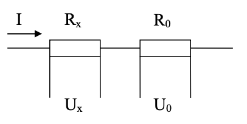
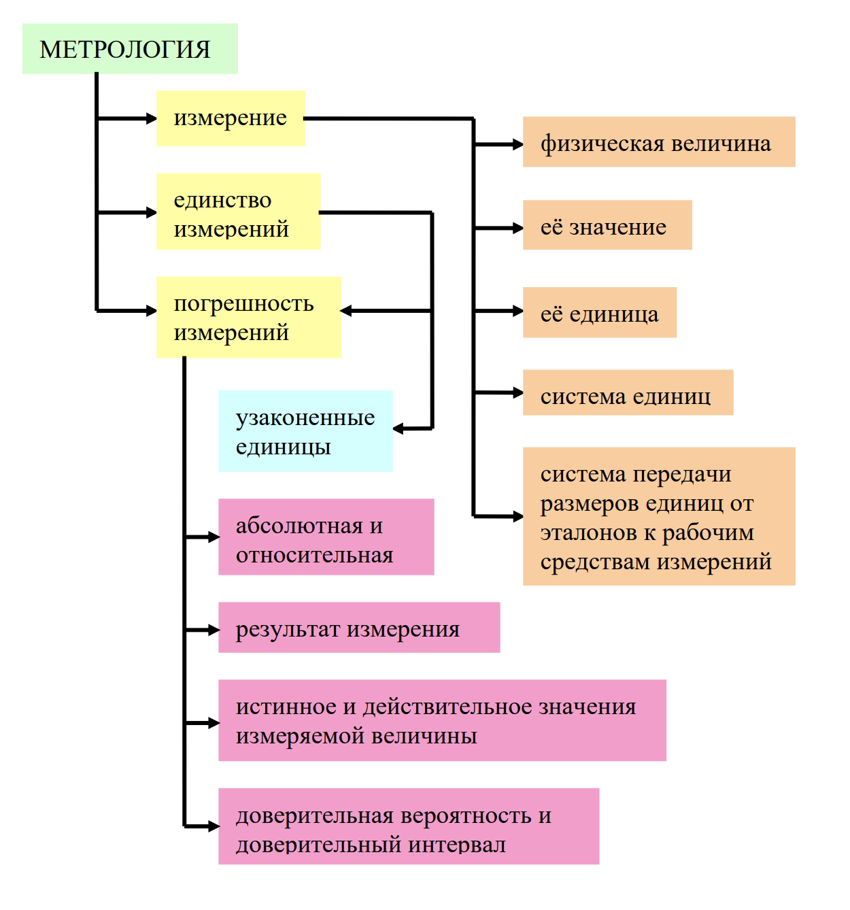

#### Определения метрологии

Метрология - это наука об измерения, методах и средствах обеспечения их единства и способаъ достижения требуемой точности.

Физическая величина (ФВ) - свойство материального объекта, между объектами присуще многим объектам, но индивидуально для каждого объекта. 

Как любая система единиц, она содержит несколько независимых основных единиц: 
1. Единица длины – метр (м); 
2. Единица массы – килограмм (кг); 
3. Единица времени – секунда (с); 
4. Единица силы электрического тока – ампер (А); 
5. Единица термодинамической температуры – кельвин (К); 
6. Единица силы света – кандела (кд); 
7. Единица количества вещества – моль (моль)

Остальные - *проивзодные единицы*. Они образуются из основных на основе фундаметнльных физических законов.

Кратные и дольные единицы ФВ

| $10^{-12}$ | $10^{-9}$ | $10^{-6}$ | $10^{-3}$ | 1   | $10^{3}$ | $10^{6}$ | $10^{9}$ | $10^{12}$ |
| ---------- | --------- | --------- | --------- | --- | -------- | -------- | -------- | --------- |
| **п**      | **н**     | **мк**    | **м**     |     | **К**    | **М**    | **Г**    | **Т**     |
| **p**      | **n**     | **$\mu$** | **m**     |     | **K**    | **M**    | **G**    | **T**     |
| пико       | нано      | **микро** | **мили**  |     | **кило** | **мега** | **гига** | **тера**      |

**Измерение** – это процесс нахождения значения физической величины опытным путём с помощью специальных технических средств.
**Измерение** - это совокупность операций по применению технического средства, хранящего единицу физической величины, обеспечивающих нахождение соотношения измеряемой величины с её единицей и получение значения этой величиный.
Измерение всегда сравнение с единицей 
**Измерить** какую-либо физическую величину - это узнать, сколько в  ней содержится единиц. *Результат* измерения - это именованное число, например: 5,83 мкА

Физические величины могут быть: 
1. механические – сила, давление, … 
2. пространства и времени – длина, время, скорость,… 
3. тепловые – температура, теплоёмкость, теплопроводность, … 
4. электрические – ток, напряжение, мощность, сопротивление, …  
5. световые – сила света, световой поток, освещённость, … 
6. акустические – скорость звука, звуковое давление, …

Электрические величины в свою очередь можно разделить на: 
1. активные – ток, напряжение, э.д.с., мощность и др.;
2. пассивные (параметрические) – сопротивление, ёмкость, индуктивность, взаимная индуктивность и др. 

Кроме того, есть некоторые величины, неразрывно связанные с электрическими – частота, период, фазовый сдвиг. 
Под электрическими измерениями понимают: 
1. Измерения электрических величин;
2. Измерения временных величин, связанных с электрическими (обычно активными);
3. Измерение неэлектрических величин, преобразованных в электрические, например, измерение температуры с помощью термопары. 
>Термопара – пример измерительного преобразователя. Его нельзя отнести ни к мерам, ни к измерительным приборам.

#### Единство измерений

Единствно измерений - это сотояние измерений, при котором их результаты выражены в указанныъ единицах и погрешности измерений не выходят за установленные границы с заданной вероятностью.
>Узаконенные единицы - это единицы СИ и некоторые внесистемные единицы, разрешённые к применению (их около 20, например: тонна, гектар)

#### Точность измерений

**Погрешность** - это имеренное минус действительное

1. Абсолютная погрешность $\Delta = |X - X_{ист}|$
   $X$ - результат измерения
   $X_{ист}$ - истинное значение измеряной величины. Могут вместо источника использовать действительное значение. Действительное значение - достаточно близкое к $X_{ист}$. Обозначение $X_д$
2. Относительная погрешность измерения $\delta = \dfrac{\Delta}{X_{д}}$
3. Приведённая погрешность измерения $\gamma = \dfrac{\Delta}{X_н}$
   $X_н$ - [нормирующее значение](2022.09.08.md###Нормирующеезначение) измеряемой величины.

#### Прямые и косвенные измерения

1. **Прямые** – искомое значение физической величины получают непосредственно из опыта. Примеры: измерение длины линейкой; измерение тока амперметром и т.п., т.е. все обычные измерения. 
2. **Косвенные** – искомое значение физической величины вычисляют на основании известной зависимости этой величины от нескольких других, значения которых получены прямыми измерениями.

#### Методы измерений

1. **Нулевой метод.** Разность между измеряемой величиной и величиной, воспроизводимой мерой, доводится до нуля. Пример: равносильный мост
   >Равносильный мост постоянного тока: 
   >
   >Изменением $R_1$ уравновешивают мост, т.е. добиваются отсутствия тока в нуль-индикаторе НИ. Легко показать, что при этом $R_xR_2 = R_1  R_3$. Отсюда измеряемое сопротивление $R_x = \dfrac{R_1R_3}{R_2}$.  При изображении НИ на схемах стрелку внутри окружности рисуют вертикально.
2. **Дифференциальный метод.** Разность между измеряемой величиной и величиной, воспроизводимой мерой, измеряется прибором непосредственной оценки.Пример: неравновенстный мост.
   >Неравновестный мост постоянного тока:
   >
   >При $\Delta R = 0$ изменением $R_1$ мост уравновешен при $R_0R_2 = R_1R_3$; далее при $\Delta R ≠ 0$ значение $\Delta R$ преобразуется в ток $I$. Неравновесные мосты широко применяются при измерении не электрических величин. Измеряемая величина преобразуется в $\Delta R$ измерительным преобразователем. Например, температура преобразуется в изменение сопротивления терморезистора.
   
3. **Метод замещения.** Измеряемую величину замещают известной, и измеряют поочерёдно.
   > Пример: $R_x$ – искомое сопротивление; $R_0$ – известное. Поочерёдно измеряют напряжения $U_x$ и $U_0$. Ток $I$ не нужно устаналивать, не нужно знать его значение.
   > 
   > $\dfrac {U_x}{R_x} = \dfrac {U_0}{R_0} = I$ $R_x = R_0 \dfrac {U_x}{U_0}$

#### Заключение
