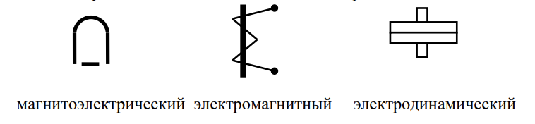
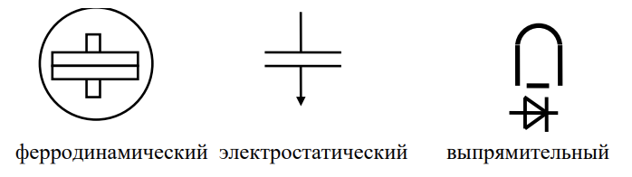
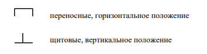
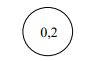

### Виды средств измерений

Средство измерения (СИ) - техническое средство предназначенное для проведения измерения и имеющие метрологические характеристики (точность).

- Меры воспроизводят физическую величину заданного значения. Они бывают однозначные (например, резистор с сопротивлением 10 Ом)  и многозначные (линейка, магазин сопротивлений, магазин ёмкостей)
- Измерительные преобразователи преобразуют сигналы измерительной информаци в форму, более удобнную для дальнейшнего использования
	Примеры:
	1. Термопара преобразует температуру в термо-э.д.с.
	2. Измерительный усилитель преобразует меньшее напряжение в большее
	3. Измерительный трансформатор тока преобразует больший переменный ток в меньший
- Измерительные приборы преобразуют сигналы измерительной информации в форму, доступную для восприятия человеком. 

>Меры, измерительные преобразователи, измерительные приборы - это элементарные средства измерений. С добавлением средсив вычислений образуются более сложные: измерительно-вычислительные системы и комплексы.

Информационно-измерительные системы (ИИС) - совокупность СИ и вспомогательного устройства соединенных между собой каналами связи предназначеными для сбора измеренных величин.
1. Сбор измеренных величин
2. Передача измеренных величин
3. Обработка измеренных величин
4. Предоставление измеренных величин

### Виды измерительных приборов
1. По измеряемой величине:
	1. Измерители напряжения $U$ 
		1. Вольтметры $V$
		2. Милливольтметры $mV$
		3. Микровольтметры $\mu V$
		4. Киловольтметры $kV$
	2. Измерите тока $I$
		1. Амперметры $A$
2. По форме представления результата:
	1. Аналоговые (шкала и указатель)
	2. Цифровые
3. По выполняемым функциям:
	1. Показывающие
	2. Регистрирующие
	3. Показывающие и регистрирующие
4. По элементной базе:
	1. Электромеханические:
	   
	2. Электронные:
	   
5. По условиям применения:
   

### Основные характеристики средств измерений

1. Шкалы
	1. Нулевая: 0 - 150 В
	2. Безнулевая: 380 - 480 Гц
	3. Двусторонняя: - 10 мА - 0 - +10 мА
	4. Неравномерная: 0 - $\infty$
	Нормирущие значение:
		1. 150 В
		2. 480 Гц
		3. 10 мА
		4. l = длине отрезка от 0 до $\infty$
2. Диапозон показаний:
	(левая крайня) 0 В <-> 150 В (правая крайняя)
3. Диапозон измерений (чаще всего совпадает с диапозоном показаний):
	30 - 150 В
	> Имеется нормированная погрешность
#### Точность

Количественная характеристика точности - [погрешность](2022.09.05.md###Точность). Чем меньше погрешность, тем выше точность.
- Погрешность измерения
- Погрешность измерительного прибора

Существует три формы погрешностей:
1. Абсолютная $\Delta$
2. Относительная $\delta$
3. Приведённая $\gamma$

>Погрешность измерения может быть выражена в форме $\Delta$ или $\delta$, а погрешность измерительного прибора - в любой из трёх форрм.

Номинальная статическая функция преобразования показывает связь между вхожной и выходной величиной.

#### Нормирующее значение
**Примеры:**
1. Вольтметр с диапозоном измерения от 0 до 15 В. Тогда $X_{н}=U_{н}=15В$
2. Миллиамперметра с двусторонней шкалой - 5мА - 0 мА - +5мА. Тогда $X_{н} = I_{н} = 5мА$
3. Частомер с узким диапозоном измерения 49 Гц - 50 Гц - 51 Гц
   $X_{н}=f_{н}=50Гц$

>Связь относительной погрешности с приведённой: 
>$\delta = \gamma\dfrac{X_н}{X}$
>$\delta = \gamma$ при $X = X_{н}$
>$\delta > \gamma$ при $X < X_{н}$

### Основная погрешность и дополнительная погрешности

Основная погрешность $\Delta_о$ - это погрешность в нормальных условиях.

Рабочие условия применения прибора - это такие условия, когда влияющие величины $\xi_i$ находятся в пределах рабочих областей значений:
$$\xi_{iраб,min} < \xi_i < \xi_{iраб,max}$$

Погрешность $\Delta$ зависит от влияющих величин $\xi$:
$$\Delta = f(\xi_1;\xi_2;...;\xi_n)$$
Влияющие величины:
1. Внешние факторы - температура, напряжение питания (если оно есть у прибора)
2. Неинформативные параметры входного сигнала:
   Пример: $u(t) = U_{m}\sin(ωt) = 2U\sin(2\pi ft)$ 
   1. Вольтметром измеряют среднее квадратическое значение $U$ синусоидального напряжения $u(t)$; в этом случае частота $f$ этого напряжения;
   2. Неинформативный параметр входного сигнала, т.е. такой параметр, который не несёт полезной информации о значении $U$, но влияет на результат измерения $U$;
   3. частотомером измеряют частоту $f$ синусоидального напряжения $u(t)$; в этом случае $U$ – неинформативный параметр входного сигнала.

Рабочие условия создают допольнительную погрешность $\Delta_{доп}$
Предел СИ - набольшная погрешность СИ, при которой прибор может быть годен и допущен к применнению.

Дополнительная погрешность $\Delta_д$ - это изменение погрешности, вызванное отклонением одной из влияющих величин $\xi_i$ от её нормального значения $\xi_{iнорм}$ или выходом за пределы нормальной области значений $\xi_{iнорм,min} - \xi_{iнорм,max}$

### Нормирование погрешностей

Нормируют предельно допусккаемые значения погрешностей средств измерений, в первую очередь для основной погрешности. Существуют разные формулы нормирования погрешностей:
1. По предельному значению $\gamma_п$. Сущесвует $\pm\gamma_п$
   $$-\gamma_{п} \leq \gamma \leq +\gamma_{п}$$

- Абсолютная $\Delta_{п} = \pm \dfrac{\gamma_{п}X_{норм}}{100}$
  
- Относительная $\delta = \dfrac{\Delta_{п}}{X} * 100 = \pm \dfrac{\gamma_{п}X_{норм}}{X}$
  
  Когда $\gamma \textuparrow$ то $\delta_{п} \textdownarrow$ и наборот.
2. Гораздо реже гарантируется предельно допускаемые значения основной относительной погрешности, например, $\delta_{о,п} = \pm 0,02$. Так, например, нормируют погрешность измерительных мостов. Нормирование по относительной погрешности указывают $\delta_п$
   $$-\delta_{п} \pm \delta \pm +\delta_{п}$$

   
   $\Delta_{п}= \dfrac{\pm\delta_{п}X}{10}$
   Когда X -> 0 => $\Delta_{п}$ => 0

3. Нормируют предельно допускаемые значения основной относительной погрешности, о не в виде числа со знаками $\pm$, а в виде формулы:
$$\delta_{о,п} = \pm [c+d(\dfrac{X_{к}}{X}-1)]$$
Так нормируют погрешность для цифровых измерительных приборов в процентах, например:
$$\delta_{о,п} = \pm [0,01+0,005(\dfrac{X_{к}}{X}-1)]$$
где $\delta_{п} \leq \delta \leq +\delta_{п}$

Также: $$\Delta_{п}=\pm[d X_{норм} + (c - d)x]\dfrac{1}{100}$$

### Классы точности

Класс точности СИ -обобщённая характеристика СИ, определяемая основной и дополнительной погрешностью, а также другими свойствами СИ, влияющими на погрешности.

Обозначение классов точности:
- На циферблате аналогового прибора проставлено число, например, 0,5. Что оно означает? В первую очередь, что $\gamma_{о,п}$ = ± 0,5 %.
- На лицевой панели прибора проставлено число внутри окружности, например,

>Это значит, что $\delta_{о,п}$ = ± 0,2 %.
- В документации цифрового измерительного прибора его класс точности обозначен 0,01/0,005. Это значит, что $$\delta_{о,п} = \pm [0,01+0,005(\dfrac{X_{к}}{X}-1)]$$

Кроме основной погрешности класс точности даёт информацию о дополнительных погрешностях, например, так, как это было показано в приведённых выше примерах, но как именно, в частности, «…не более половины основной…» или «…не более основной…» – это надо уточнять по документации на прибор.

### [Продолжение 3 билета](2022.09.12.md) 
