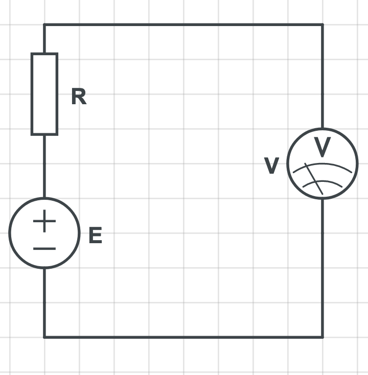

### Оценка погрешностей измерения
~~~ mermaid
graph
A[Погрешность измерений] --> B[Инструментальные]
A[Погрешность измерений] --> C[Методическая]
A[Погрешность измерений] --> D[Отсчитывания]
B[Инструментальные] --> E[Погрешность СИ осн, доп]
B[Инструментальные] --> F[Погрешность взаимодействия средства измерения с источником сигнала]
~~~

### Методическая погрешность
$\Delta_{м}$ - методическая абсолютная погрешность

### Погрешность отсчитывания
$\Delta_{отс}$ - абсолюная погрешность отсчитывания
На рисунке в сильно увеличенном виде показано одно деление шкалы, т.е. расстояние между соседними метками. Будем считать, что отсчёт делают с округлением до четверти деления (иногда до половины, иногда до целого деления, но это плохо). Например, сделан отсчёт 104,25 дел. Тогда можно считать, что при любом положении стрелки погрешность округления не выходит за пределы $\pm 0,125$ дел (расстояние от точечной линии до пунктирной). Тогда $\Delta_{отсч,п} = \pm0,125$с, где с - цена деления

Пример: У прибора класса 0,5 шкала имеет 150 делений. Следовательно, предельные значения основной приведённой погрешности $\gamma_{о,п} = \pm0,5$%, а предельные значения приведённой погрешности отсчитывания

$$\gamma_{отс,п}=\pm\dfrac{100*0,125}{150} = \pm 0,083$$

### Инструментальная
#### Погрешность СИ
#### Взаимодействия
$\Delta_{вз}$ - погрешность взаимодействия
Пример:

$$U_{v}=IR_{v}=\dfrac{E}{R+R_{v}}R_{v}$$
$$\Delta_{вз}=U_{v} - E=\dfrac{E}{R+R_{v}}R_{v}-E=-\dfrac{R}{R+R_{v}}E$$
Учтём что $R$ << $R_v$ -> $$\Delta_{вз}=-\dfrac{R}{R_v}E$$
$$\delta_{вз}=-\dfrac{R}{R_{v}}*100$$

Пусть R -> 0 Смещаем значения на оси. 

$\delta_{вз,макс}=0 \div \dfrac{R_{макс}}{R_{v}}*100$
После введение поправок:
$\eta = \pm 0,5\delta_{вз,макс} = -0,5\dfrac{R_{макс}}{R_{v}}*100$
И тогда:
$U_{v,исправ} = U_{v}\left[1 - \eta\dfrac{1}{100}\right]=U_{v}[1+\dfrac{0,5R_{макс}}{R_{v}}]$

>Стандарты: Может быть несколько резисторов. Если $R-> R_{ниж} \div R_{верх}$. Тогда $\eta = 0,5\sum\limits_{i = 1}^n(\Delta_{i,ниж} + \Delta_{i,верх})$
>Где $\Delta_{i,ниж}$ от $R_{ниж}$, а $\Delta_{i,верх}$ от $R_{верх}$

Погрешность для исправленного результата в 2 раза меньше:
$-0,5\dfrac{R_{макс}}{R_{v}} \ll \dfrac{\delta_{вз}}{100} \ll 0,5\dfrac{R_{макс}}{R_{v}}$
Обычно $R_{v} \gg R$ => $\dfrac{R}{R_{v}}$ -> 0
>Для приборов $\delta_{вз}$ малы

### Сложение погрешностей

$\Delta_{п}=\pm\sum\limits_{i=1}^4\Delta_{i}$
>4 погрешности: $\Delta_{осн},\Delta_{доп},\Delta_{отсч},\Delta_{вз}$

### Правила округления
1. Число, выражающее реузльтат измеренноого объекта должно оканчиваться цифрой того же разряда, что и предельное значение погрешности измерения. При этом лишнии цифры в целом числе заменить 0, а в десятичных дробях отбрасываются.
2. Если отбрасываемое число меньше 5, то предыдущий разряд ничего не меняет, если больше или равно 5, то предыдущий разряд увеличивается на 1.
   Пример:
	   $1,523$ при $\Delta = 0,10$ -> $1,52$
1. Числовое выражение $\delta_{i}$ должно содержать не более 2 знач цифр.
   Примеры:
	$\pm0,2571$->$\pm0,26$
	$\pm1,3578$->$\pm1,4$