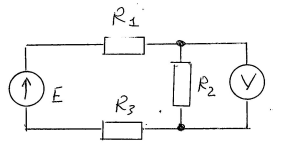
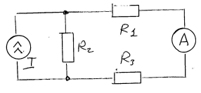

#### Погрешность линейности
$\Delta_{л}$ является нелинейной функцией измеряемой величины. Погрешнось линейности - это погрешность СИ, которая остается после исключения аддитивной и мультипликативной погрешности. Из-за того, что исключена аддитивная погрешность, график погрешности линейности проходит через начало координат. Из-за того, что сключена мультипликативная погрешность, погрешности линейности в точке $X_{k}$ равна нулю. 

При исключённых аддитивной и мультипликативной погрешностях, характеристика СИ, имеющего только погрешность линейности, выглядит следующим образом.

>Систематическую погрешность линейности возможно существенно уменьшить, проводя многоточечную калибровку.

### Статическая и динамическая погрешности
#### Статическая погрешность
$\Delta_{ст}$ - погрешность средства измерений при установившемся значении измеряемой величины, т.е. при скорости $\dfrac{dx}{dt} = 0$ и при закончившихся переходных процессах в самом СИ.
####  Динамическая погрешность
$\Delta_{дин}$ возникает:
1. Если в процессе измерения происходит изменение измеряемой величины $X$.
2. Пока показание СИ не достигает своего установившегося значения.
Пример: Ртутный термометр

У ртутного термометра постонная времени $\tau$ приблизительно составляет 0,5 минуты. При использовании ртутного термометра доминирующей составляющей погрешности измерения будет погрешность отсчитывания. Она равна 0,05 градуса.
Целесообразно, чтобы динамическая погрешность $\Delta t$ была существенно меньше, чем погрешность отсчитывания. Пусть $\Delta t$  ≤ 0,02 градуса. Решив экспоненциальное уравнение, получаем, что динамическая погрешность пренебрежимо мала при времени измерения не менее 3,5 минут. 
Итак, чтобы судить о точности измерений приходится принимать в расчет большое количество разнообразных (по форме выражения, характеру проявления, источникам возникновения) составляющих погрешности

### Задача №1.1
Доверительный интервал (интервал в котором находится значение измеряемой величины)

Измеренное значение сопротивления $R$ = 100,0 Ом. Предел допускаемой относительной погрешности измерения $\delta_{п} = 1,0$ %. Найти интервал, в котором должно находиться $R_{и}$ - истинное значение сопротивления.

#### Решение
1. $\Delta = R - R_{и}$; $R_{и}-\Delta$
2. $-\Delta_{п}\leq\Delta\leq\Delta_{п}$ $R -\Delta_{п}\leq R\leq R + Delta_{п}$
3. $\Delta_{п} = \dfrac{\delta_{п}R}{100} = 1,0$ Ом
Ответ: $99,0\leq R_{и}\leq101,0$

### Задача №1.2
Использование измеренного значения вместо истинного при вычислении относительной погрешности:

$\delta = \dfrac{\Delta}{X_{и}}$
$\delta'= \dfrac{\Delta}{X}$

При вычислении относительной погрешности δ часто пользуются приближенной формулой, при этом в знаменатель вместо истинного или действительного значения измеряемой величины подставляют измеренное значение. Полученное в результате такого расчета значение относительной погрешности $\delta'$ отличается от $\delta$ на «погрешность погрешности» $\delta_{погр}$:
$$\delta_{погр}=\dfrac{\delta'-\delta}{\delta}$$
Выразить: $\delta_{погр}$ через $\delta$
#### Решение
$X_{и}$ - это истинное значение
$X$ - измеренное значение

$\delta = \dfrac{\Delta}{X_{и}}$, $\delta' = \dfrac{\Delta}{X}$
$\delta_{погр} = \dfrac{\dfrac{\Delta}{X} - \dfrac{\Delta}{X_{и}}}{\dfrac{\Delta}{X_{и}}} = \dfrac{\dfrac{1}{X} - \dfrac{1}{X_{и}}}{\dfrac{1}{X_{и}}}\dfrac{X}{X} =\dfrac{1- \dfrac{\Delta}{X_{и}}}{\dfrac{\Delta}{X_{и}}}=\dfrac{1 - \dfrac{X_{и}+\Delta}{X_{и}}}{\dfrac{X_{и}+\Delta}{X_{и}}}=\dfrac{1-1-\dfrac{\Delta}{X_{и}}}{1 + \dfrac{\Delta}{X_{и}}} = -\dfrac{\delta}{1+\delta}$

Так как $\delta << 1$, то $\delta_{погр} = - \delta$

В результате анализа погрешностей мы находим предельное значение погрешности $\delta_{п}$. То есть мы не знаем конкретного значения  $\delta$, но со 100% вероятностью можем утверждать, что  $-\delta_{п}\leq\delta\leq\delta_{п}$
Например, предельное значение относительной погрешности, рассчитанное, как обычно, по формуле $\delta' = \dfrac{\Delta}{X} = 1$%, на самом деле лежит в диапазоне от 0,99% до 1,01%. То есть, загрублением оценки предельной погрешности явно можно пренебречь. Тем более, если речь идет о предельной погрешности 0,1%. В этом случае уточненное значение лежит в диапазоне от 0,0999% до 0,1001%.

### Задача №2.1
Погрешность взаимодействия
Определить интервал возможных значений погрешности взаимодействия для прибора, включенного в приведенную ниже схему, если известно, что: 
1. $R_{1} = 100$ Ом;
2. $R_{2} = 200$ Ом; 
3. $R_{3} = 100$Ом; 
4. $R_{v} \geq  10$ кОм; 
5. $U_{v} = 100$ В.

#### Решение
$\Delta_{вз} = -U\dfrac{R_{экв}}{R_{v}}$

Чтобы найти эквивалентное сопротивление нужно проделать следующий мысленный эксперимент: заменить источник э.д.с. E коротким замыканием, исключить вольтметр и рассчитать сопротивление схемы объекта между точками, куда подключается этот вольтметр.

$R_{экв}=\dfrac{R_{2}(R_{1}+R_{3})}{R_{2}+R_{1}+R_{3}}$
$R_{экв}=100$ Ом
$\Delta_{вз,пред}=-1$В

То есть, погрешность взаимодействия лежит в пределах от 0 до -1 В. В данной схеме при измерении вольтметр показал 100 В. 
**Вопрос:** каково было напряжение на сопротивлении $R_{2}$ до подключения вольтметра? 
**Ответ:** $\Delta_{вз}=U_{v}- U_{ист}$; $U_{ист}=U_{v}-\Delta_{вз}$
Значит напряжение на сопротивлении $R_{2}$до подключения вольтметра лежало в пределах от 100В до 101В

### Задача №2.2
Погрешность взаимодействия.

Определить интервал возможных значений погрешности взаимодействия для прибора, включенного в приведенную ниже схему, если известно, что: 
1. $R_{1} = 15$кОм
2. $R_{2} = 20$ кОм
3. $R_{3} = 10$ кОм
4. $R_{A} \leq 200$ Ом
5. $I_{A} = 500$ мкА.

$$\Delta_{вз}=-I_{A}\dfrac{R_{A}}{R_{экв}}$$
Чтобы найти эквивалентное сопротивление нужно проделать следующий мысленный эксперимент: заменить источник тока I разрывом,, исключить амперметр и рассчитать сопротивление схемы объекта между точками, куда подключается амперметр.

Получаем: $R_{экв}=R_{1}+R_{2}+R_{3}$; $\Delta_{вз,п}=-2,2$мкА

То есть, погрешность взаимодействия лежит в пределах от 0 до – 2,2 мкА. Значит ток в ветви до подключения амперметра находился в пределах от 500 мкА до 502,2 мкА.