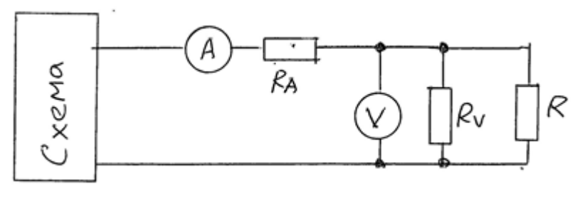

### Задача №7.1
#### Условие:
В некоторой схеме, работающей на постоянном токе, имеется резисто $R$. Требуется измерить мощность, выделяемую в этом резисторе, используя вольметр и амперметр. Погрешность взаимодействия принебречь.
####  Показание приборов:
$I=100$ mA
$U=1,00$ В
#### Решение:

С учетом входных сопротивлений

Пусть:
$R_{v}=1$ кОм
$R_{A}=0,05$ Ом
$P'= UI$
Найти: $P$ и погрешность по формуле $\delta=\dfrac{P'-P}{P}$
Из-за того, что подключили приборы - уменьшилась мощность резистора из-за взаимодейтсивя. По условию надо найти мощность после поделючения приборов.

$P = UI_{R}$
$I_{R} = I-\dfrac{U}{R_{v}}$
Тогда:
$\delta=\dfrac{P'-P}{P}=\dfrac{UI-UI+\dfrac{U^2}{R_{v}}}{UI-\dfrac{U^2}{R_{v}}}=\dfrac{\dfrac{U}{R_{v}}}{I-\dfrac{U}{R}}=1,0$%

### Задача №7.2
#### Условие
А если амперметр включить между вольтметром и нагрузкой, то какова будет погрешность $\delta$?
#### Решение
$P=U_{R}I$
$U_{R}=U-IR_{A}$
$P=UI-I^2R_{A}$
Тогда:
$\delta=\dfrac{P'-P}{P}=\dfrac{UI-UI+I^2R_{A}}{UI-I^2R_{A}}=\dfrac{IR_{A}}{U-IR_{A}}=0,5$%

Уменьшили погрешность прибора, путем перестановки элементов

# Метрологические характеристики средств измерений

>Метрологическая характеристика - описание свойства средства измерений, позволяющее определить значение величины или оценить погрешность измерений.

Для каждого средства измерений определяется **комлпекс нормируемых метрологических характеристик (НМХ)**, необходимый и достаточный для достижения следующих целей:
- Выбор средства измерений при подготовке к решеню имеющийся измерительной задачи
- В процессе измерения - определение значения измеряемой величины и оценка погрешности выполненного измерения.

Кроме того комплекс НМХ используется при поверке средства измерений.

>Повершка средства измерений - определение действительных значений НМХ и сравнение их с нормальными занчениями, указанымми в паспорте этого средства измерений.

Поверка выполняется при 
- выпуске в эксплуатацию нового или отремонтированного средства измерений
- по истечении определённого периода его эксплуатации (межповерочного интервала)

### Характеристики предназначенные для определения физической величины

1. Мера - номинальное значение  выходной величины $y_{н}$
	1. Набор гирек
	2. Нормальный элемент насыщенный: 1,018 В
	3. Шунт: 0,0100 Ом
2. Измерительные преобразователи - номинальная функция преобразования  $y = f_{н}(x)$
	1. Термопреобразователь сопротивления:
	   $R_{t_{ном}}=(1 + 0,00428t)100$
	2. Термопара - коэффициент преобразования: $S = 40\dfrac{мкВ}{град}$
	3.  Измерительный трасформатор тока - коэффициент трансформации $\dfrac{600}{5}$. Входной номинальный ток 600 А, выходной ток номинальный 5 А.
3. Аналоговый измерительный прибор
	1. Цена деления, например, вольметра: $C_{v}=\dfrac{U_{k}}{\alpha_{k}}$
	   > $U_{k}$ -  конечное напряжение
	      > $\alpha_{k}$ - конечное количество значений делений
4. Цифровой измерительный прибор - измеренная величина всметс с размерон тью отображается на отсчётном устройстве.

###  Характеристики погрешностией
1.   Пределы допускаемой основной погрешности и соотвествующие нормальные области влияющих величин
2. Пределы допускаемых дополниельных погрешностей и соотвествующие рабочие области влиябщих величин

### Динамические характеристики
1. Время измерения (у ртутного медицинского термометра - более трёх минут)
2. Измерение концеетрации вещества (несколько минут)
3. Быстродействующие приборы (количество измерений в единицу времени)

### Характеристики взаимодействия
1. По входу (для измерительных преобразователей и приборов) - например, входное сопротивление, входная ёмкость.
2. По выходу (для измерительных преобразователей и мер) - например, выходное сопротивление

### Неинформационные параметры выходного сигнала
Для измерительных преобразователей и мер. Например, амплитуда импульсов выходного напряжения измерительного преобразователя, преобразующего некоторую физическую величину в частоту следования импульсов.
