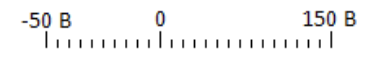
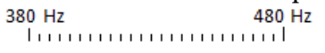
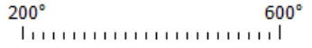
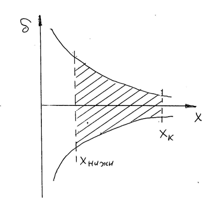
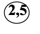
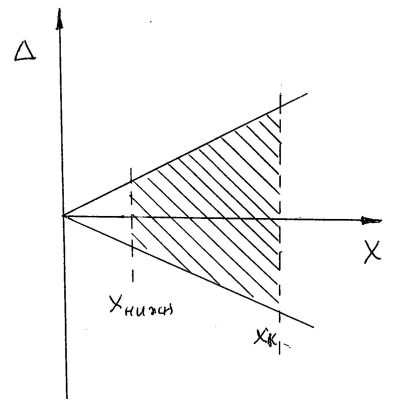
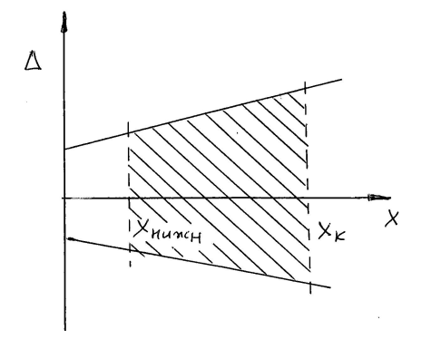
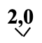
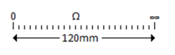

### Обозначение классов точности
**Класс тчности средства измерений** - обобщённая характеристика, определяемая пределами допускаемых основной и дополнительной погрешностей (и,возможно, другими свойствами средства измерений, влияющими на точность).

#### Первый способ
Аналогивые измерительные приборы.
**1.0** - число, равное пределу допускаемой основной приведённой погрешности, выраженной в процентах.
$\gamma_{о.п.} = \dfrac{\Delta_{о.п.}}{X_{н}}100\%$
>$X_{н}$ - нормирующее значение

**Нормирующее значение:**
1. 
   Диапозон показаний: 0 - 60 В;
   Диапозон измерений 30 - 60 В;
   Нормирующее значение: 60 В;
2. 
   Нормирующее значение: 150 В
3. 
   Нормирующее значение: 430 Hz
4. 
   Нормирующее значение: 400 C$\degree$

**Вывод**: в случае, когда шкала аналогового прибора ограничена нулевым и конечным значениями, нормирующее значение совпадает с конечным значением, в остальных случаях нормирующее значение следует уточнить в паспорте прибора.

>Рассматриваемое обозначение класса точности используется для тех приборов, погрешность которых носит, преимущественно, аддитивный характер, так как $\Delta_{о.п.}=\gamma_{о.п.}X_{н}$
>$\gamma_{о.п.}$ - константа
>$\Delta_{о.п.}$ - не зависит от измеряемой величины, а это свойство аддитивной погрешности

Класс точности указывает на предельную (например, основную) погрешность. Реальная погрешность прибора не должна превышать предельную.
$$-\delta_{о.п.}\leq\delta\leq\delta_{о.п.}$$

**Вывод:** при таком нормировании, погрешность прибора, скорее всего, имеет аддитивный характер и находится в диапозоне, показанным выше.

#### Второй способ
Аналогивые измерительные приборы.

Число, равное пределу допускаемой основной относительной погрешности, выраженной в процентах.
$$\delta_{о.п.}=\dfrac{\Delta_{о.п.}}{X}100\%$$
>$X$ -измеренное значение

>Это обозначение класса точности используется для тех приборов, погрешность которых носит, преимущественно, мультипликативный характер.

Реальная погрешность прибора не должна превышать предельную.
$$-\Delta_{о.п.}\leq\Delta\leq\Delta_{о.п.}$$

Если погрешность прибора описывается с помощью предельной мультипликативной погрешности, то приходится ограничивать снизу диапазон измерения прибора, так как при малых $X$ абсолютная погрешность $\Delta$ стремится к нулю (что у реальных СИ не может присутствовать).

#### Третий способ
Используется для цифровых приборов

**0,2/0,1** - два числа, равные выраженным в процентах коэффициентам $с$ и $d$.

$$\delta_{о.п.}=[c+d(|\dfrac{X_{к}}{X}|-1)]\%$$

$$\Delta_{о.п} = cX+dX_{k}-dX=(c-d)X+dX_{k}$$
>Основная предельная погрешность, заданная таким способом хорошо описывает ситуацию, когда присутствует все составляющие погрешности (и аддитивная и мультипликативная и погрешность линейности).

$$-\Delta_{о.п}\leq\Delta\leq\Delta_{о.п}$$

#### Четвёртый способ
Зарубежные цифровые приборы. 
Предел основной абсолютной погрешности задаётся следующим образом:
$$\Delta_{о.п}=aX+bq$$
>$a$(дробное),$b$(целое) - коэффициенты
>$X$ - измеренное значение
>$q$ - единица младшенго разряда в показании цифрового прибора (квант)

**Пример:** $\Delta_{о.п.}=0,01U+4q$. Показание вольтметра U=1,234 В
Тогда предел основной абсолютной погрешности вольтметра равен:
 $\Delta_{о.п.}$ = 0,01·1,234 В + 4 · 0,001 В = 0.01234 В + 0,004 В = 0, 01274 В ≈ 0,013В
#### Пятый способ
Аналогивые приборы с существенно неравномерной шкалой

Число, равное пределу допускаемой основной приведённой погрешности, выраженной в процентах , при этом подстрочный знак «галочка» указывает на то, что в качестве нормирующего значения используется длина шкалы, представленная в единицах длины.

**Пример:**

$\gamma_{о.п.}=\dfrac{\Delta_{о.п.}}{X_{н}}100\%$
>$X_{н}$ - нормирующее значение

Дано: $\gamma_{о.п.}$ = 2.0% $X_{н}$=120мм
Поэтому: $\Delta_{о.п}=\gamma_{о.п.}X_{н}=0,02\cdot120$ мм = 2,4 мм

#### Задача
**Условие:**
Имеется два вольтметра: первый с классом точности 0,15 и диапазоном показаний (0 – 100 В) и второй с классом точности 0,25/0,1 и диапазоном показаний (0 – 100 В). 
**Вопрос:**
Каким вольтметром можно точнее измерить напряжение 50 В при нормальных условиях?
**Решение:**
1. $\gamma_{о.п.}=0,15\%$;  
   $\Delta_{о.п.}=\gamma_{о.п.}\cdot X_{н}=0,0015\cdot100=0,15$ В
2. $\delta_{о.п.} = (0,25+0,1[\dfrac{100}{50}-1])=0,35\%$
   $\Delta_{о.п.} =\dfrac{\delta_{о.п.}U}{100\%}=\dfrac{0.35\%\cdot 50 В}{100\%}=0,18$ В

**Вопрос:**
А каким вольтметром можно точнее измерить напряжение 20 В при нормальных условиях?
**Решение:**
1. $\gamma_{о.п.}=0,15\%$;  
   $\Delta_{о.п.}=\gamma_{о.п.}\cdot X_{н}=0,0015\cdot100=0,15$ В
2. $\delta_{о.п.} = (0,25+0,1[\dfrac{100}{20}-1])=0,65\%$
   $\Delta_{о.п.} =\dfrac{\delta_{о.п.}U}{100\%}=\dfrac{0.65\%\cdot 20 В}{100\%}=0,13$ В