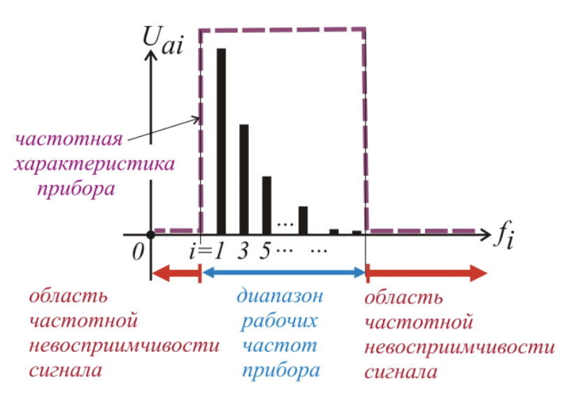
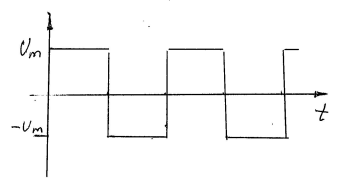

Вывод: любое периодическое напряжение можно описать набором амплитуд гармоник (спектр амплитуд) и набором фаз этих гармоник (спектр фаз).

$$U = \sqrt{U_{0}^{2}+U_{1}^{2}+...+U_{n}^{2}}$$

> $U_{0} , U_{1} , U_{2}, U_{n}$ - СКЗ, соответственно, нулевой, первой, второй и т.д. гармоник. То есть на СКЗ сигнала не влияют фазы гармоник, а важны только их амплитуды.

==Проблема: измеряемое напряжение имеет набор гармоник, но прибор имеет ограниченный рабочий диапазон частот.==

**Ограничение 2:** часть спектра измеряемого напряжения, вносящая существенный вклад в СКЗ, должна укладываться в рабочий диапазон частот вольтметра.

**Пример:**
Напряжение, имеющее форму **меандра**, которое мы уже анализировали с точки зрения коэффициента формы.

Напряжение имеет первую гармонику с амплитудой = $\dfrac{4u_{m}}{\pi}$
Напряжение имеет третью гармонику с амплитудой = $\dfrac{4u_{m}}{\pi}\dfrac{1}{3}$
Напряжение имеет пятую гармонику с амплитудой = $\dfrac{4u_{m}}{\pi}\dfrac{1}{5}$

СКЗ напряжения, ограниченного девятой гармоникой равно:

$$U=\sqrt{(\dfrac{4u_{m}}{\pi\sqrt{2}})^{2}+(\dfrac{4u_{m}}{\pi\sqrt{2}}\dfrac{1}{3})^{2}+...(\dfrac{4u_{m}}{\pi\sqrt{2}}\dfrac{1}{9})^{2}} = \dfrac{4U_{m}}{\pi\sqrt{2}}\sqrt{1+(\dfrac{1}{3})^{2}+...+(\dfrac{1}{9})^{2}} = 0,98U_{m}$$

СКЗ напряжения, ограниченного девятнадцатой гармоникой равно:
$$U = \dfrac{4U_{m}}{\pi\sqrt{2}}\sqrt{1+(\dfrac{1}{3})^{2}+...+(\dfrac{1}{19})^{2}} = 0,99U_{m}$$

==Из-за чего возникает ограничение рабочего диапазона частот вольтметра?== 
> Из-за того, что амплитуды гармоник высокочастотной части спектра напряжения, проходя через входной делитель, усилитель и преобразователь СКЗ, искажаются, и возникает частотная погрешность вольтметра, неудовлетворительно большая за пределами рабочего диапазона частот. Но если несколько искажаются гармоники, суммарный вклад которых в СКЗ сигнала не превыщает 1%, то такой погрешностью от погрешности явно можно пренебречь. Вывод: напряжение, имеющее форму меандра, может быть измерено вольтметром, если его частота не превышает 1/20 от верхней границы рабочего диапазона частот вольтметра

Предназначен для измерения среднеквадратического значения напряжения переменного тока произвольной формы со спектром частот в диапазоне от 5 Гц до 5 МГц

**Метрологические характеристики**

| Характеристики                         | Значение                                                |
| -------------------------------------- | ------------------------------------------------------- |
|                                        | 0,03/0,1/0,3/1/3/10/30/100/ 300 мВ; 1/3/10/30/100/300 В |
| Класс точности                         | 1,0 (на пределах мВ) 2,5 (на пределах В)                |
| Диапазон нормальных значений частот    | ($5...5*10^{6}$) Гц                                     |
| Коэффициент амплитуды, не более        | $$6\sqrt{\dfrac{U_{k}}{U}}$$                            |
| Диапазон рабочих значений температур   | (+5 ... + 40) $\degree$C                                |
| Входное сопротивление $R_{v}$ не менее | 1 МОм                                                   |
| Входная ёмкость, $C_{v}$, макс         | 20пФ                                                    | 

**Задача.** 
Микровольтметром В3-57 измеряют переменное напряжение, имеющее ориентировочно следующие параметры: 
1. СКЗ U ≈ 200мВ, 
2. Коэффициент амплитуды Ка ≈ 8, 
3. Частота f ≈ 1 кГц. 
4. Отсчет по шкале производят с округлением до 0,5 деления.
5. Выходное сопротивление источника сигнала R не превышает 10 кОм. 

Оценить погрешность измерения с доверительной вероятностью P = 1.

**Решение**
$$\Delta_{п} = \Delta_{о.п} + \Delta_{отс.п} + \Delta_{вз.п} $$
1. Спектр измеряемого напряжения и рабочий диапазон частот. Частота сигнала – 1 кГц, значит в диапазон нормальных значений частот укладываются гармоники вплоть до 5 МГц / 1 кГц = 5000. Встречающиеся на практике сигналы, имеют пренебрежимо малое СКЗ гармоник выше 5000-ной.
2. Измерения напряжения 200 мВ естественно проводить на пределе 300 мВ, но надо проверить условие по коэффициенту амплитуды.
   $$6\sqrt{\dfrac{U_{k}}{U}} = 6\sqrt{\dfrac{300мВ}{200мВ}}= 7,3 $$
   >То есть из-за ограничения по коэффициенту амплитуды придется проводить измерение на соседнем старшем пределе.
3. Тогда основная предельная абсолютная погрешность равна: 
	$$\Delta_{о.п}= \gamma · U_{к} = 0,025 · 1 В = 25 мВ$$
4. Из фотографии прибора видно, что при измерении на пределе 1 В округление до половины деления означает округление до 5 мВ. Поэтому: 
   $$\Delta_{отс.п} = 0,5 · 5 мВ = 2,5 мВ$$
5. Предельное значение погрешности взаимодействия при измерении переменного напряжения рассчитывается по формуле:
   $$\Delta_{вз.п} = U[\dfrac{R}{R_{v}}+0,5(2\pi fRC_{v})^{2]}=200мВ[0,01 + 0,8*10^{-6}]=2мВ$$
6. Результат измерения: $U = (200 \pm 30) мВ$ P = 1 