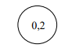

# Вопросы экзаменационных билетов по дисциплине “Метрология, Стандартизация и Сертификация". А-20 

- [x] 1.Понятия физической величины, единицы физической величины. Измерения, средства измерений. Понятия точности измерений, абсолютной и относительной погрешностей измерений. Доверительный интервал и доверительная вероятность.
- [x] 2.Средства измерений: меры, измерительные преобразователи, измерительные приборы, измерительно – вычислительные системы и комплексы. 
- [x] 3.Классификация погрешностей измерений. Погрешности: абсолютная и относительная, систематическая и случайная, методическая, инструментальная, взаимодействия, отсчитывания. 
- [x] 4.Погрешности средств измерений (составляющие инструментальной погрешности). Абсолютная и относительная погрешность меры. Погрешности измерительного преобразователя по входу и по выходу. Абсолютная, относительная и приведенная погрешности измерительного прибора.
- [x] 5.Погрешности средств измерений (составляющие инструментальной погрешности). Влияющие величины: неинформативные параметры входного сигнала и свойства окружающей среды. Нормальные и рабочие условия.
- [x] 6.Погрешности средств измерений (составляющие инструментальной погрешности). Погрешности: аддитивная, мультипликативная, линейности. Статическая и динамическая погрешности. 
- [x] 7.Нормируемые метрологические характеристики средств измерений: номинальное значение меры, номинальная функция преобразования измерительного преобразователя, цена деления шкалы и цена единицы наименьшего разряда, основная и дополнительная погрешность.
- [x] 8.Понятие класса точности средств измерений. Обозначения классов точности.
- [x] 9.Оценивание погрешности прямых измерения. Учет погрешностей (основной, дополнительной, взаимодействия, отсчитывания, методической) методом наихудшего случая. Достоинства и недостатки метода.
- [x] 10.Оценивание погрешности прямых измерения. Учет погрешностей (основной, дополнительной, взаимодействия, отсчитывания, методической) методом статистического суммирования. Условия применимости метода. Доверительный интервал и доверительная вероятность.
- [x] 11.Оценивание погрешности косвенных измерений. Метод наихудшего случая и метод статистического суммирования. Достоинства и недостатки.
- [x] 12.Аналоговые и цифровые измеительные приборы. Особенности. Магнитоэлектрический измерительный механизм. Функция преобразования. Свойства.
- [x] 13.Аналоговый электронный вольтметр переменного напряжения с преобразователем средневыпрямленного значения. Структурная схема. Средневыпрямленное и среднеквадратическое значения периодического сигнала. Коэффициент формы синусоидального напряжения и меандра. Основные метрологические характеристики.
- [x] 14.Аналоговый электронный вольтметр переменного напряжения с преобразователем среднеквадратического значения. Структурная схема. Среднеквадратическое значения периодического сигнала. Коэффициент амплитуды. Спектр измеряемого сигнала и требование к его ограничению. Основные метрологические характеристики. 
- [x] 15.Цифровые измерительные устройства. Основное отличие цифрового измерительного устройства от аналогового. Квантование и дискретизация. 
- [x] 16.Идеальный аналого-цифровой преобразователь. Функция преобразования и ее аналитическое выражение. Связь диапазона входных значений, разрядности АЦП и ступени квантования. Погрешность квантования. Связь разрядности АЦП и погрешности квантования. Основные метрологические характеристики АЦП.
- [x] 17.АЦП прямого преобразования. Структурная схема. Принцип работы. Основные метрологические характеристики.
- [x] 18.АЦП последовательного приближения. Структурная схема. Принцип работы. Основные метрологические характеристики.
- [x] 19.Идеальный цифро-аналоговый преобразователь. Функция преобразования. Связь диапазона выходной величины ЦАП, разрядности и ступени квантования. Основные метрологические характеристики ЦАП.
- [x] 20.Измерение сопротивления методом амперметра и вольтметра. Влияние входных сопротивлений амперметра и вольтметра. Измерение сопротивление омметром: методическая погрешность при двухпроводном подключении измеряемого резистора. Четырехпроводное подключение резистора. Разъем Кельвина.
- [x] 21.Токовые измерительные шунты. Класс точности шунта. Исключение влияния сопротивления проводов и контактных сопротивлений при использовании четырехзажимных резисторов.
- [x] 22.Аналоговые осциллографы. Обобщённая схема. Назначение основных узлов. (л.р. «Осциллографы и их применение»).
- [x] 23.Устройство и работа электронно-лучевой трубки (л.р. «Осциллографы и их применение»).
- [x] 24.Режимы развёртки в осциллографе. Синхронизация (л.р. «Осциллографы и их применение»).
- [x] 25.Измерение напряжений с помощью осциллографа (л.р. «Осциллографы и их применение»).
- [x] 26.Измерение временных интервалов с помощью осциллографа (л.р. «Осциллографы и их применение»).
- [x] 27.Методы измерения частоты с помощью осциллографа (л.р. «Осциллографы и их применение»).
- [x] 28.Цифровой частотомер, работающий в режиме измерения частоты (л.р. «Измерение частоты и интервалов времени»).
- [x] 29.Цифровой частотомер, работающий в режиме измерения периода (л.р. «Измерение частоты и интервалов времени»).

# Ответы

## 1.Понятия физической величины, единицы физической величины. Измерения, средства измерений. Понятия точности измерений, абсолютной и относительной погрешностей измерений. Доверительный интервал и доверительная вероятность.

**Физическая величина (ФВ)** - свойство материального объекта, между объектами присуще многим объектам, но индивидуально для каждого объекта.

Физические величины могут быть: 
1. механические – сила, давление, … 
2. пространства и времени – длина, время, скорость,… 
3. тепловые – температура, теплоёмкость, теплопроводность, … 
4. электрические – ток, напряжение, мощность, сопротивление, …  
5. световые – сила света, световой поток, освещённость, … 
6. акустические – скорость звука, звуковое давление, …

Электрические величины в свою очередь можно разделить на: 
1. активные – ток, напряжение, э.д.с., мощность и др.;
2. пассивные (параметрические) – сопротивление, ёмкость, индуктивность, взаимная индуктивность и др. 

Кроме того, есть некоторые величины, неразрывно связанные с электрическими – частота, период, фазовый сдвиг. 
Под электрическими измерениями понимают: 
1. Измерения электрических величин;
2. Измерения временных величин, связанных с электрическими (обычно активными);
3. Измерение неэлектрических величин, преобразованных в электрические, например, измерение температуры с помощью термопары. 
>Термопара – пример измерительного преобразователя. Его нельзя отнести ни к мерам, ни к измерительным приборам.

**Единицы ФВ** - ФВ, которым по определнию присвоено значение равное 1.Как любая система единиц, она содержит несколько независимых основных единиц: 
1. Единица длины – метр (м); 
2. Единица массы – килограмм (кг); 
3. Единица времени – секунда (с); 
4. Единица силы электрического тока – ампер (А); 
5. Единица термодинамической температуры – кельвин (К); 
6. Единица силы света – кандела (кд); 
7. Единица количества вещества – моль (моль)

Остальные - *проивзодные единицы*. Они образуются из основных на основе фундаметнльных физических законов.

Кратные и дольные единицы ФВ

| $10^{-12}$ | $10^{-9}$ | $10^{-6}$ | $10^{-3}$ | 1   | $10^{3}$ | $10^{6}$ | $10^{9}$ | $10^{12}$ |
| ---------- | --------- | --------- | --------- | --- | -------- | -------- | -------- | --------- |
| **п**      | **н**     | **мк**    | **м**     |     | **К**    | **М**    | **Г**    | **Т**     |
| **p**      | **n**     | **$\mu$** | **m**     |     | **K**    | **M**    | **G**    | **T**     |
| пико       | нано      | **микро** | **мили**  |     | **кило** | **мега** | **гига** | **тера**      |

**Измерение** – это процесс нахождения значения физической величины опытным путём с помощью специальных технических средств.
>Измерение всегда сравнение с единицей 

**Измерить** какую-либо физическую величину - это узнать, сколько в  ней содержится единиц. 
**Результат** измерения - это именованное число, например: 5,83 мкА.
**Средства измерния (СИ)** - технические средства, предназначенные для проведения измерний и имеющим метрологические характеристики (точность).
**Точность измерений** - качество средства измерения, отражающее близость к нулю погрешности.
**Погрешность** - отклонение результата измерения от истинного значения

### Абсолютная погрешность

Абсолютная погрешность $\Delta = |X - X_{ист}|$
>$X$ - результат измерения
> $X_{ист}$ - истинное значение измеряной величины. Могут вместо источника использовать действительное значение. Действительное значение - достаточно близкое к $X_{ист}$. Обозначение $X_д$

### Относительная погрешность
Относительная погрешность измерения $\delta = \dfrac{\Delta}{X_{д}}$

>Погрешность - измеренное минус действительное

**Доверительный интервал** - интервал, в котором находится истинное значение при определённой вероятности.
**Доверительная вероятность** - вероятность, с которой истинное значение лежит на данном интервале.
$$x-\Delta_{гр}\leq x_{ист}\leq x+\Delta_{гр}$$

#### Среднее квадратическое отклонение σ

---

## 2.Средства измерений: меры, измерительные преобразователи, измерительные приборы, измерительно – вычислительные системы и комплексы. 

**Средство измерения**(СИ) - техническое средство предназначенное для проведения измерения и имеющие метрологические характеристики (точность).

**Меры** воспроизводят физическую величину заданного значения. Они бывают однозначные (например, резистор с сопротивлением 10 Ом) и многозначные (линейка, магазин сопротивлений, магазин ёмкостей)

**Измерительные преобразователи** преобразуют сигналы измерительной информаци в форму, более удобнную для дальнейшнего использования  
Примеры:

1.  Термопара преобразует температуру в термо-э.д.с.
   
2.  Измерительный усилитель преобразует меньшее напряжение в большее
3.  Измерительный трансформатор тока преобразует больший переменный ток в меньший
4. АЦП
   
5. ЦАП
   

**Измерительные приборы** преобразуют сигналы измерительной информации в форму, доступную для восприятия человеком. 

> $\alpha$ - цена деления

Меры, измерительные преобразователи и измерительные приборы – это элементарные средства измерения. С добавлением средств вычислений образуются более сложные: измерительно-вычислительные системы и комплексы

**Измерительно-вычислительный комплекс** – это совокупность функционально связанных устройств, обеспечивающих: 
1. Измерение
2. Сбор 
3. Вычислительную обработку
4. Распределение измерительной информации в системах управления производственными процессами и объектами

---

## 3.Классификация погрешностей измерений. Погрешности: абсолютная и относительная, систематическая и случайная, методическая, инструментальная, взаимодействия, отсчитывания. 

### По форме выражения
1. Абсолютная погрешность$\Delta = X_{измеренная} - X_{истинная}$ 
2. Относительная погрешность $\delta = \dfrac{\Delta}{X_{истинная}} = \dfrac{\Delta}{X_{измереннеая}}$

### По характеру проявления
1. **Систематическая погрешность** - это погрешность повторяется при повторении измерений. Чтобы повысить точность надо определить эту погрешность и скорректировать значения, а именно, прибавить к нему поправку.
   Пример: мера массы (набор гирь = 1000 грамм, на самом деле 990 грамм). Каждый раз будет погрешность 10 грамм.
   Более сложная погрешность - это функция измеряемой величины. 
   >Пример: Если значение функции увеличивается погрешность увеличивается.
   >С помощью систематическое погрешности можно сделать калибровку.
   >$\Delta_{сист(эксперим)} = X_{измер(калибр)} - X_{действи(калибр)}$
   >$X_{изм} = X_{ист} + \Delta_{сист}$
   >$X_{скорректив} = X_{ист} - \Delta_{сист} = X_{ист}+ \Delta_{сист} - \Delta_{сист(эксперим)} = X_{ист}$
2. **Случайная погрешность** - погрешность, которая в разные моменты времени принимает разные величины. Погрешность является случайной величиной.
   
   Каждый раз будет величиная оличается:
   $U_{i}= U_{ист} + \Delta_i$
   $\dfrac{1}{N}\sum\limits_{i=1}^{N}Ui=\dfrac{1}{N}\sum\limits_{i=1}^{N}U_{ист}+\dfrac{1}{N}\sum\limits_{i=1}^{N}\Delta_i$
   При этом:$\dfrac{1}{N}\sum\limits_{i=1}^{N}\Delta_i$ -> 0. При большом количестве измерений.
   Метод уменьшения случайной погрешность - сделать большое количество измерений и найти среднеарифметическое измерений. При коллибровке надо провести 100 измерений чтобы избавиться от сулчайной погрешности.
3. **Грубая погрешность** - погрешность, которая изменяется по неизвестному закону. Отличается тем, что ее значение существенно, на порядок и более превышает по модулю ожидаемое максимальное возомжное значение погрешности выполняемых измернений.

### По причине возникновения
1. **Погрешность взаимодействия** - возникает при подключении СИ, которое изменяет измеряемую величину.
	  1. Вольтметр:
      
	   $U_{v}=E\frac{R_{v}}{R_{экв}+R_{v}}$
	   $E=U_{v}\frac{R_{экв}+R_{v}}{R_{v}}$
	   $\Delta_{вз}=U_{v}-E=E\frac{R_{v}}{R_{экв}+R_{v}}-E=-E\frac{R_{v}}{R_{экв}+R_{v}}=-U_{v}\frac{R_{экв}}{R_{v}}$
	   $$\Delta_{вз}=-U_{v}\frac{R_{экв}}{R_{v}}$$
	  2. Амперметр:
	     
	     **До**: $I=\frac{E}{R_{экв}}$
	     **После:** $I_{A}=\frac{E}{R_{экв}+R_{A}}$
	     $\Delta_{вз}=I_{A}-I=\frac{E}{R_{экв}+R_{A}}-\frac{E}{R_{экв}}=-E\frac{R_{A}}{R_{экв}(R_{экв}+R_{A})}=-I_{A}\frac{R_{a}}{R_{экв}}$
	     $$\Delta_{вз}=-I_{A}\frac{R_{A}}{R_{экв}}$$
	 3. Измерение напряжение синусоидального тока
	   
	   $$\Delta_{вз}=-U_{v}(\frac{R_{экв}}{R_{v}}+0,5(2\pi f R_{экв}C_{v})^2)$$
	4. Замечачния
	   1. Как найти $R_{экв}$:
		- Выкинуть все источники сигнала (источники ЭДС, истчоники тока)
		- Исключаем измерительный прибор
		- Рассчитываем сопротивлние между двумя точками, куда подключаем прибор. Это и будет $R_{экв}$.
	    2. Как эксприментально найти выходное сопротивление схемы
		- Подключить сопротивление $R$
		- Подключить к этому сопротивлению вольметр $V$
		   
		   $$U_{1}=\dfrac{ER_{1}}{R_{экв}+R1}$$
		   $$U_{2}=\dfrac{ER_{2}}{R_{экв}+R2}$$
		   $$\dfrac{U_{1}}{U_{2}}=\dfrac{R_{1}(R_{экв}+R_{2})}{R_{2}(R_{экв}+R_{1})}$$
 
2. **Погрешность методическая** - возникает из-за неточности математической модели, которая поставлена в соответствии методу измерений, и связывает измеренное и истинное значение измеряемой величины.
   1. Пример 1: Весы, на которых весит 2 груза. Срвнение масс, так как на весах сравниваются не массы, а силы тяжести и измерение осуществляется в воздушной среде, то модель не точка, так как не учитываются действия силы Архимеда.
      
      - $m_{арб}$- масса арбуза
      - $m_{гир}$ - масса гирек
      - $m_{возд_гир}$ - масса воздуха, вытесненная гирьками
      - $m_{возд_арб}$ - масса воздуха, вытесненная арбузом
      Тогда формула:
	   1. $m_{арб}g - m_{возд_арб}g=m_{гир}g-m_{возд_гир}g$
	   2. $\Delta_M = m_{гир} - m_{арб} =  m_{возд_гир} - m_{возд_арб}$
	   3. $\delta_M=\dfrac{\Delta_M}{m_{арб}} = \dfrac{m_{возд_гир} - m_{возд_арб}}{m_{арб}} = \dfrac{-m_{возд_арб}}{m_{арб}} = \dfrac{-\rho_{возд}}{\rho_{арб}}$
	      Так как масса воздуха, вытесненная гирьками, гораздо меньше массы воздуха, вытесненного арбузом
	    4. $\rho_{возд}=1,22\dfrac{кг}{м^3}$
	       $\rho_{арб}=1000\frac{кг}{м^3}$
	       Тогда: $\delta_{M}=-0,0012=0,12\%$
   2. Пример 2: Весы на принципе динамометра
       
       Показания весов $N=mg$
       На экваторе: $g=9,78\dfrac{м}{с^2}$
       На полюсах: $g=9,83\dfrac{м}{с^2}$
       Относительная разница $g$: $\delta=\dfrac{9,83-9,78}{9,8}=0,5\%$
       Если нужна более высокая точность, то требуется исключить методическую погрешность – провести калибровку (с помощью соответствующей гирьки – меры массы)
3. **Погрешность инструментальная** - определяется свойствами средства измерения. Задаётся классом точности измерительного прибора.
4. **Погрешность отсчитывания** - возникает вследствие неточности снятия показаний (отсчитывания) и имеет смысл только при сипользовании аналоговых измерительных приборов.
   
   $$\Delta_{отс}=40-x$$
   Очевидно, что: $$\Delta_{отс,пред}(\alpha)=0,5q$$
   >$q=\dfrac{U_{k}}{\alpha_{k}}$
   >$\alpha_{k}$ - количество делений шкалы
   >$U_{k}$ - конечное значение напряжения

	Пример: Пусть используется вольтметр, имеющий шкалу от 0 до 100 делений и диапазон показаний 0 – 300 вольт. Какова погрешность отсчитывания, если отсчет производится с округлением до 0,5 деления?
	$U_{k}$ = 300 В
	$\alpha_{k}$ = 100 дел
	$C_{v}=\dfrac{U_{k}}{\alpha_{k}}=3\dfrac{В}{дел}$ - цена деления
	$\Delta_{отс,пред}(\alpha)=0,5q=0,5 * 0,5 = 0,25$ дел
	$\Delta_{отс,пред}(U) = \Delta_{отс,пред}(\alpha) * C_{v}=0,75 В$

### Симметрирование погрешности взаимодействия
Пример:
Дано:
$R_{экв}=1,0кОм, R_{v}=(200\pm50)кОм,U_{v}=10,000 В$
Тогда:
1. $\Delta_{вз,max}=-U_{V}\dfrac{R_{экв}}{R_{V,min}}=-10,000\dfrac{1000 Ом}{150000 Ом}=-0,06667$
2. $\Delta_{вз,min}=-U_{V}\dfrac{R_{экв}}{R_{V,max}}=-10,000\dfrac{1000 Ом}{250000 Ом}=-0,0400$

$\Delta_{вз}=U_{v}-U_{ист}$ => $U_{ист}=U_{v}-\Delta_{вз}$
$U_{ист,1}=U_{v}-\Delta_{вз,max} = 10,000 - (0,0667) = 10,0667$
$U_{ист,1}=U_{v}-\Delta_{вз,min} = 10,000 - (0,0400) = 10,0400$

$$U_{скор}=U_{v}+\eta=\dfrac{U_{ист,1}+U_{ист,2}}{2}=\dfrac{(U_{v}-\Delta_{вз,max})+(U_{v}-\Delta_{вз,min})}{2}=U_{v}-\dfrac{\Delta_{вз,max}+\Delta_{вз,min}}{2} = 10,05334$$

>$$\eta=-\dfrac{\Delta_{вз,max}+\Delta_{вз,min}}{2}$$

$$\Delta{вз, половина}=\dfrac{U_{ист,1}-U_{ист,2}}{2}=\dfrac{(U_{v}-\Delta_{вз,max})-(U_{v}-\Delta_{вз,min})}{2}=U_{v}-\dfrac{\Delta_{вз,min}-\Delta_{вз,max}}{2} = 0,01334$$

Погрешность уменьшилась в 5 раз по сравнению с 0,06667

>$$\Delta_{вз,п}=\dfrac{\Delta_{вз,min}-\Delta_{вз,max}}{2}$$

---

## 4.Погрешности средств измерений (составляющие инструментальной погрешности). Абсолютная и относительная погрешность меры. Погрешности измерительного преобразователя по входу и по выходу. Абсолютная, относительная и приведенная погрешности измерительного прибора.

### Погрешность меры

$\Delta = y_{ном}-y_{ист}=y_{ном}-y_{д}$
>$y_{ном}$ - номинальное значение
>$y_{ист}$ - истинное значение

$\delta=\frac{\Delta}{y_{ном}}$

### Измерительный преобразователь

Может принимать вид:

#### Погрешность по входу

$\Delta_{вх} = X_{выч}-X_{ист}$
$\delta_{вх} = \frac{\Delta_{вх}}{X_{выч}}$
#### Погрешность по выходу

$\Delta_{вых}=y_{изм}-y_{ном}$
$\delta=\frac{\Delta_{вых}}{y_{изм}}100\%$

1. Абсолютная погрешность $\Delta=X-X_{ист}=X-X_{д}$
2. Относительная погрешность $\delta=\frac{\Delta}{X_{ист}}=\frac{\Delta}{X}100\%$
3. Приведённая погрешность $\gamma=\frac{\Delta}{X_{норм}}100\%$

---

## 5.Погрешности средств измерений (составляющие инструментальной погрешности). Влияющие величины: неинформативные параметры входного сигнала и свойства окружающей среды. Нормальные и рабочие условия.

Измерительный сигнал, вырабатываемый средством измерений, зависит не только от измеряемой (преобразуемой величины), но и от других величин, называемых **влияющими величинами.**

**Инструментальная погрешность** - определяется свойствами СИ (классом точности)

### Неинформативный параметр входного сигнала
Величины, помимо измеряемой величины, являющиеся свойствами объекта измерения, их называют **неинформативными параметрами входного сигнала.**
>Пример: $u(t) = \sqrt{2}Usin2\pi f t$
>Частомером измеряют частоту $f$ синусоидального напряжения  $u(t)$. 
>В этом случае $U$ - неинформативный параметр входного сигнала.

### Внешние факторы
1. Напряжение питания
2. Температура окражающей среды
3. Влажность
4. Радиация

В зависимости от того, насколько широки допускаемые диапозоны влияющих величин различают два вида условий эксплуатауции средств измерений. 

### Нормальные условия применения прибора
Это такие условия, когда все влияющие велечины $\xi_{i}$ либо имеют нормальные щначения: $\xi_{i}=\xi_{i,норм}$, либо находится в пределах нормальных областей значений: $\xi_{i,норм,min}\leq\xi_{i}\leq\xi_{i,норм,max}$
>Примеры:
> 1. $0\div20 C\degree$ - нормально значение температуры, принятое в нашей стране
> 2. От 30 до 80 \% - нормальная область значений.

### Рабочие условия
Это такие условия, когда влияющие величины $\xi_{i}$ находятся в пределах рабочих областей значений: $\xi_{i,раб,min}\leq\xi_{i}\leq\xi_{i,раб,max}$
>Пример: $10\degree C≤T≤35\degree C$

---

## 6.Погрешности средств измерений (составляющие инструментальной погрешности). Погрешности: аддитивная, мультипликативная, линейности. Статическая и динамическая погрешности. 

### Классификация по зависимости от размера измеряемой величины

#### Аддитивная погрешность  
Абсолютное значение аддитивной поегрешности $\Delta_{a}$ остаётся постоянным при любых значениях измерямеой величины.

Зависимость относительного значения аддитивной погрешности от измеряемого сигнала X показана на рисунке.

>Если погрешность измерительного преобразователя или измеритнлього прибора имеет аддтивный характер, то при малых входных сигналах $X$ относительное значение погрешности этого средства измерения $\delta_{a}$ стремится к бесконечности, поэтому диапозон измерения ограничивает снизу (измерение точнее в конце шкалы).
#### Мультпликативная погрешность
Относительное значение мультипликативной погрешности $\delta_{м}$ остаётся постоянным при любых значениях измерямеой величины.

Зависимость абсолютного значения аддитивной погрешности от измеряемого сигнала X показана на рисунке.

>Если погрешность прибора описывается с помощью пределньой мультипликативной погрешности (например измерительные мосты), то приходится ограничивать снизу диапозон измерения прибора, так как при малых $X$ абсолютная погрешность $\Delta$ стремится к нулю.
##### Задача

Рассмотрит калибровку СИ, когда систематическая погрешность имеет и аддитивную и мультипликативную погрешность.

Систематическая погрешность вольтметра постоянного напряжения является линейной функцией измеряемого напряжения: $\Delta = a + bU_{д}$
> $a,b$ - неизвестные постоянные коэффициенты
> $U_{д}$ - действительное значение измеряемого напряжения

Для вычисления поправки, прибавляемой к измеренному значению в целях компенасции систематической погрешности, выполняются измерения двух напряжений, действительные значения которых $U_{1д}$ и $U_{2д}$ известны.

Рисунок: 

При измерении напряжения $U_{1д}$ = 0 В показание $U_1$ = -0,001 В
При измерении напряжения $U_{2д}$ = 10 В показание $U_2$ = 9,997 В

##### Решение
По определению: $\Delta = U - U_{д}$
Составим систему из двух линейных уравнений:
$$U_{1}-U_{1д}=a+bU_{1д}$$
$$U_{2}-U_{2д}=a+bU_{2д}$$

Выходит:
$a = - 0,001$ В, $b = -0,0002$ 
$\Delta = + 0,001 + 0,0002U$
Зависимость погрешности от измеренного значения:

Номинальная и реальная характеристика вольтметра с учетом найденной систематической погрешности:

#### Погрешность линейности
Погрешность линейности - нелинейная функция измеряемой величины. Эта погрешность СИ, которая остаётся после исключения аддитивной и мультипликативной погрешности
Из-за того, что исключена аддитивная погрешность, график погрешности линейности проходит через начало координат. Из-за того, что исключена мультипликативная погрешность, погрешности линейности в точках –Хк и Хк равна нулю.

При исключенных аддитивной и мультипликативной погрешностях, характеристика СИ, имеющего только погрешность линейности, выглядит следующим образом.

#### Статическая погрешность
Статическая погрешность - погрешность СИ при установившемся значении измеряемой величины, то есть при скорости $\frac{dx}{dt}=0$ и при закончившихся переходных процессах в самом СИ.

#### Динамическая погрешность
1. Если в процессе измерения происходит изменения измеряемой величины X
2. Пока показание СИ не достигает своего установишегося значения

>В современных цифровых компьютеризированных СИ систематическую погрешность линейности также возможно существенно уменьшить, проводя многоточечную калибровку.

---

## 7.Нормируемые метрологические характеристики средств измерений: номинальное значение меры, номинальная функция преобразования измерительного преобразователя, цена деления шкалы и цена единицы наименьшего разряда, основная и дополнительная погрешность.

**Метрологическая характеристика** - описание свойства СИ, позволяющие определить значения измеренной величины и оценить погрешность

### Мера
Есть выход, нет входа. Номинальное зачение Yном (выходная величина)
~~~ mermaid
flowchart LR
A[Мера]-->|Y|C[Выход]
~~~
Пример: Гиря которую просверлили. 
1. $\Delta=Y_{ном}-Y_{ист}$
2. $\delta=\dfrac{\Delta}{Y_{ном}}$
### Измерительные преобразования
~~~ mermaid
flowchart LR
А[Вход] -->|X|B[И.Преобр]-->|Y|C[Выход]
~~~
Главная характеристика: функция преобразования номинальная функция: $y=f_{ном}(x)$
Может принимать вид:

Частный случа - линейная функция, проходящая через начало координат.

Здесь достаточен номинальный коэффициент преобразонвания
$$S_{ном}=\dfrac{Y}{X}$$
Примеры:
1. Термопара $S=\dfrac{de}{d\Theta_{x}}$ - коэффициент преобразования размерный
2. Измерительный усилитель $S=\dfrac{dU_{вых}}{dU_{вх}}$ - коэффициент преобразования безразмерный

Для измерительных преобразователей остаются в силе понятия о формах выражения погрешности: абсолютная $\Delta$  и относительная $\delta$, понятия о систематической $\Delta_{с}$ и случаной $\Delta^0$ составляющих. 
Кроме того, здесь действуют ещё два, которых нет у мер:
1. Погрешность **по входу** $\Delta_{вх}$ 
2. Погрешность **по выходу** $\Delta_{вых}$ 

### Цена деления шкалы
1. Аналоговый измерительный прибор
   $C_{v}=\frac{U_{k}}{\alpha_{k}}$
   >$U_{k}$ - конечное значение диапозона
   >$\alpha_{k}$ - конеченое значение в делениях
2. Цифровой измерительный прибор
   Цена единицы младшего разряда

### Дополнительная погрешность
**Дополнительная погрешность $\Delta_{д}$** - это изменение погрешности, вызванное отклонением одной из влияющих величин $\xi_{i}$ от её нормального значения $\xi_{i,норм}$ или выходом за пределы нормальной области значений $\xi_{i,норм,min}\div\xi_{i,норм,max}$

1. Предел дополнительной погрешности постоянне. Пример:
	дополнительная погрешность не более основной
	Рабочий диапозон: $20Гц\div5МГц$
	Нормальный диапоон: $45Гц\div1МГц$
	Из это следует:
	$20Гц\div45Гц$
	$1МГц\div5МГц$
	$$\Delta_{п}=\Delta_{о.п}+\Delta_{д.п}=2\Delta_о.п$$
	$$\Delta_{д.п}=\Delta_{о.п}$$

2. Дополнительная погрешность линейно зависит от влияющей величины:
   $$\Delta_{д.п}=K|\xi_{i}-\xi_{i,норм}|$$
   Пример: Температурная погрешность:
   $$\Delta_{д.п}=K|T-T_{норм}|$$
   $$K=\frac{\Delta_{о.п}}{\Delta T}$$
   >Дополнитеольная температурная погрешность не более половины основной на каждый $10\degree C$ в рабочем диапозоне
### Основная погрешность
**Основная погрешность $\Delta_{о}$** - это погрешность в нормальных условиях

---

## 8.Понятие класса точности средств измерений. Обозначения классов точности.

**Класс точности** СИ - обобщённая характеристика СИ, определяемая основной и дополнительной погрешностью, а также другими свойствами СИ, влияющими на погрешности.

Обозначение классов точности:
1. На циферблате аналогового прибора проставлено число, например, 1,0. 
   Что оно означает? В первую очередь, что $\gamma_{о,п}$ = ± 1,0 %. 1,0 - предел допускаемой основной приведенной погрешности $$\gamma_{о.п}=\dfrac{\Delta_{о.п}}{x_{норм}}100\%$$
   >Номирующее значение примеры:
   > Нулевая шкала: $0\div150$ $x_{норм}=150$ 
   > Безнулевая шкала $58\div62$ $x_{норм}=\dfrac{58+62}{2}=60$
   > Двустороння шкала $-5\div5$ $x_{норм}=5$  
2. На лицевой панели прибора проставлено число внутри окружности, например,  Это значит, что $\delta_{о,п}$ = ± 0,2 %. 0,2 - предел допускаемой основной относительной погрешности, выраженной в процентах
   $$\delta_{о.п}=\dfrac{\Delta_{о.п}}{x}100\%$$
   > $x$ - измеренное значение
3. В документации цифрового измерительного прибора его класс точности обозначен  Это значит, что $\delta_{о,п} = \pm [c+d(\dfrac{X_{к}}{X}-1)]$$= \pm [0,2+0,1(\dfrac{X_{к}}{X}-1)]$
   >Зарубежные цифровые приборы: $\Delta_{о.п} = ax+bq$ 
   >q - единица младшего разряда (квант)
   >a,b - коэффициенты
   >x - измеренное значение
4. 
   Число, равное пределу допусукаемой основной приведённой погрешности, выраженной в процентах, при этом подстрочный знак (галочка) указывает на то, что в качестве нормирующего значения используется длина шкалы, пресдставленная в единицах длины.
   
   $$\gamma_{о.п}=\dfrac{\Delta_{о.п}}{X_н}100\%$$
   >Пример:$\gamma_{о.п}=2\%$
   >$\Delta_{о.п}=\frac{\gamma_{о.п}X_{норм}}{100\%}=0,02*120=2,4$мм
   
---

## 9.Оценивание погрешности прямых измерения. Учет погрешностей (основной, дополнительной, взаимодействия, отсчитывания, методической) методом наихудшего случая. Достоинства и недостатки метода.

При измерении возникают разные составляющие погрешности измерения:
- Основная (при Н.У.)  
- Дополнительные (неинформативные параметры входного сигнала (частота, амплитуда, фаза); свойства окружающей среды (температура, влажность, ЭМ наводки и т.д.)  
- Взаимодействия (подключаемый прибор изменяет измеряемый сигнал)
- Отсчитывания (округление показания стрелки)  
- Методическая (измерение массы в воздухе, сопротивление проводов при подключении омметра по двухпроводной линии, сопротивление изоляции тераомметра и т.д.)  
- Динамическая (неустановившееся значение)

>При суммировании погрешности учитываются как случайные величины

### Метод наихудшего случая

Наихудший для точности выполняемых измерений случай возникает, когда все составляющие погрешности принимают свои максимальные по модулю значения, при этом их знаки совпадают.
Такой расчёт даёт завышенную, но зато максимально надёжную, оценку погрешности. Его применение оправдано в тех случаях, когда получение результатов измерений, не соответствующих расчётным оценкам погрешностей, может привести к угрозе жизни или здоровью людей, или к большому материальному ущербу.

$\Delta=\Delta_{o.п}+\sum\Delta_{д.j.п}+\Delta_{вз.п}+\Delta_{отс.п}+\sum\Delta_{м.j.п}+\Delta_{дин.п}$

>$\Delta_{o.п}$ – основная погрешность средства измерений; 
>$\Delta_{д.j.п}$ – дополнительная погрешность средства измерений, вызванная влиянием величины ξj ; 
>$\Delta_{вз.п}$ – погрешность взаимодействия; 
>$\Delta_{отс.п}$ – погрешность отсчитывания; 
>$\Delta_{м.j.п}$ – методические погрешности; 
>$\Delta_{дин.п}$– динамическая погрешность.

### Задача
Измерено напряжение постоянного тока с помощью аналогового вольтметра. Объект измерения – источник напряжения с внутренним сопротивлением $R_{и}$ от 10 до 30 Ом.

#### Характеристики
1. Класс точности 0,25
2. Диапазон показаний (0 – 15)В
3. Конечное значение положения указателя на шкале (совпадающее с длиной шкалы) $a_{k}$ = 150 дел.;
4. Входное сопротивление вольтметра $R_{v}$ = (5,0±1,0) кОм;
5. Нормальная область температур (20,0±2,0)$C\degree$; 
6. Рабочая область температур (10 – 35)$C\degree$;
7. Коэффициент дополнительной температурной погрешности: $\dfrac{\Delta_{о.п}}{10C\degree}$ 
8. Температура в момент измерения $T$ = 15оС. 
9. Отсчёт по шкале вольметра $a$= 100.5 дел выполнение с округление до половиные деления шкалы

#### Решение
1. Цена деления диапазон показаний (0 – 15)В; конечное значение положения указателя на шкале (совпадающее с длиной шкалы) $a_{k}$ = 150 дел.; $$C_{u} = \dfrac{U_{k}}{a_{k}} = \dfrac{15}{150} = 0,1 \dfrac{В}{дел}$$
2. Измеренное значение  $U=aC_{U}= 100,5 дел.· 0,1 В/дел. = 10,05 В.$
3. Модель погрешности измерения: $\Delta=\Delta_{o}+\Delta_{д.т}+\Delta_{отс}+\Delta_{вз}$
4. Предел допускаемого значения основной погрешности 
	1. Класс точности 0,25; 
	2. Диапазон показаний (0 – 15)В; 
	3. $\Delta_{о.п} = \gamma_{о.п}\dfrac{U_{k}}{100\%}=0.25\%\dfrac{15В}{100\%}=0.0375В$ 
5. Предел допускаемого значения дополнительной температурной погрешности 
	1. Нормальная область температур $(20,0\pm2,0)C\degree$;
	2. Рабочая область температур $(10-35)C\degree$. 
	3. Коэффициент дополнительной температурной погрешности: $\dfrac{\Delta_{о.п}}{10C\degree}$ 
	4. Температура в момент измерения $T=15C\degree$ 
	5. $\Delta_{д.T.п}=\dfrac{\Delta_{о.п}}{10C\degree}|T-20C\degree|=\dfrac{0,0375В}{10C\degree}5C\degree=0,01875 В$
6. Предел допускаемого значения погрешности отсчитывания. Полагаем, что единственной существенной причиной погрешности отсчитывания является квантование (округление) отсчётов, Отсчёт по шкале вольтметра $a = 100,5$ дел. выполнен с округлением до половины деления шкалы. $\Delta_{отс.п} = 0,5·q = 0,5·0,5 C_{U} = 0,025 В$, 
   > q – квант напряжения, т.е. минимальное значение напряжения, на которое могут отличаться два измеренных значения вследствие округления соответствующих отсчётов по шкале аналогового вольтметра.

7. Погрешность взаимодействия 
	   1. Объект измерения – источник напряжения с внутренним сопротивлением $R_{и}$ от 10 до 30 Ом. 
	   2. Входное сопротивление вольтметра $R_{v}$ = (5,0$\pm$ 1,0) кОм;
	   3. $\Delta_{вз}=-U\dfrac{R_{и}}{R_{V}}$, 
	   4. $\Delta_{вз.п}=|-U\dfrac{R_{и.макс}}{R_{V.мин}}|=10.05В\dfrac{30}{4000}=0,075375В$
8. Найдём предел допускаемого значения погрешности измерения для $Р = 1$ (методом наихудшего случая):
9. 1.$\Delta_{п}=\Delta_{о.п}+\Delta_{д.Т.п.}+\Delta_{отс.п}+\Delta_{вз.п}$
	   2. После округления получаем: $\Delta_{п} ≈ 0,16 В$. Результат измерения напряжения: $$(10,05 ± 0,16) В; Р = 1$$

---

## 10.Оценивание погрешности прямых измерения. Учет погрешностей (основной, дополнительной, взаимодействия, отсчитывания, методической) методом статистического суммирования. Условия применимости метода. Доверительный интервал и доверительная вероятность.

При измерении возникают разные составляющие погрешности измерения:
- Основная (при Н.У.)  
- Дополнительные (неинформативные параметры входного сигнала (частота, амплитуда, фаза); свойства окружающей среды (температура, влажность, ЭМ наводки и т.д.)  
- Взаимодействия (подключаемый прибор изменяет измеряемый сигнал)
- Отсчитывания (округление показания стрелки)  
- Методическая (измерение массы в воздухе, сопротивление проводов при подключении омметра по двухпроводной линии, сопротивление изоляции тераомметра и т.д.)  
- Динамическая (неустановившееся значение)

>При суммировании погрешности учитываются как случайные величины

### Метод статического суммирования
#### Условия применимости:
1. Число слагаемых ≥ 3
2. Среди слагаемых нет существенно преобладающих (например, в 5 и более раз)
3. Все слагаемые по закону равномерной плотности в симметричных относительно нулевого значения интервалах
   >Независимые случайные величины:
   >Δо - определяется настройками конкретного экземпляра СИ; 
   >Δд.Т - определяется температурой окружающей среды;
   >Δотс. - определяется положением стрелки прибора при конкретном измерении;
   >Δм - например, определяется сопротивлением используемых проводов при измерении малого сопротивления омметром с двухпроводным включением;  
   >Δдин - переходной процесс заканчивается позже момента измерения.
   
   Если же какие-то условия не выполняются, то при оценке погрешности допускается погрешность
**При выполнении условий:**
$$\Delta_{гр}=K_{p}\sqrt{\Delta_{o.п}^2+\sum\limits\Delta_{д.j.п}^2+\Delta_{вз.п}^2+\Delta_{отс.п}^2+\Delta_{м.п}^2+\Delta_{дин.п}^2}$$

>$K_{p}$ - коэффициент, значение которого зависит от заданого вероятности P

| P       | 0,9  | 0,95 | 0,99 |
| ------- | ---- | ---- | ---- |
| $K_{p}$ | 0,95 | 1,1  | 1,4  | 

### Задача
#### Характеристики
1. Класс точности 0,25
2. Диапазон показаний (0 – 15)В
3. Конечное значение положения указателя на шкале (совпадающее с длиной шкалы) $a_{k}$ = 150 дел.;
4. Входное сопротивление вольтметра $R_{v}$ = (5,0±1,0) кОм;
5. Нормальная область температур (20,0±2,0)$C\degree$; 
6. Рабочая область температур (10 – 35)$C\degree$;
7. Коэффициент дополнительной температурной погрешности: $\dfrac{\Delta_{о.п}}{10C\degree}$ 
8. Температура в момент измерения $T$ = 15оС. 
9. Отсчёт по шкале вольметра $a$= 100.5 дел выполнение с округление до половиные деления шкалы
#### Решение
1. Цена деления диапазон показаний (0 – 15)В; конечное значение положения указателя на шкале (совпадающее с длиной шкалы) $a_{k}$ = 150 дел.; $$C_{u} = \dfrac{U_{k}}{a_{k}} = \dfrac{15}{150} = 0,1 \dfrac{В}{дел}$$
2. Измеренное значение  $U=aC_{U}= 100,5 дел.· 0,1 В/дел. = 10,05 В.$
3. Модель погрешности измерения: $\Delta=\Delta_{o}+\Delta_{д.т}+\Delta_{отс}+\Delta_{вз}$
4. Предел допускаемого значения основной погрешности 
	1. Класс точности 0,25; 
	2. Диапазон показаний (0 – 15)В; 
	3. $\Delta_{о.п} = \gamma_{о.п}\dfrac{U_{k}}{100\%}=0.25\%\dfrac{15В}{100\%}=0.0375В$ 
5. Предел допускаемого значения дополнительной температурной погрешности 
	1. Нормальная область температур $(20,0\pm2,0)C\degree$;
	2. Рабочая область температур $(10-35)C\degree$. 
	3. Коэффициент дополнительной температурной погрешности: $\dfrac{\Delta_{о.п}}{10C\degree}$ 
	4. Температура в момент измерения $T=15C\degree$ 
	5. $\Delta_{д.T.п}=\dfrac{\Delta_{о.п}}{10C\degree}|T-20C\degree|=\dfrac{0,0375В}{10C\degree}5C\degree=0,01875 В$
6. Предел допускаемого значения погрешности отсчитывания. Полагаем, что единственной существенной причиной погрешности отсчитывания является квантование (округление) отсчётов, Отсчёт по шкале вольтметра $a = 100,5$ дел. выполнен с округлением до половины деления шкалы. $\Delta_{отс.п} = 0,5·q = 0,5·0,5 C_{U} = 0,025 В$, 
   > q – квант напряжения, т.е. минимальное значение напряжения, на которое могут отличаться два измеренных значения вследствие округления соответствующих отсчётов по шкале аналогового вольтметра.
7. Пределы допускаемого значения погрешности взаимодействия 
	1. $\Delta_{вз}=U\dfrac{R_{U}}R_{V}$ 
	2. $\Delta_{вз.max}=U\dfrac{R_{U,макс}}R_{V,мин}= –10,05 В · \dfrac{30}{4000}= –0,075375 В$
	3. $\Delta_{вз.min}=U\dfrac{R_{U,мин}}R_{V,макс}= -10,05 В · \dfrac{10}{6000}= –0,01675 В$
	4. $\Delta_{вз.п} = \dfrac{\Delta_{вз.min} - \Delta_{вз.max}}{2}2 = 0,0293125 В$, 
	5.  $\eta= – \dfrac{\Delta_{вз.min} + \Delta_{вз.max}}{2} = 0,0460625В$
	6. $U' = U+ \eta = 10,0960625 В.$
8. Найдём модуль граничного значения симметричного доверительного интервала погрешности измерения для Р = 0,95 методом статистического суммирования:
	1. $\Delta_{гр}=K_{p}\sqrt{\Delta_{o.п}^2+\sum\limits\Delta_{д.j.п}^2+\Delta_{вз.п}^2+\Delta_{отс.п}^2+\Delta_{м.п}^2+\Delta_{дин.п}^2}=1,1\sqrt{0,03752 + 0,018752 + 0,0252 +0,02931252}В=1,1\sqrt{0,0032420352}В = 0,0626327598 В ≈ 0,063 В$ 
	2. Найдём предел допускаемого значения погрешности измерения для Р = 1 (при симметрировании погрешности взаимодействия): $\Delta_{п}=\Delta_{o.п}+\Delta_{д.T.п}+\Delta_{отс.п}+\Delta_{вз.п} = 0,0375+0,01875+0,025+0,0293125 = 0,1105625 В ≈ 0,11 В$

#### Ответ
1. (10,05 ± 0,16) В; Р = 1 (погрешность взаимодействия не симметрирована) 
2. (10,10 ± 0,11) В; Р = 1 (при симметрировании погрешности взаимодействия)
3. (10,096 ± 0,063) В; Р = 0,95

**Доверительный интервал** - интервал, в котором лежит значение при данной вероятности
**Доверительная вероятность** - вероятность, при которой значения попадает на данный интервал

---

## 11.Оценивание погрешности косвенных измерений. Метод наихудшего случая и метод статистического суммирования. Достоинства и недостатки.
*Постановка задачи в обобщенном виде.**
Пусть измерили несколько величин: $X_{1},X_{2}, … X_{n}$ с абсолютными погрешностями. соответственно: $\Delta X_{1},\Delta X_{2}, … \Delta X_{n}$. На основе этих измерений рассчитывают результат $Y=f(X_{1},X_{2}, … X_{n})$, 
>$Y$ - результат косвенного измерения. 

Требуется найти погрешность $\Delta Y$, происходящую от погрешностей $\Delta X_{1},\Delta X_{2}, … \Delta X_{n}$.

**Метод наихудшего случая (для Р = 1)** 
$\Delta_{п}=|\dfrac{dY}{dX_{1}}\Delta_{1.п}|+|\dfrac{dY}{dX_{2}}\Delta_{2.п}|+...+|\dfrac{dY}{dX_{n}}\Delta_{n.п}|$

>$X_{i.п}$ - предельное значение абсолютной погрешности измерения величины $X_{i}$

**Метод статистического суммирования (для Р < 1)**
$\Delta_{гр}=K_{P}\sqrt{[\dfrac{dY}{dX_{1}}\Delta_{1.п}]^2+[\dfrac{dY}{dX_{2}}\Delta_{2.п}]^2+...+[\dfrac{dY}{dX_{n}}\Delta_{n.п}]^2}$

#### Частный случай №1
$$Y=a_{1}X_{1}+a_{2}X_{2}+...+a_{n}X_{n}$$

1. P = 1
   $\Delta_{п}=|a_{1}|\Delta_{1.п}+|a_{2}|\Delta_{2.п}+...+|a_{n}|\Delta_{n.п}$
2. P < 1
   $\Delta_{гр}=K_{P}\sqrt{[a_{1}\Delta_{1.п}]^2+[a_{2}\Delta_{2.п}]^2+...+[a_{n}\Delta_{n.п}]^2}$

#### Частный случай №2
$$Y=X_{1}^{a_{1}}X_{2}^{a_{2}}...X_{n}^{a_{n}}$$
>$a_{1},a_{2}...a_{n}$ - действительные числа, положительные и отрицательные, целые и дробные. Пример: $Y=\dfrac{X_{1}^{2}}{\sqrt{X_{2}}}$. $a_{1}=2,a_{2}=-0,5$

Для этого случая частные производные равны:
$$\dfrac{dY}{X_{1}}=a_{1}X_{1}^{a_{1}-1}X_{2}^{a_{2}}...X_{n}^{a_{n}}=a_{1}\dfrac{Y}{X_{1}}$$
$$\dfrac{dY}{X_{2}}=...=a_{2}\dfrac{Y}{X_{2}}$$
$$\dfrac{dY}{X_{n}}=...=a_{n}\dfrac{Y}{X_{n}}$$

$$\Delta = \dfrac{dY}{dX_{1}}\Delta_{1}+\dfrac{dY}{dX_{2}}\Delta_{2}+...+\dfrac{dY}{dX_{n}}\Delta_{n}=\sum\limits_{i=1}^{n}\dfrac{dY}{dX_{i}}\Delta_{i}$$

Следует:
$\Delta=a_{1}\dfrac{Y}{X_{1}}\Delta_{1}+a_{2}\dfrac{Y}{X_{2}}\Delta_{2}+...+a_{n}\dfrac{Y}{X_{n}}\Delta_{n}=Y(a_{1}\delta_{1}+a_{2}\delta_{2}+...+a_{n}\delta_{n})$
То есть:  $\delta=\dfrac{\Delta}{Y}=a_{1}\delta_{1}+a_{2}\delta_{2}+...+a_{n}\delta_{n}$
1. P = 1
   $\delta_{п}=|a_{1}|\delta_{1.п}+|a_{2}|\delta_{2.п}+...+|a_{n}|\delta_{n.п}$
2. P < 1
   $\delta_{гр}=K_{P}\sqrt{[a_{1}\delta_{1.п}]^2+[a_{2}\delta_{2.п}]^2+...+[a_{n}\delta_{n.п}]^2}$

---

## 12. Аналоговые и цифровые измерительные приборы. Особенности. Магнитоэлектрический измерительный механизм. Функция преобразования. Свойства.

### Аналоговые
- Непрерывность функции преобразования измеряемой величины
- Из-за аналогового отсчётного устройства существует погрешность отсчитывания
- Динамика изменения показания гораздно нагляднее на аналоговом отсчётном устройстве.
### Цифровые
- Цифровое отсчётное устройство
- Включает в себя аналого-цифровой преобразователь (АЦП)
### Мегнитоэлектрический прибор
В настоящее время выпуск всех электромеханических приборов, кроме магнитоэлектрических, практически прекращен.
Магнитоэлектрические приборы продолжают выпускать для различных применений, но главное, что эти приборы используются как отсчетные устройства всех электронных аналоговых приборов.

1. Постоянный магнит
2. Полюсные наконечники
3. Цилиндрический внутрирамочный сердечник из магнитномягкого материалы, неподвжиен 2,3 органищуют в воздушном зазоре равномерное радиальное магнитное поле.
4. Рамка с обмоткой из медной проволоки, по которой протекает измеряемый ток
5. Ось вращения,на которой закреплены все подвижные элементы: рамка, растяжки, стрелки
6. Растяжки из упругого материала
7. Стрелка, жестко скрепленная с рамкой
8. Противовес

Есть магнит, он создаёт равномерное магнитное поле, в нём поворачивается рамочка, по которой протекает измеряемый ток, закручивает пружину, которая пытается вернуться в исходное положение. Выходит угол поворота рамки и показание, отсчитываемое по шкале пропорционально протекающему по рамке току. Взаимодействие измеряемого тока I и магнитного поля B создает вращающий момент: $M_{вр}=BSwI$
- $B$ - индукция магнитного поля
- $S$ - ab - активная площадь рамки
- $w$ - число витков
- $I$ - измеряемый ток

При закручивании растяжки на угол $\alpha$ создаётся противодействующий момент: $M_{пр}=W\alpha$
- $\alpha$ - угол отклонения рамки от начального положения
- $W$ - удельный противодействующий момент, определяемый упругостью растяжки

Подвижная часть остановится при $M_{вр}=M_{пр}$. Тогда:
$$\alpha = \frac{BSw}{W}I=S_{I}I$$
>$S_{I}$ - чувствительность по току

Зависит от тока. Отрицательный -> в другую сторону повернётся стрелка.
Если входной ток переменный, то подвижная часть из-за механической инерционности будет усреднять колебания стрелки. То есть с ростом частоты чувствительность по току SI уменьшается.

При частоте тока I выше 10Гц положение стрелки $\alpha$ будет отражать среднее значение тока I (постоянную составляющую тока)
$$I_{ср}=\frac{1}{T}\int_{0}^{T}i(t)dt$$

>Магнитоэлектрические приборы могут измерять только постоянные токи и напряжения.

---

## 13.Аналоговый электронный вольтметр переменного напряжения с преобразователем средневыпрямленного значения. Структурная схема. Средневыпрямленное и среднеквадратическое значения периодического сигнала. Коэффициент формы синусоидального напряжения и меандра. Основные метрологические характеристики.

### Схема вольтметра СВЗ

- Входные цепи: делитель напряжения + усилитель
>

- Детектор - преобразователь переменного напряжения в постоянный ток
- МИЭМ - магнитоэлектрических измерительных механизм

Делитель напряжения и усилитель нужны для того, чтобы весь диапазон измеряемого напряжения вольтметра (например, от 0,1 мВ до 1000 В) разбить на ряд относительно небольших поддиапазонов (например, от 0,1В до 1В), в пределах которых относительная погрешность вольтметра невелика.

Вольтметр показывает значение СКЗ для синосоидальной формы сигнала (реагирует на СВЗ)
$U_{скз}=\sqrt{\frac{1}{T}\int_{o}^{T}u^{2}(t)dt}$
$U_{свз}=\frac{1}{T}\int_{o}^{T}|u(t)|dt$
$K_{ф}=\frac{U_{скз}}{U_{свз}}$

### Синусоидальный сигнал
$u(t)=U_{m}sin(wt)$
$U_{скз}=\sqrt{\frac{1}{T}\int_{0}^{T}U_{m}^{2}sin^{2}wt}=U_{m}\sqrt{\frac{1}{T}\int_{0}^{T}\frac{1-cos2wt}{2}dt}=U_{m}\sqrt{\frac{1}{T}(\frac{t}{2}-\frac{sin2wt}{4w})|_{0}^{T}}=\frac{U_{m}}{\sqrt{2}}$

$U_{свз}=\frac{1}{T}\int_{0}^{T}|U_{m}sinwt|dt=\frac{2}{T}\int_0^{\frac{T}{2}}=\frac{2U_{m}}{T}\frac{-coswt}{w}|_{0}^{\frac{T}{2}}=\frac{2U_{m}T}{T2\pi}(-cos\frac{2\pi}{T}\frac{T}{2}+cos0)=\frac{2U_{m}}{\pi}$

$K_{ф,sin}=\frac{U_{скз}}{U_{свз}}=\frac{\pi}{2\sqrt{2}}=1,1$

### Меандр

$$u(t)=\left\{ \begin{gathered}  U_m, 0<t<\frac{T}{2}; \\ -U_m,  \frac{T}{2}<t<T, \\ \end{gathered} \right.$$

$U_{скз}=\sqrt{\frac{1}{T}(\int_{0}^{\frac{T}{2}}U_{m}^{2}dt+\int_{\frac{T}{2}}^{T}(-U_{m})^{2}dt)}=U_m$
$U_{свз}=\frac{1}{T}(\int_{0}^{\frac{T}{2}}|U_{m}|dt+\int_{\frac{T}{2}}^{T}|-U_{m}|dt))=U_{m}$

$K_{ф,меандр} = \frac{U_{скз}}{U_{свз}}=1$

Преобразователь средневыпрямленного значения напряжения в ток в электронных вольтметрах строится на основе диодов, включенных в обратную связь операционного усилителя. Такие схемы обеспечивают достаточно высокую точность преобразования, но имеют неширокий частотный диапазон.

На входе МЭИМ появляется пульсирующий ток. Если частота пульсирующего тока выше 10 Гц, то отклонение стрелки будет пропорционально среднему значению пульсирующего тока.
$$\alpha=K_{мэ}\frac{1}{T}\int_0^Ti(t)dt$$
>$K_{мэ}$ - коэффициент с размерностью $\frac{дел}{А}$, определяемоый МЭИМ.

Общая формула, связывающая входное переменное напряжение $u(t)$ и отклонение стрелки $\alpha$ имеет вид:
$$\alpha=K_{ф}K_{д}K_{у}K_{в}K_{мэ}\frac{1}{T}\int_0^Tu(t)dt$$

- $K_{ф}$ - коэффициент формы синосуидального сигнала
- $K_{д}$ - коэффициент делителя напряжения
- $K_{у}$ - коэффициент усилителя
- $K_{в}$ - коэффициент выпрямителя
- $K_{мэ}$ - коэффициент МЭИМ

## 14.Аналоговый электронный вольтметр переменного напряжения с преобразователем среднеквадратического значения. Структурная схема. Среднеквадратическое значения периодического сигнала. Коэффициент амплитуды. Спектр измеряемого сигнала и требование к его ограничению. Основные метрологические характеристики. 

### Схема вольтметра СКЗ

- Входные цепи: делитель напряжения + усилитель
>

- Детектор - преобразователь переменного напряжения в постоянный ток
- МИЭМ - магнитоэлектрических измерительных механизм

В этих вольтметрах используется преобразователь СКЗ переменного напряжения в пульсирующий ток.  
Так как вольтметр измеряет СКЗ переменного напряжения и проградуирован тоже в СКЗ, то он может измерять напряжения не только синусоидальной, но и любой другой формы.

>Проградуирован - снабжён шкалой

$$U_{скз}=\sqrt{\frac{1}{T}\int_{0}^{T}U^{2}(t)dt}$$
$$K_{a}=\frac{U_{m}}{U_{скз}}$$
>$K_{a}$ - коэффициент амплитуды. Небольшие $K_{a}$ соответствуют очень искаженным сигналам.

**Ограничения:**
1. Коэффициент амплитуды не должен превышать заданной величины
2. Сигнал представленный суммой функций. Пример: 
   $$U(t)=U_0+U_1sin(wt1+\phi_1)+U_2sin(wt2+\phi_2)...$$ 
   $$U=\sqrt{U_0^2+U_1^2+U_2^2...}$$
   >$U_{0}^{2},U_{1}^{2},U_{2}^{2}$ ...- СКЗ гармоник
   На СКЗ сигнала не влияют фазы гармоник, важны только амплитуды

**Спектр** - набор каких-то значений. Любое периодическое значение напряжения можно описать набором амплитуд (спект амплитуд) и набором фаз (спект фаз)

**Проблема**
Измеряемое напряжение имеет набор гармоник, но прибор имеет ограниченный рабочий диапозон

>Высшие гармоники, не укладывающиеся в частотный диапазон вольтметра вносят погрешность.

**Ограничение**
часть спектра измеряемого напряжения, вносящая существенный вклад в СКЗ, должна укладываться в рабочий диапазон частот вольтметра. Из-за чего возникает ограничение рабочего диапазона частот вольтметра? Из-за того, что амплитуды гармоник высокочастотной части спектра напряжения, проходя через входной делитель, усилитель и преобразователь СКЗ, искажаются, и возникает частотная погрешность вольтметра, неудовлетворительно большая за пределами рабочего диапазона частот.

### Основные метрологические характеристики
- Пределы измерения U
- КТ
- Диапозон нормальных значений частоты
- Коэффициент амплитуды
- Дапозон рабочих значений температуры
- Входное сопротивление
- Входная ёмкость

---

## 15.Цифровые измерительные устройства. Основное отличие цифрового измерительного устройства от аналогового. Квантование и дискретизация. 

Аналоговые измерительные устройства отличаются непрерывностью функции преобразования физической величины $x$ в информативый параметр выходного сигнала $y$, а также непрерывностью зависимости $y$ от времени.
В случае цифровых соответсювщие зависимости - **дискретны**

### Квантование по уровню
$q$ - квант величины $x$, то есть минимальное приращение $x$, вызывающее изменение $y$
### Дисретизация по времени
$T_{д}$ - период дискретищации, то есть временной интервал, разделяющий два соседних мгновенных значения $y$

>Очевидно, чо квантование и дискретизация сопряжены с потерей части изерительной информации.

## 16.Идеальный аналого-цифровой преобразователь. Функция преобразования и ее аналитическое выражение. Связь диапазона входных значений, разрядности АЦП и ступени квантования. Погрешность квантования. Связь разрядности АЦП и погрешности квантования. Основные метрологические характеристики АЦП.

**Аналого-цифровой преобразователь** - преобразование аналогового сигнала в двоичный код

### 3-х разрядный АЦП

$$N=[\dfrac{x}{q_{н}}+0,5]$$
>$q_{н}$ - номинальное значение кванта

Связь диапозона входных значений, разрядности АЦП и ступени квантования
$$N_{max}=2^{m}-1$$
>$m$ - разрядность АЦП
>$N_{max}$ - максимальный код

$N_{max}$ ступеней, каждый длиной $q_{н}$ составляет конечное значения $x_{к}=q_{н}(2^{m}-1)$

Ступень квантования:
$$q_{н}=\frac{X_{k}}{2^{m}-1}$$

>Пример. Чему равна ступень квантования 23 разрядного АЦП с диапозоном $0\div8,4$В
>$q_{н}=\frac{8,4}{2^{23}-1}=1$мкВ

### Погрешность квантования
$X_{д}$ (дискретная) = $Nq_{н}$
$\Delta_{кв}=X_{д}-X=Nq_{н}-X$
$\Delta_{кв.п}=0,5q_{н}$
$\gamma_{п}=\frac{\Delta_{кв.п}}{X_{к}}=\frac{0,5q_{н}}{q_{н}(2^{m}-1)}=\frac{50\%}{2^{m}-1}$

>Связь разоядности с погрешностью

Погрешность квантования АЦП является следствием округления дествующего значения непрерывной велечины $x$ до ближайшего значения дискретной величины $x_{д}$. Определяется только свойствами СИ, так как явлется составляющей инструментальной погрешности.

### Основные метрологические характеристики
- Пределы измерения $U_{к}$
- Пределы допускаемой основной погрешности
- Пределый допускаемой дополнительной погрешности
- Входное сопротивление
- Входная ёмкость
- Единица младшего разряда
- Максимальная частота измерения
- Разрядность
- Значение кванта
- Частота дискретизации

---

## 17.АЦП прямого преобразования. Структурная схема. Принцип работы. Основные метрологические характеристики.

### Схема

1. $\frac{13}{16}U_{0}=\phi_1$
2. $\frac{11}{16}U_{0}=\phi_2$
3. $\frac{9}{16}U_{0}=\phi_3$
4. $\frac{7}{16}U_{0}=\phi_4$
5. $\frac{5}{16}U_{0}=\phi_5$
6. $\frac{3}{16}U_{0}=\phi_6$
7. $\frac{1}{16}U_{0}=\phi_7$

$U_{вх}≤\frac{1}{16}U_{o}$ 000
$\frac{1}{16}U_{o}≤U_{вх}≤\frac{3}{16}U_{o}$ 001
$\frac{3}{16}U_{o}≤U_{вх}≤\frac{5}{16}U_{o}$ 010
......
$U_{вх}≥\frac{13}{16}U_{o}$ 111

### Прицип работы
Входной сигнал поступает одновременно на все плюсовые входы компараторв, на минусовые подаётся ряд напряжений, полученных из опорного путём деления резисториями R.

#### Достоинства
Все компоратры работают параллельно из-за чего получаем высокое быстродействие
#### Недостатки
Для получения N разрядов нужно $2^N$ компораторов, требуется довольно много утсройств при увеличение разрядов. Требуется много питания чтобы работали усилители

## 18.АЦП последовательного приближения. Структурная схема. Принцип работы. Основные метрологические характеристики.

### Принцип работы
Сигнал с выхода ЦАП поступает  на компаратор. На другой вход оступает аналоговый сигнал, который требуется оцифровать.
Изначально все биты регистра сброшены. При запуске преобразования старший бит регистра '1'. Далее выполняется сравнение. Если входное напряжение > напряжение на выходе у ЦАП, то это бит '1' иначе '0'. Затем устаналивается следующий по старшенству бит в регистре и происходит аналогично.

---

## 19.Идеальный цифро-аналоговый преобразователь. Функция преобразования. Связь диапазона выходной величины ЦАП, разрядности и ступени квантования. Основные метрологические характеристики ЦАП.

### Функция преобразования ЦАП (3-х разрядный)

$X_{д}=Nq_{н}$
>$q_{н}$ - номинальное значение Кванта (ступень квантования)

$$N_{max}=2^{m}-1$$
$$X_{k}=N_{max}q_{н}=(2^{m}-1)q_{н}$$
Связь диапозона выходной величины ЦАП, разрядности и ступени квантования:
$$q_{н}=\frac{X_{k}}{2^{m}-1}$$

Пример: описывание синусоидалного напряжения

### Основные метрологические характеристики
- Разрядность
- Частота дискретизации
- Коэфициент преобразования

---

## 20.Измерение сопротивления методом амперметра и вольтметра. Влияние входных сопротивлений амперметра и вольтметра. Измерение сопротивление омметром: методическая погрешность при двухпроводном подключении измеряемого резистора. Четырехпроводное подключение резистора. Разъем Кельвина.

### Методы измерения сопротивления
1. Метод амперметра и вольтметра (косвенное измерение)
2. Электромеханический омметр (прямое измерение)
3. Электронные омметры (прямое измерение)
4. Мультиметры (прямое измерение)
5. Измерительные мосты (прямое измерение)

### Амперметр + вольтметр

$$R=\frac{U_v}{I_A}$$
$$\Delta R = |\frac{dR}{dU_v}|\Delta U+|\frac{dR}{dI_A}|\Delta I$$ P=1

Влияние $R_{v},R_{A}$

$$U_{v}=E\frac{RR_{v}}{RR_{v}+Rr_{н}+R_{v}r_{н}}$$
$$I_{A}=\frac{E}{r_{н}+R_{A}+R}$$
$$R=\frac{U_v}{I_A}$$

### Омметром при двухпроводном подключении измеряемого резистора

$$R=\frac{U}{I}=\frac{I(r_{н1}+r_{н2}+R_{x})}{I}$$
$\Delta_{м}=R-R_{x}=r_{н1}+r_{н2}$ - сопротивление проводов

### Четырёхпроводная схема:

Если всё идеально $I_{v}=0$:
$R=\dfrac{U}{I}=R_{x}$
Если нет:
$I_{v}=I\dfrac{R_{x}}{R_{x}+r_{п3}+R_{v}+r_{п4}} = I\dfrac{R_{x}}{R_{x}+R_{v}}$
$R=\dfrac{U}{I}=\dfrac{R_{v}I_{v}}{I}=\dfrac{R_{v}R_{x}}{R_{v}+R_{x}}$
$\Delta=R-R_{x}$
$\delta = \dfrac{\Delta}{R_{x}}=\dfrac{R_{v}R_{x}}{R_{v}+R_{x}}-R_{x}=-\dfrac{R_{x}}{R_{x}+R_{v}} = - \dfrac{R_{x}}{R_{v}}$

### Разъём Кельвина

---

## 21.Токовые измерительные шунты. Класс точности шунта. Исключение влияния сопротивления проводов и контактных сопротивлений при использовании четырехзажимных резисторов.

Шунтирующий резистори= "преобразует" величину тока в пропорциональную величину напряжения. Таким образом, сила тока может быть точно определена путем измерения напряжения на шунтирующем резисторе.
Измерение тока при помощи вольтметра и шунтирующего резистора особенно актуально в цепях с токами большой величины. В таких цепях сопротивление шунта будет, вероятно, в пределах милли или микроом, чтобы падение напряжения при полном токе было минимальным. Сопротивление такой малой величины можно сравнить с сопротивлением соединительных проводов, а это значит, что замер напряжения на шунтирующем резисторе нужно произвести так, чтобы избежать измерения падения напряжения на токонесущих проводах. Для того, чтобы вольтметр измерял только напряжение на шунте, без всяких паразитных напряжений, возникающих из проводов и т.д

### Real life:

### Рисунок

### Схема

$I=\dfrac{U}{R_{ш}}=\dfrac{U}{\dfrac{U_{шн}}{I_{шн}}}=I_{шн}\dfrac{U}{U_{шн}}$

Класс точности от 0,02 до 0,05.
Особенности применения:
1. Измерять как постоянный то, так и топ промышленной частоты
2. Высокая точность

$R_{ш}=10^{-6}...10^{0}$ Ом

>Допускается отклонение сопротивления шунта от номинального значения при нормальных условиях << 0,5% $R_{ш,ном}$

Ислючение влияния сопротивления проводов и контактных сопротивлний при использовании 4-х зажимных резисторов

#### Подключение к A-B
$U = I_{v}R_{v}$
$I_{v}=I_{x}\frac{r_{k1}+R_{ш}+r_{k2}}{r_{k1}+R_{ш}+r_{k2}+r_{k3}+r_{k4}+R_{v}+r_{n1}+r_{n2}}$
Так как $Rv >>R_{ш},r_{k1},r_{k2},r_{k3},r_{k4}$, то $U=I_{x}(r_{k1}+R_{ш}+r_{k2})$

#### Подключение к C-D
$U = I_{v}R_{v}$
$I_{v}=I_{X}\dfrac{R_{ш}}{R_{ш}+r_{k3}+r_{n1}+R_{v}+r_{n2}+r_{k4}}$
Так как $R_{v}>>R_{ш},r_{k3},r_{k4},r_{n1},r_{n2}$ 
$I_{v}=I_{x}\dfrac{R_{ш}}{R_{v}}$

---

## 22. Аналоговые осциллографы. Обобщённая схема. Назначение основных узлов. 
### Обобщённая схема

### Назначение узлов

Основными составными частями АО являются:
1. Электронно-лучевая трубка (ЭЛТ)
2. Канала K1(CH1 X) и K2 (CH2 Y) 
3. Канал развёртки 
4. Отсуствуют на схеме (источники питания, блоки с помощью которых устанавливаются масштабы изображения по вертикали и горизонтали)

- ДН - делитель напряжения
- У - усилитель
- ЛЗ - линия задержки
- ГР - генератор развёртки
- НН - нить накала
- К - катод
- С - сетка
- А1,А2 - аноды
- ПВО - пластины вертикального отклонения
- ПГО - пластины горизонтального отклонения
- Э - экран

---

## 23. Устройство и работа электронно-лучевой трубки 
Электронно-лучевая трубка представляет собой откаченный стеклянный баллон с электродами. Катод (К) подогреваемый нитью накаливания (НН) из-за чего эммитирует электроные, которые под действием поля с помощью анодов А1 и А2 летят в направление экрана.  На А2 обычно подается положительное относительно катода (К) напряжение от 800 до 3000 В. А1 отвечает за фокусировку потока электронов (ПЭ) и на него подается 20-50% велечины напряжения от А2. Конфигурацию (расположение и напряжение) анодов (А1 и А2) выбирают так, чтобы создаваемое электричское полок ускоряло и фокусировало поток электронов (ПЭ). За яркость отвечает сетка (С) - изменение напряжением, отрицательное по отношению к катоду.
Внутренняя поверхность экрана, на которую направляется электронный луч, покрыта люминофором, состав которые светится под действием электронов.

Из-за того, что в достаточно большом диапозоне частот можно считать электроннный луч безинерционным, то координаты электронного пятна на экране (x y) в любой момент времени пропорциональным мгновенным значениям $U_{y,элт}$  и $U_{x,элт}$  приложенным соответвенно к пластинам вертикального отклонения (ПВО) и пластинам горизонтального отклонения (ПГО).

Чувствительность ЭЛТ $S_{y}=\dfrac{y}{U_{y,элт}}$ и $S_{x}=\dfrac{x}{U_{x,элт}}$ составляется 0,2 - 0,5 мм/В и определяется следующим соотношением.
$$S_{элт}=\dfrac{Ll}{dU_{A2}}$$
>$L$ - расстояние от середины пластины до экрана
>$l$ - длина пласти в направлении ПЭ
>$d$ - расстояние между пластинами
>$U_{A2}$ - напряжение на аноде 2 (А2)

### Каналы K1 (CH1 X) и K2(CH2 Y)

На вход данных каналов (выбирают один из двух) подаётся исследуемое нами напряжение. Из-за того, что напряжение по величине может быть разным, например от 1 мВ до 100 В, в канале находится делитель напряжения (ДН) и усилтель (У) напряжения. Это сделано, чтобы получить приемлимое изображение по вертикали на экране. Выходной сигнал подается через узлы управления уже дальше на ПВО.

Если на вход K1 подано илссдуемое напряжение, то координата $y$ светящнегося пятна на экране пропорциональна в любой момент времени мгновенном значению напряжение исслдуемого напряжения $u(t)$ 

$y = K_{дн}K_{у}S_{y}u(t)=S_{k}u(t)$
>$K_{дн}$ - коэффициент делителя напряжения
>$K_{y}$ - коэффициент усилителя
>$S_{y}$ - чувствительность трубки по вертикали
>$S_{k}$ - чувствительность канала

$\dfrac{1}{S_{k}} = K_{O.Y}$ - коэффициент отклонения по вертикали и явялется нормированной величиной. Размерность: $\dfrac{В}{дел}$
>Второй канал по составу входящих в него функциональных узлов аналогичен первому.

#### Канал развёртки
Чтобы получить кривую исследуемого напряжения $u_{y}(t)$ в прямоугольной системе координат необходимо, чтобы напряжение поступающее на ПГО изменчлось в течение некоторого интервала времени по линейному закону $u(t) = vt$
>$v$ - скорость изменения напряжения
>$t$ - время

Луче должен перемещаться по экрану слева направо. Для этого и требуется генератор развертки (ГР), формирующие пилообразное напряжение.

>$t_{1}$ - время ожидания запуска генератора
>$t_{р}$ - время развертки (рабочего) хода луча
>$t_{2}$ - время хода обратного луча

- В течение $t_{1}$ светящееся пятно находится в левой части экрана, координата $x$ не изменяется. 
- В течение $t_{р}$ под действием линейно нарастающего напряжения светящееся пятно движется по экрану слева направо с постоянной скоростью, координата $x$ увеличивается.
- В течение $t_{2}$  луч движется справа налвео в исходное направление, координата $x$ уменьшается.

Время $t_{2}$ стремятся сделать возможно меньшим, с помощью подачи запирающего импульста отрицательной полярности на сетку ЭЛТ перекрывают поток электронов. 

При  исследовании периодических напряжений изображение на экране будет неподвижным и удобным для наблюдения, если во время кжадого прямого хода луча светящиеся пятно движется по одной и той же траектории.  Это возможно лишь только в том случае, если начало развертки (начало движения луча слева направо) и период развёртки $T_{р}$ равен или в целое число раз больше периода исследуемого напряжения. 
Регулировать можно только время рабочего хода $t_{р}$ и время ожидания $t_{1}$, тогда изменяется период $T_{р}$ и, следовательно, можно добиться неподвижности изображения.
> $t_{2}$ не регулиреутся.
Напряжение из ГР подается на  усилитель (У) и поступает на ПГО.
Формула для координаты $x$:
$$x = K_{x}S_{x}vt = S_{р}u(t)$$
> $K_{x}$ - коэффициетн усилителя
> $S_{x}$ - чувствительность трубки по горизонтали
> $S_{р}$ - чувстивтельность развёртки

$\dfrac{1}{S_{р}} = K_{O.X} = K_{Р}$ - коэффициент отклонения по горизонтали (коэффициент развёртки) и явялется нормированной величиной для каждого значения $v$. Размерность: $\dfrac{с}{дел}$

Если выразить y через x, то получится $$y = S_{y}K_{дн}K_{у}u_{y}(\dfrac{x}{K_{x}S_{x}v})$$
Здесь все постоянные множители, они определяют лишь масштаб изображения.

#### Про синхронизацию
1. Непрерывная жёсткая связь. 
   Для осуществления синхронизации исследумеого напряжение, снимаемое с выхода усилителя подаётся на управляющий вход генератора развёртки. Это режим внутренней синхронизации. 
   Синхронизация может также осуществляться от внешнего источника напряжения, частота которого совпадает с частотй напряжений или меньшее её в целое число раз. Это режим внешней синхронизации.
2. В ждущем режиме запуск ГР происходит с некоторым запаздыванием, то изображение начальной сачти сигнала теряется. Для получения полного изображения сигнала вводится линия задержки (ЛЗ). Регулировкой нукжно добиться чтобы задержка ГР была меньше задержки ЛР.

---

## 24. Режимы развёртки в осциллографе. Синхронизация

В АО предусмотрены два режима работы ГР:
1. Автоколебательный (непрерывный) режим генератора развёртки, при котором развёртка происходит без запускающего импульса. 
2. Ждущая развёртка, при которой ГР для выполнения каждого своего цикла (каждого "зуба пилы") ждёт запускающего импульса

На практие периоды исследуемого и развёртывающего напряжений обычно нестабильны. Вследствие этого изображение на экране будет перемещаться. Для получения неподвижного изображения осуществляется жёсткая связь (синхронизация) между периодами исследуемого и развертываюющего напряжений.

1. Идея автоколебательного (непрерывного)  режима развёртки $t_{1}=0$ заключается в том, что прямой  (рабочий) ход луча принудительно заканчивается при определённом мгновенном значении исследуемого напряжения. Из-за этого происходит малое изменение периода исслудемого напряжений и автоматические к изменению периода развёртывающего напряжения. Синхронизация может осуществляться от внутреннего и внешнего источника.
2. Ждущий режим подходит для последователноьсти одинаковых импульсов напряжения, где длительность импульса гораздо меньше паузы. Непрервыный режим неудобен, потому что невозможности получить соизмеримое по размеру экрана электронного осцилографа (ЭО) изображение по горизонтали. В данном режиме ГР ждет ($t_{1}$) определённый уровень (определенное мгновенное значение) и знак производной исследумеого напряжения. Этот уровень - уровень запуска, который можно регулировать.
   > Время $t_{р}$ прямого хода луча можно устаналивать произвольным.
    
   После окончания обратного хода луча генератор развёртки прекращает работу и ждёт до тех пор, пока опять на управляющий вход не поступит исследуемого напряжение заданного уровня.
   >Выбрат время $t_{р}$ соизмеримым с длительностью исследумоего импульса и используя фронт для запуска ГР можно растянуть изображение одного импульса на весь экран.

---

## 25. Измерение напряжений с помощью осциллографа.
При использовании откалиброванных осцилографов измерение напряжения своидтся к измерению длины линейного отрезка, соответствующего измеряемому напряжение и умноженному на его коэффициент отклонения по вертикали.
$$u_{y}=l_{y}K_{O.Y}$$

$\delta=\pm(|\delta_{l}|+|\delta_{K_{O.Y}}|)$
- $\delta_{l} = \frac{0,4b}{l}100\%$ - визуальная погрешность
- $\delta_{K_{O.Y}}$ - погрешность коэффициента отклонения по вертикали
- $b$ - ширина луча

---

## 26. Измерение временных интервалов с помощью осциллографа
Электронные осцилографы широко применяются для измерений интервало времени между точками на оси времени. При использовании откалиброванных осцилографов для этого достаточно измерить длину линейного отрезка, соответствующего измеряемому интервалу времени, умножить его на коэффициент отклонения по горизонтали (коэффициент развёртки)

$$t_{x}=l_{x}K_{O.X}=l_{x}K_{р}$$
- $l$ - длина исследуемого интервала времени на экране осцилографа
- $K_{O.X}$ - коэффициент отклонения по горизонтали

$\delta=\pm(|\delta_{l}|+|\delta_{K_{O.X}}|)$
- $\delta_{l} = \frac{0,4b}{l}100\%$ - визуальная погрешность
- $\delta_{K_{O.X}}$ - погрешность коэффициента отклонения по горизонтали
- $b$ - ширина луча

$\delta_{t_{и}}=\pm(|\delta_{l}|+|\delta_{0,5}|+|\delta_{K_{O.X}}|)$
- $\delta_{0.5}=\frac{0,3b(tg\alpha_{1}+tg\alpha_{2})}{l}100\%$ - погрешность неточности определения уровня 0,5
- $\alpha_{1},\alpha_{2}$ - углы при $t_{ср}$ и $t_{фр}$
  

---

## 27. Методы измерения частоты с помощью осциллографа
Измерение частоты исследуемого напряжения обычно сводят к измерению интервала времени (периоду). Полное измерение целесобразно производить при сложной форме исследумеого напряжения, так как в этом случае не всегда можно использовать частотомер.
При измерении частоты синусоидального напряжения часто используют метод фигур Лиссажу. Регулировку часоты $f_{x}$ нужно добиться неподвижного изображения на экране - фигуры Лиссажу, что достигается, когда отношение частот будет соответствовать отношению целых чисел.

$$f_{y}=\dfrac{f_{x}N_{x}}{N_{y}}$$
> $N_{x}$ - наибольшее число точек пересечения фигуры горизонтальной секущей
> $N_{y}$ - наибольшее число точек пересечения фигуры вертикальной секущей
> $f_{y}$ - частота, которую требуется найти
> $f_{x}$ - известная частота

В частном случае, когда $f_{y}=f_{x}$, фигура Лиссажу представялет собой эллипс. 

> Точность измерения частоты рассмотренным методом не зависит от свойств осциллографа (частотного диапазона, чувствительности, размеров экрана и т.д.), а целиком определяется точностью, с которой известна образцовая частота.

---

## 28.Цифровой частотомер, работающий в режиме измерения частоты (л.р. «Измерение частоты и интервалов времени»).

### Схема

- ФУ - формирующее устройство
- ЭК - электронный ключ
- СИ - счётчик импульсов
- ДЧ - делитель частоты
- ГОЧ - генератор опорной частоты
- ЦОУ - цифровое отсчётное устройство
### Временная диаграмма

### Устройство частомера, работающего в режиме измерения частоты

Напряжение измеряемой частоты ($f_{x}$ - б) подаётся на вход формирующего устройства (ФУ), назначение которого - формирование сигнала стандартной формы при достаточно произвольной форме входного сигнала.
> В составе ФУ входит:
> 1. Усилитель-ограничитель, обеспечиващий заданную амплитуду своего выходного сигнала
> 2. Формирователь для обеспечения малой длителности фронта и среза импульсов на выходе ФУ

Частота импульсов ФУ равна частоте входного сигнала (График в). Эти импульсы проходят через ЭК на СИ в течение времени $T_{c}$, которое задаётся генератором опорной часоты ГОЧ и делителем частоты ДЧ.
>Частоты ГОЧ стабилизирована кварцевым резонатором

Необходимое $T_{c}$ выбирается переключателем ==ВРЕМЯ СЧЁТА==. При каждом запуске прибора на выходе ДЧ появляется один импульс(Грифик г), под действием которого замыкается ЭК.

Чисто импульсов $N_{x}$, прошедшее на СИ, определяется формулой:
$$N_{x}=\frac{T_{c}}{T_{x}}=T_{c}f_{x}$$
А саму частоту мы можем получить по формуле:
$$f_{x}=\frac{N_{x}}{T_{c}}$$

### Оценка погрешности измерения

$$\Delta f_{x}=\pm(\frac{1}{T_{c}}+\frac{f_{x}\delta_{o}}{100})$$
$$\delta f_{x}=(\frac{100}{f_{x}T_{c}}+|\delta_{o}|)$$

$\delta_{0}$ - погрешность частоты кварцевого генератора

---

## 29.Цифровой частотомер, работающий в режиме измерения периода (л.р. «Измерение частоты и интервалов времени»).

### Схема

- ГОЧ - генератор опорной частоты
- ЭК - электронный ключ
- СИ - счётчик импульсов
- ЦОУ - цифровое отсчётное устройство
- ДЧ - делитель частоты

### Временная диаграмма

### Устройство частомера, работающего в режиме измерения периода

Время замкнутого состояния ЭК задаётся периодом (n периодами). Входной сигнал, период которого $T_{x}$ измеяется (Рисунок б) также, как и при измерении частоты, подаётся на вход ФУ. Выходной сигнал ФУ (Рисунок в) поступает на делитель частоты ДЧ (множитель периодов $T_{x}$). Число n (обычно $1$,$10$,$10^2$,$10^3$,$10^4$) выбирается перключателем ==ВРЕМЯ СЧЕТА== то есть $nT_{x}$. При запуске на выходе ДЧ появляется импульс по длительности раный $nT_{x}$ (Рисунок г), в течение которого СИ подсчитывает прошедшие за это время импульсы с известным периодом следования $T_{такт}$ (Рисунок д), называемыми метками времени.

Число импульсов:
$$N_{x}=\frac{nT_{x}}{T_{такт}}$$
Число периодов:
$$T_{x}=\frac{N_{x}T_{такт}}{n}$$

### Оценка погрешности измерения
$$\Delta T_{x}=\pm(T_{такт}+\frac{T_{x}\delta_{o}}{100})$$
$$\delta T_{x}=(\frac{T_{такт}100}{nT_{x}}+|\delta_{o}|)$$

$\delta_{0}$ - погрешность частоты кварцевого генератора

---