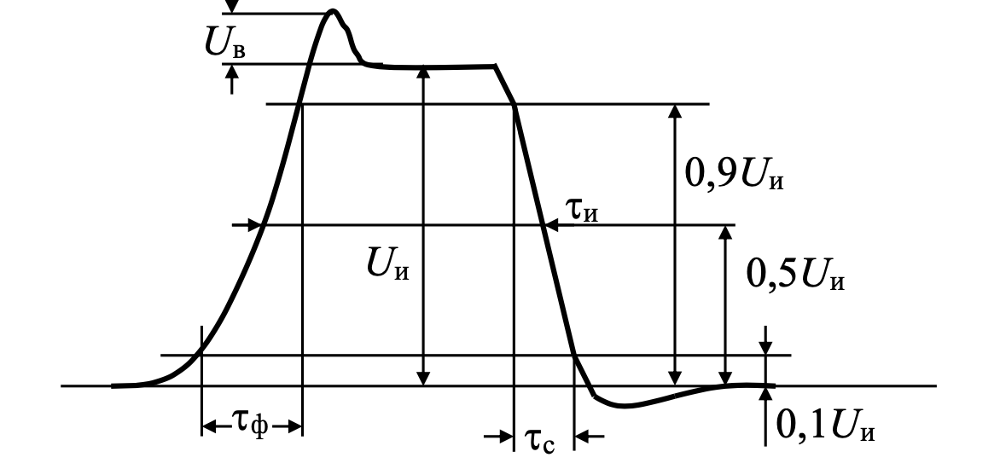
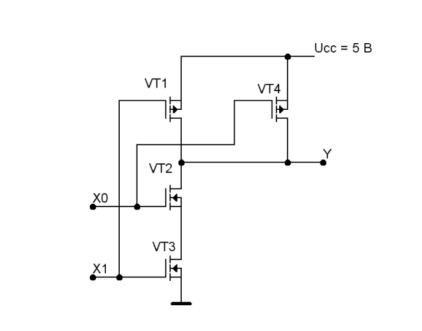
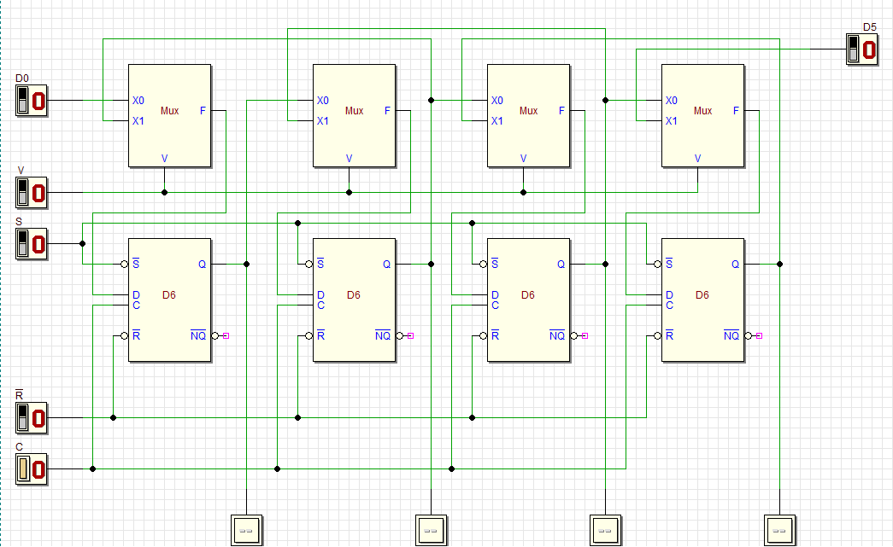
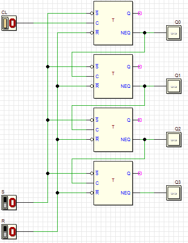
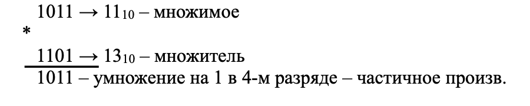

### 1.Аналоговые и цифровые сигналы. Определение параметров. Амплитуда, уровни 0 и 1. Фронт, срез, длительность, период, частота. Относительные параметры. Задержки, задержка распространения.

Сигнал - это любая физическая величина (например, напряжение, температура, давление воздуха, интенсивность света, сила тока и т.д.), изменяющаяся во времени и рассматриваемая как носитель информации.

Аналоговый сигнал

Цифровой сигнал

Параметры сигнала

Задержки распространения

>Задержка распротранения - время потраченное при переходе с одного уровня на другой

$t_{ср}=\dfrac{t_{1}+t_{2}}{2}$

### 2.Булева модель сигналов. Булева алгебра. Основные логические функции и элементы

1 - Истина
0 - Ложь

Основные аксиомы:
1 or A = 1
0 or A = A
1 and A = A
0 and A = 0
A and not A = 0

### 3.Логические функции и элементы НЕ(NOT-инвертор), И (AND), ИЛИ (OR), И-НЕ (NAND) и ИЛИ-НЕ (NOR), Исключающее ИЛИ (XOR) и Исключающее ИЛИ-НЕ (XNOR).

### 4.Задержки распространения сигнала и временные диаграммы работы комбинационных схем.

Логические элементы обладают задержками.
На графике выходного сигнала инвертора Y показаны максимальные задержки его относительно входного сигнала Х при изменении выходного сигнала из 1 в 0 и из 0 в 1- соответственно $t_{PHL}$ и $t_{PLH}$.

Схема

В результате действия задержек длительность сигнала на выходе инвертора может уменьшиться или увеличиться. Это связано с тем, что времена переключения значения выходного сигнала из "1" в "0"($t_{PHL}$ -Time propagation from higher state to low)) и из "0" в "1" ($t_{PLH}$- Time propagation from low state to higher) разные. Области между минимальными и максимальными значениями задержек отмечены на временной диаграмме заштрихованными областями.

Завод-изготовитель (в России) логических элементов обычно указывает только максимальные значения времен задержек при переключении из "1" в "0"- $t_{PHL}$ и при переключении из "0" в "1" - $t_{PLH}$.

Для упрощения расчетов вводится средняя величина времени задержки, называемая также задержкой распространения (tpd-Time of Propagation delay) сигнала

$$t_{Pd}=\dfrac{t_{PLH} + t_{PHL}}{2}$$

### 5.Коэффициент объединения по входу, нагрузочная способность, каскадирование и связи логических элементов.

- Коэффициент объединения по входу определяет минимально возможное число входов логических элементов
- Нагрузочная способность - насколько логических входов может быть одновременно нагружен выход логического элемента без нарущения роботоспособности
- Каскадирование - подсоединение одних и тех же элементов с целью расширения функционала устройства

### 6.Логические функции и принцип дуализма. Проектирование комбинационных схем.

Принцип даулизма - преставление одной функции с помощью суммирования или произведения.
>Закон де Моргана:
>$\neg(A \land B) = \neg A \lor \neg B$

Комбинационная схема - схема, выходные сигналы которой полностью зависит от текущих значений на входе.
Проектирование сводится к следующим этапам:
1. Построение таблицы истинности
2. Составление булевыих уравнений
3. Минимизация системы булевых уравнений
4. Создание этих функций на логических элементах с учётом нагрузочных состояний

### 7. Основные технологии и их базовые этапы: МДП, КМДП, кремний на диэлектрике, формирование эпитаксиального слоя, ионное легирование, металлизация, подзатворный диэлектрик, последние вариации технологий – хай-к диэлектрик, вертикальный затвор.

 >МОП - металл-оксид-полупроводник
 >МДП - металл-диэлектрик-полупроводник
 >КМОП - комплиментарная структура металл-оксид-полупроводник
 >КДМП - комплиментарная структура металл-диэлетрик-полупроводник

Техология производства
1. Изготовление монокристаллов крмения Si - в виде цилиндра
2. Разрезают цилиндр на тонкие пластины (одна из сторон отшлифована, то есть готова к выращиванию эпитаксиля)
3. Формирование эпитаксиля
   
4. Окисление поверхности SiO2
5. Фотолитография - нанесение на поверхность SiO2 фоторезистор, на фоторезистор фото-шаблон. Засвечиваем. После в засвеченных местах появлется фоторезистор.
6. Ионная импластадия - внесение необоходимых примесей через вскрытые окна (ионизируем примесь)
7. Металлизация - нанесение проводниковогг слоя, который соединит области в нужной конфигурации. Формирование металлического затвора (Заливка Al)
8. Окисление SiO2
9. Разразаем на чипы. Вид сверху
   

Инновации:
- АL -> Cu с примесью
- Изоляция p-n переходов
- Замена кремния на диэлектрик
- SiO2 -> дтэлектрик с высокой диэлектрической проницаемостью (E)

### 8.Базовый КМОП инвертор. Статические характеристики КМОП инвертора. Динамические характеристики КМОП инвертора.

Базовым элементом любой микросхемы, выпускаемой по КМОП технологии, является инвертор (логический элемент "НЕ"), выполненный на двух последовательно соединенных МОП транзисторов с изолированным затвором.

- Исток - источник электронов, протекающих через транзистор
- Сток - место, куда электроны сткают
- Затвор - контакт, куда подаётся управляющий сигнал

| Uвх | VT1    | VT2    | Uвых |
| --- | ------ | ------ | ---- |
| 0   | Открыт | Закрыт | E    |
| E   | Закрыт | Открыт | 0

0 < Uвх < 1,5 Uвых не изменяется (зона 1)
3,5 < Uвх < 5 U вых не изменяется (зона 0)

#### Динамические характеристики

Подадим на вход инвертора X последовательность импульсов напряжения, полученных от такой же схемы, а к выходу Y подключим нагрузку.

- X – напряжение на входе инвертора (В), 
- Y – напряжение на выходе инвертора (В), 
- I – сквозной ток в транзисторах VT1 и VT2 (мА), 
- P – мощность, выделяемая в транзисторах VT1, VT2 (Вт)

Из графика видно, что это чисто динамическая мощность, выделяемая только в момент переключения инвертора.

Ток и мощность принимают максимальное значение при переходе с одного логического уровня на другой. При нагрузке активной и емкостной tф, tср увеличивается и следовательно увеличивается ток (I) и мощность (P)

### 9.Базовые КМОП логические элементы И-НЕ и ИЛИ-НЕ. Основные статические и динамические параметры и характеристики КМОП элементов.

На базе МОП транзисторов с каналами p и n типов создают многовходовые логические элементы, реализующие функции И-НЕ и ИЛИ-НЕ. 
Если на входы Х0 и Х1 подать сигналы высокого уровня, то транзисторы VT2 и VT3 окажутся открытыми, а транзисторы VT1 и VT4 – закрытыми. В результате выход Y окажется подключенным к "земле" (низкому уровню). Если хотя бы на один из входов Х0 или Х1 будет подан сигнал низкого уровня, то один из последовательно соединенных транзисторов VT2 и VT3 окажется закрытым, а хотя бы один из двух соединенных параллельно транзисторов VT1 и VT4 окажется открытым. В результате выход Y окажется подключенным к источнику питания Ucc (сигналу высокого уровня).

Схема И-НЕ

| X0  | X1  | VT1    | VT2    | VT3    | VT4    | Y   |
| --- | --- | ------ | ------ | ------ | ------ | --- |
| 0   | 0   | Открыт | Закрыт | Закрыт | Открыт | 1   |
| 0   | 1   | Закрыт | Закрыт | Открыт | Открыт | 1   |
| 1   | 0   | Открыт | Открыт | Закрыт | Закрыт | 1   |
| 1   | 1   | Закрыт | Открыт | Открыт | Закрыт | 0   |

Закрыт - Uзс = 0
Открыт - Uзс != 0

Схема ИЛИ-НЕ

Если на входы Х0 и Х1 подать сигналы низкого уровня, то транзисторы VT1 и VT2 окажутся открытыми, а транзисторы VT3 и VT4 – закрытыми. В результате на выходе Y окажется сигнал высокого уровня. Если хотя бы на один из входов подан сигнал высокого уровня, то хотя бы один из транзисторов VT1 или VT2 окажется закрытым, а хотя бы один из транзисторов VT3 или VT4 – открытым. В результате сигнал на выходе Y окажется низкого уровня.

| X0  | X1  | VT1    | VT2    | VT3    | VT4    | Y   |
| --- | --- | ------ | ------ | ------ | ------ | --- |
| 0   | 0   | Открыт | Открыт | Закрыт | Закрыт | 1   |
| 0   | 1   | Открыт | Закрыт | Закрыт | Открыт | 0   |
| 1   | 0   | Закрыт | Открыт | Открыт | Закрыт | 0   |
| 1   | 1   | Закрыт | Закрыт | Открыт | Открыт | 0   |

### 10.Выходной каскад с тремя состояниями в КМОП технологии

Состояния микросхем
1. Логическая 1
2. Логический 0
3. Логический Z (В таких микросхемам есть управляющий вход Enable)

| En  | X   | VT1    | VT2    | Y   |
| --- | --- | ------ | ------ | --- |
| 0   | 0   | Закрыт | Закрыт | Z   |
| 0   | 1   | Закрыт | Закрыт | Z   |
| 1   | 0   | Закрыт | Открыт | 0   |
| 1   | 1   | Открыт | Закрыт | 1   |

Состояние Z если VT1, VT2 закрыты
Закрыт  - Uзс = 0
Открыт Uзс != 0

### 11.Дешифраторы

$y=2^x$
>x - количество входов
>y - количество выходов

От комбинации X, активен один из выходов на дешифраторе

### Линейный дешифратор 3в8

### Пирамидальный дешифратор 3в8

### Матричный дешифратор 4в16

(+) Линейный дешифратор самый быстрый и меньше всего логических элементов
(-) Линейный дешифратор нельзя построить на большое число входов (есть ограничесние по входам у логических элементов)

У матричного и пирамидального всё наоборот

### 12.Шифратор и кодовый преобразователь

$y = log_{2}x$
> y - количество выходов
> x - количество входов

Преобразование унарного кода в двоичный

#### Кодовый преобразователь
Преобразует кодовое слово в другое кодовое слово
$Y_{m}=F(X_{n})$
>n,m  длины кодовых слов

Также применяется связка дешифратора + шифратора для создания кодового преобразователя. Таблица преобразования задаётся междут дешифратором и входом шифратора.

### 13.Мультиплексор

| V0  | V1  | Y   |
| --- | --- | --- |
| 0   | 0   | X1  |
| 0   | 1   | X2  |
| 1   | 0   | X3  |
| 1   | 1   | X4  |

### 14.Реализация логических функций на мультиплексорах

Пример логической функции:

| X2  | X1  | X0  | Y   |
| --- | --- | --- | --- |
| 0   | 0   | 0   | 0   |
| 0   | 0   | 1   | 0   |
| 0   | 1   | 0   | 1   |
| 0   | 1   | 1   | 1   |
| 1   | 0   | 0   | 0   |
| 1   | 0   | 1   | 1   |
| 1   | 1   | 0   | 0   |
| 1   | 1   | 1   | 1   | 

### 15.Компаратор

Компаратор - это устройство, которое сравнивает 2 числа
Сравнивать можно двумя способами:
1. Каждый разряд по отдельности, а потом в зависимости от старшинства разряда делать вывод об отношении чисел
2. С помощью вычисления одного числа из другого

#### Сравнивая по 1 биту

#### С помощью вычитания

При сложении числа А с отрицательным числом B перенос  P будети в том случае, если  А == B или  A > B

### 16.Двоичный сумматор

---
Суммирование происходит за счёт сравнений каких-либо комбинаций

| A   | B   | S   |
| --- | --- | --- |
| 0   | 0   | 0   |
| 0   | 1   | 1   |
| 1   | 0   | 1   |
| 1   | 1   | 0   | 

---
Сравнение чисел происходит без учёта переноса на следующий разряд

| A   | B   | S   | P   |
| --- | --- | --- | --- |
| 0   | 0   | 0   | 0   |
| 0   | 1   | 1   | 0   |
| 1   | 0   | 1   | 0   |
| 1   | 1   | 0   | 1   | 

---
Сложение учитывает перенос на следующий разряд, но не учитывает перенос с предыдущего разряда

| P   | A   | B   | S   | P0  |
| --- | --- | --- | --- | --- |
| 0   | 0   | 0   | 0   | 0   |
| 0   | 0   | 1   | 1   | 0   |
| 0   | 1   | 0   | 1   | 0   |
| 0   | 1   | 1   | 0   | 1   |
| 1   | 0   | 0   | 1   | 0   |
| 1   | 0   | 1   | 0   | 1   |
| 1   | 1   | 0   | 0   | 1   |
| 1   | 1   | 1   | 1   | 1   |

### 17.Многоразрядный сумматор с параллельным переносом.

Многоразрядный сумматор - каскадирование последовательно сумматоров. Из-за последовательного соединения сумматоров происходят гонки.

#### Параллельный перенос
Сумматор с последовательным переносом обладает малым быстродействием. Время суммирования практически пропорционально числу разрядов сумматора. Значительно меньшими задержками обладают сумматоры с параллельным переносом.

**Схема сумматора с параллельным переносом.**

Многоразрядный сумматор с параллельным переносом реализует очень простую идею:
1. В каждом двоичном разряде складываются только два входных числа Аi и Bi.
2. Сигналы переноса Ci вырабатываются одновременно и независимо при помощи специальной комбинационной схемы ускорения переноса CRi

Определим следующие логические функции:

1. Функция генерации переноса Gi .
Если Ai и Bi равны единице, то на выходе разряда сумматора появляется сигнал переноса, не зависящий от сигнала CINi. Поэтому Gi = Ai ⋅ Bi; 
2. Функция распространения Hi.
Если только одна из переменных Ai или Bi равна единице, то сигнал переноса на выходе разряда сумматора появляется только при наличии сигнала CINi. Hi = Ai ⊕ Bi;  
В этой формуле функцию "Исключающее ИЛИ" можно заменить на "ИЛИ", так как при А = 1 и В = 1 сигнал переноса формируется функцией Gi. Hi = Ai ∪ Bi;  

Рекуррентная функция формирования сигнала переноса на выходе разряда имеет следующий вид : Ci = Gi ∪ Hi ⋅C(i −1);

Для нулевого разряда сумматора  
C1 = G0 ∪ C0⋅H0;

Для первого разряда C2=G1 ∪ C1⋅H1 = G1 ∪ G0 ⋅ H1 ∪ C0 ⋅ H1⋅H0;

Эти логические функции позволяют построить схемы формирования сигналов переноса в базисе И – ИЛИ. Однако лучшие результаты получаются в базисе И – ИЛИ – НЕ. Получим

C0= A0⋅B0⋅C0⋅H0;  
C1= A1⋅B1⋅A0⋅B0⋅H1⋅C0⋅H1⋅H0;  
C1= A2⋅B2⋅A1⋅B1⋅H2⋅A0⋅B0⋅H2⋅H1⋅C0⋅H2⋅H1⋅H0;

Время сложения в сумматоре с параллельным переносом равно времени сложения в сумматоре $t_{сум}$ и времени формирования сигнала переноса $t_{CR} = 3t_{ЛЭ}$
> $t_{CR}$ не зависит от разрядности сумматора.

Однако с ростом числа разрядов в схеме квадратично возрастает число элементов И-НЕ и число их входов. Это приводит к росту нагрузки в схеме и, как следствие, к увеличению задержек сигналов в сумматоре. 

**Многоразрядный сумматор с параллельным переносом.**

### 18.Цифровые узлы последовательностного типа. Определения.

1. Последовательная схема - схема, выходные сигналы которой зависят не только от входных сигналов, но и предыдущим значением. 
2. Состояния последовательной схемы - совокупность её состояний элементов памяти.
3. Если изменения происходят с подачей сигнала (синхросигнала), то это синхронный автомат
4. Если изменения происходят в любой момент времени, то это асинхронный автомат.

Схема автомата:

Граф-схема автомата Мура,  D - триггер

### 19.Асинхронный RS-триггер на элементах И-НЕ. Синхронный RS-триггер на элементах И-НЕ.

>Работает по фронту

#### Асинхронный 
| S   | R   | Q        |
| --- | --- | -------- |
| 0   | 0   | Хранение |
| 1   | 0   | 1        |
| 0   | 1   | 0        |
| 1   | 1   | Запрещ   |

#### Синхронный 
| C   | S   | R   | Q        |
| --- | --- | --- | -------- |
| 0   | x   | x   | Хранение |
| 1   | 0   | 1   | Хранение |
| 1   | 1   | 0   | 1        |
| 1   | 0   | 1   | 0        |
| 1   | 1   | 1   | Запрещ   | 

.png)

### 20.D-триггер с управлением уровнем синхросигнала

>Прозрачная защелка. Пока есть сигнал C, есть Q

| C   | D   | Q        |
| --- | --- | -------- |
| 0   | X   | Хранение |
| 1   | 0   | 0        |
| 1   | 1   | 1        | 

.png)

#### D-триггер на 6 элементах

.png)

### 21.Счетный Т-триггер

>Работает по фронту

.png)

### 22.JK-триггер.
>Работает по спаду

| C   | J   | K   | Q        |
| --- | --- | --- | -------- |
| 0   | X   | X   | Хранение |
| 1   | 0   | 0   | Хранение |
| 1   | 0   | 1   | 0        |
| 1   | 1   | 0   | 1        |
| 1   | 1   | 1   | Счётчик  | 

.png)

###  23.Двухступенчатый D-триггер

| C   | D   | Q        |
| --- | --- | -------- |
| 0   | X   | Хранение |
| 1   | 0   | 0        |
| 1   | 1   | 1        | 

Временная диаграмма:

C, D, Q0 - одноступенчатый D триггер
!С, Q0, Q - одноступенчтаый D триггер

**Схема:**
.png)

### 24.Регистры. Параллельные регистры. Регистры сдвига.

Регистр - объединения триггеров для хранения информации.

#### Параллельные регистры
Параллельно расположены триггеры

#### Регистры сдвига (вправо или влево)

>При V = 0 происходит сдвиг вправо значения  D0. 
>При V = 1 происходит сдвиг влево значения  В5

### 25.Счетчики с непосредственной связью. Вычитающий счетчик с непосредственной связью.

#### Счётчик

#### Вычитающий счётчик

### 26.Счетчик с параллельным переносом.

Идея заключается в том, чтобы убрать сумму задержек, которые создают T-триггеры

### 27.Счетчики по произвольному основанию

### 28.Запоминающие устройства. Классификация

ЗУ - устройства, предназначенное для записи, хранения и чтения данных.
#### Классификация
##### По форме записи информации
- Аналоговые
- Цифровые
##### По возможности перезаписи
- Однократная запись (CD-R)
- Перепрограммируемые ЗУ (ППЗУ) - устройства с возможностью многократной перезаписи (CD-RW)
- Устройства с многократной записью по месту функционирования (жесткий диск)
##### По назначению
- Оперативная память (ОЗУ) - память, в которой размещаются данные, над которыми непосредственно производятся операции процессора (DRAM, SRAM)
- Внутренние устройства для долговременного хранения (SSD, жёсткий диск)
- Внешние устройства, предназначенные для хранения либо переноса информации от одного устройства к другому (флешки)
- Запоминающие устройства для идентификация и платежей (магнитные карты)
##### По энергозависимости
- Энергозависисые (нет питания - память стералсь)
- Энергонезависимые (нет питания, но память хранится)
- Статические (для хранения нужно питание)
- Динамические (информации разрушается во временем, для хранения нужно питание и для восстановления информации)
##### По типу доступа
- С последовательным доступом (магнитные ленты)
- С произвольным доступом (RAM)
- С прямым доступом (жёсткий диск)
- С ассоциативным доступом (специальным усройства, для повышения производительности баз данных)

### 29. Архитектура полупроводниковых ЗУ

>ДА - дешифратор адреса

##### Однокоординатная выборка

K - количество ячеек
$K = 2^n$

Недостаток: довольное большое количество проводов = K

##### Многокоординатная выборка

$K= 2^{\dfrac{n}{2}}+2^{\dfrac{n}{2}}=2^{\dfrac{n}{2}+1}$
Выигрыш в уменьшении количества проводов

##### ПЗУ

>ПЗУ - постоянное запоминающее устройство

Функции элементов памяти играют диоды или другие полупроводниковые приборы

##### ППЗУ
>ППЗУ - перепрограммируемое  запоминающее устройство

Напряжение элемента памяти:
Uпп > Uп

### 30. Статическая шетитранзисторная ячейка памяти (SRAM)

VT1,VT2 - ключи
VT3, ... ,VT6 - ячейки памяти

#### Запись
Допустим была 1
1. Запись 1 в 0: 
   шА = 1 -> VT1 открыт VT2 закрыт
   шД0 = 1 -> VT5 открывается  VT6 закрывается
   шД1 = 0
   Так как  $\phi_{затвора,4}$ = $\phi_{затвора,6}$ ->  VT4 закрывается -> VT1,VT2 меняет состояния
2. Запись 1 в 1
   шА = 1 -> VT1 открыт VT2 закрыт
   шД0 = 0 
   шД1 = 1

Преимущества: быстрый доступ
Недостатки: высокое энергопотребление

### 31. Четырехтранзисторная ячейка динамического ЗУ (DRAM)

VT1,VT2 - ключи
C3,C4 - емкости затвора, на них хранится информация (медленная ячейка памяти - нет источника питания => нельзя вечно хранить информацию)
1. Хранение. Представим 1 на рисунке. Тогда VT3 - открыт, VT4 - закрыт. По цепочки VT3 закоротка разряжется C4. С3 остается заряженными, так как VT4 (обрыв)
2. Чтение, так как VT3 открыт шина А = 1 => VT1 - открыт. Из этого всего следует что шина D0 = 0 (VT3,VT1 - закоротки, шина D1 = 1)
3. Запись 1->0. шина D0 = 1, шина D1 = 0, шина A = 1 => VT1 - открыт (закоротка). Из этого всего следует, что C4 - заряжетсяе => VT4 - открывается => С3 - разряжается. В итоге вместо 1 - 0

### 32.Однотранзисторная динамическая ячейка памяти

1. Хранение.  Шина А = 0. 
   C = 1 -> VT - закрыт, так как засчет утечки токов 
   C = 0 -> VT - закрыт
   D = 0, так как чтобы чтобы C не разряжался/не заряжался
2. Чтение. Шина А = 1
   C = 0 -> VT открыт -> D = 0
   C = 1 -> VT открыт -> D = 1
3. Запись 
	1. 1- > 0: Шина А = 1 -> VT открыт. Шина D = 1. Из всего следует C = 1
	2. 0 -> 1: Шина А = 1 -> VT открыт. Шина D = 0.  Из всего следует C = 0 (разрядка)
	3. 1 -> 1:  Как п 3.1
4. Регенерация. Если по D течет ток -> D = 1, иначе D = 0

### 33.Многопортовые ЗУ

Позволяет одновременно или последовательно обращаться к ячейке памяти по разным адресам и разным шинам данных

### 34.Флэш-память, технологии МНОП (CTF) и с плавающим затвором, запись и чтение

Флеш-память (flash memory) — разновидность полупроводниковой технологии электрически перепрограммируемой памяти (EEPROM). Это же слово используется в электронной схемотехнике для обозначения технологически законченных решений постоянных запоминающих устройств в виде микросхем на базе этой полупроводниковой технологии. В быту это словосочетание закрепилось за широким классом твердотельных устройств хранения информации.

Основным компонентом в флеш памяти является транзистор с плавающим затвором, который является разновидностью МОП-транзисторов. Его отличие в том, что у него есть дополнительный затвор (плавающий), расположенный между управляющим затвором и pслоем.

Изменения напряжения на управляющем затворе позволяте хранить 1 бит (так как считывается состояния транзистора)
Так как заряд плавающего затвора изолирован микросхема хранит информацию при отключении напряжения питания.

#### CTF
Charge Trap Flash (CTF, память с ловушкой заряда) — технология компьютерной флеш-памяти известная с 1967 года и используемая для создания NOR и NAND накопителей с 2002 и 2008 годов соответственно. Она отличается от широко использовавшейся до 2010 года технологии флеш-памяти на MOSFET-транзисторах с плавающим затвором тем, что использует для хранения электронов пленку нитрида кремния (Si3N4), а не поликремний с допирующими элементами. За счет перехода на CTF производители памяти смогли снизить стоимость производства за счет:
- Меньшего количества технологических этапов для формирования ячейки
- Возможности использования более тонких технологических процессов
- Упрощения хранения нескольких бит в одной ячейки 
- Повышение надежности
- Более высокого выхода годных, посколько технология меньше подвержена точечным дефектам в туннельном слое оксида

#### Чтение 
Для чтения подаётся положительное напряжение на управляющий затвор. Если в плавающем затворе отсутствует заряд, то транзистор начнёт проводить ток. В противном случае ток между истоком и стоком не возникает. Для MLC ячеек необходимо произвести несколько измерений.

#### Запись
Для записи заряды должны попасть в плавающий затвор, однако он изолирован слоем оксида. Для переноса зарядов может использоваться эффект туннелирования. Для разряда ранее записанного отрицательного заряда необходимо подать большое положительное напряжение на управляющий затвор: отрицательный заряд с помощью туннельного эффекта покинет плавающий затвор. И, наоборот, для заряда плавающего затвора необходимо подать большое отрицательное напряжение (заряд) на затвор.

Так как запись наносит ущерб оксидному слою -> число записей ограничено.

### 35. NOR, NAND организация, запись и чтение.

у#### NOR, NAND 
Организации по производству флэш памяти на основе ИЛИ-НЕ и И-НЕ соответсвтенное

#### Чтение
Подаётся дополнительное напряжение на управляющий затвор. Если в плавующем затворе отсуствует заряд, то транзистор начет производить ток, в противном случае - нет.

#### Запись.
Состоит из 2-ух стадий:
1. Все транзисторы в линии устаналиваются в 1 (нет заряда)
2. Нужные ячейки устаналиваются в 0

### 36.Проектирование синхронных схем. Понятие синхронной схемы. Параллелизм и конвейеризация. Сеть распространения синхросигналов. Полезная и вспомогательная часть такта.

В современных Больших Интегральных Схемах (БИС) с тактовой частотой в несколько сотен мегагерц задержки в проводниках соизмеримы с задержками логических элементов и их следует учитывать при проектировании.

#### Понятие

Синхронные схемы (синхронные модули) – это тактируемые схемы, которые обладают следующими свойствами.
1. Все запоминающие элементы схемы (триггеры, регистры, блоки памяти (оперативной – ОЗУ (RAM), постоянной– ПЗУ (ROM), с организацией типа очередь – ФИФО (FIFO) и т.п.) должны изменять свои состояния одновременно по одному и тому же активному фронту поступающего извне тактового сигнала (Сclock ).
2. Синхросигнал (С-clock) без задержек, т.е. одновременно, должен поступать на все запоминающие элементы схемы.

Внешний синхросигнал при реализации синхронной схемы на кристалле вводится через специальный тактовый буфер и разводится так, чтобы обеспечить одновременность его поступления на все запоминающие элементы.

Ниже представлена обобщенная структура синхронной схемы с однотактной синхронизацией (синхросигнал С). К моменту прихода внешнего синхросигнала С на регистры (RG–register) выходы комбинационных схем (CC–combinatorial circuit) должны успеть принять стабильное состояние.

Таким образом, согласно принципам «чистого синхронизма» не рекомендуется, например, строить схемы, в которых применяются управляемые синхросигналы (gated clocks). Управляемым называется синхросигнал, генерируемый внутри схемы и трассируемый, если САПР не получает специальных указаний от проектировщика, как обычный сигнал. На схеме это сигнал C1.

#### Полезная и вспомогательная часть такта.

Среди методов повышения быстродействия схем выше были отмечены такие, как балансировка конвейера и уменьшение длины критического пути в комбинационной части схемы. Но повышение тактовой частоты не беспредельно. Помимо ограничений типа конечной скорости света (за одну наносекунду свет проходит 30 см), существуют и дополнительные факторы, ограничивающие пределы уменьшения тактового периода - периода поступления синхросигналов.

#### Параллелизм и конвейеризация
##### Последовательно
Рассмотрим в качестве примера схему сложения четырех слагаемых S=A+B+C+D. Вариант последовательного сложения представлена ниже. Схема использует один сумматор и один регистр и требует четырех тактов на выполнение операции. Tслож.послед.= 4*ТD=20 ns, где ТD включает задержку на сумматоре и на регистре. После обнуления регистра сигналом сброса R, А +0 загружается в регистр на первом такте, В+А на втором и т.д.

##### Параллельно
Параллелизм в реализации четырехвходового сумматора. Примером использования параллелизма может служить схема вычисления суммы четырех слагаемых S=(A+B)+(C+D) c использованием трех сумматоров и одного регистра. 

По сравнению с последовательным вариантом вычисления суммы S=A+B+C+D такая схема позволяет уменьшить время сложения в два раза. Однако расход аппаратуры – количество сумматоров увеличилось в три раза

##### Конвейеризация.

На схеме представлен вариант конвейерной организации схемы сложения четырех слагаемых. Схема использует три регистра и три сумматора. Первая сумма на выходе OUT конвейера появляется через три такта (латентность конвейера или глубина конвейера=3), а далее новые суммы появляются на каждом такте. Т.к. время такта равно TD=5 ns, Tсл_конв=TD=5 ns то быстродействие этой схемы в четыре раза больше, чем у последовательного варианта (Тсл=4TD=20 ns) и в два раза больше, чем у параллельного (Тсл=2TD=10 ns)). Однако количество регистров в конвейерной схеме возросло в шесть раз по сравнению с параллельным вариантом суммирования четырех чисел А.B,C,D.

### 37. Cтруктуры первых плис

Программируемые логические интегральные схемы (ПЛИС) – в англоязычной терминологии PLD (Programmable Logic Device) – одно из перспективных направлений развития элементной базы современной цифровой, а в последнее время и аналого-цифровой электроники. Их применение дает разработчику возможность быстро и с малыми затратами создавать сложные устройства, многократно менять и совершенствовать их функции в ходе отладки путем перепрограммирования функций и связей элементов.

#### Достоинства
1. Небольшой период от начала процесса проектирования устройства на ПЛИС до выпуска сериной продукции (быстрая отладка производства)
2. Возможность организации мелкосерийного производства без больших начальных вложений в технологию (дешёвое производство)
3. Позволяет выпускать высокотехнологичныые электронные изделия даже в странах не производящих БИС
4. Освоение САПР ПЛИС легче чем САПР БИС
5. Относительная простота исправления ошибок проектировщиков в процессе отладки изделий
6. Меньше проблем с разводкой и расфазировкой синхросигналов за счёт использования встроенных в микросхемы ПЛИС соответствующих средства
7. ПЛИС подходит идеально для обучения студентов

#### Недостатки
1. Площадь ПЛИС больше площади БИС 
2. Быстродействие ПЛИС меньше чем БИС
3. Надежность ПЛИС хуже чем БИС
4. Стоимость больше ПЛИС по сравнению с БИС, если большая серия производства
5. Сложно решаеются вопросы импортазамещения

В настоящее время наиболее распространены две архитектуры ПЛИС: СPLD и FPGA

### 38.Программируемая Логическая Матрица (ПЛМ).

Прототипами современных ПЛИС типа CPLD являлись микросхемы ПЛМ – программируемые логические матрицы (PLA–Programmable Logic Array) и ПМЛ – программируемая матричная логика (PAL–Programmable Array Logic)

ПЛМ – комбинационная схема, которая имеет N входов и M выходов. Пример-входы IN и выходы OUT. Она состоит из двух блоков– матрицы И и матрицы ИЛИ, а также входных и выходных буферов. Матрица И представляет собой совокупность из К штук 2*N– входовых схем И, образующих строки матрицы (термы). На строки из входных буферов поступают прямые и инверсные значения внешних входов ПЛМ. Выходы каждой из этих строк можно соединить с входами К– входовых схем ИЛИ, образующих столбцы матрицы ИЛИ, их М штук. Выходы этих схем ИЛИ и являются выходами ПЛМ.

В общем случае на ПЛМ с N–входами и M–выходами можно реализовать M разных N – входовых логических функций, число термов в которых ограничивается K.

### 39.Программируемая Матрица Логики (ПМЛ-PAL).

ПМЛ в отличие от ПЛМ, имеет не программируемые, а фиксированные связи строк–схем И со столбцами– схемами ИЛИ, что ограничивает их логические возможности, но резко упрощает процесс изготовления микросхем. 

### 40.Схемотехника ПЛИС типа CPLD.

В первых ПЛИС для программирования их функций использовались однократно пережигаемые перемычки. Развитие технологии ПЛМ и ПМЛ пошло по пути реализации в ПЛИС возможности многократного перепрограммирования (конфигурирования) соединений и реализации большого числа таких узлов в одной микросхеме.

CPLD (Complex Programmable Device) – ПЛИС с относительно небольшим числом функциональных блоков (ФБ – FB), состоящих из многовходовой ПЛМ (или ПМЛ) и триггера и как правило с энергонезависимой конфигурационной (FLASH) памятью, программирование которой реализует настройку блоков и их связей. В упрощенном виде СPLD можно представить как набор из множества ФБ, коммутируемых друг с другом через так называемую главную коммутационную матрицу (ГТМ или AIM–Advanced Interconnection Matrix)). На периферии расположены блоки ввода–вывода (БВВ или I/O).

Внутреннюю структуру ПЛИС типа CPLD поясним на примере семейства маломощных дешевых микросхем COOLRUNNER 2 фирмы XILINX. Каждая такая микросхема состоит из множества функциональных блоков типа ПЛМ, составляющих ее логический ресурс. ФБ в свою очередь, состоят из так называемых макроячеек (МЯ). Например, функциональный блок ПЛИС семейства COOLRUNNER 2 содержит 16 макроячеек (МС1–МС16) со структурой 40-входовых ПЛМ, что позволяет реализовать 16 логических функций от 40 переменных. 

Упрощённая схема

Семейство ПЛИС COOLRUNNER 2 отличается пониженным энергопотреблением (статический ток не превышает 100 мкА). Эти ПЛИС выпускаются в плоских корпусах. Снизу корпуса или с боков расположены выводы микросхемы, сверху указано ее обозначение.

### 41.Схемотехника ПЛИС типа FPGA.

FPGA (Field Programmable Gate Array) – это другой тип ПЛИС. На площади кристалла микросхемы ПЛИС типа FPGA размещена матрица из множества программируемых функциональных блоков и множество программируемых соединений (PM–Programmable Interconnections). Функциональные логические блоки в ПЛИС типа FPGA называются конфигурируемыми логическими блоками (КЛБ), а в англоязычной литературе CLB – Сonfigurable Logic Block. В свою очередь КЛБ состоят из логических ячеек (ЛЯ).

По периметру микросхемы размещены блоки ввода–вывода сигналов (IOB–Input Output Block). В отличие от ПЛИС типа CPLD функциональные блоки FPGA имеют другую организацию и логические возможности, а трассировочные ресурсы более разнообразны, т.к. состоят из линий разной длины и коммутаторов

#### Логическая ячейка ПЛИС типа FPGA.

Конфигурируемый Логический блок (КЛБ) образован из нескольких секций–slice, которые в свою очередь состоят обычно из двух логических ячеек (ЛЯ). Логическая ячейка является базовым логическим элементом ПЛИС типа FPGA (рис.6.6).Она состоит из 4–6-ти входовой (в зависимости от типа FPGA) схемы, выполняющей логическую функцию – логической таблицы (ЛТ, ЛУТ) по-английски – LUT–Luc Up Table), реализуемую с помощью постоянного запоминающего устройства (ППЗУ), D–триггера (DFF–D–Flip Flop), дополнительной управляющей логики и схемы ускорения переноса, используемой при построении сумматоров. Часто для всей логической ячейки используется то же наименование ЛУТ (LUT) как и для отдельной логической таблицы.

Обычно, как уже отмечалось, логическая функция ячейки ПЛИС типа FPGA реализуется таблично с помощью Постоянного Запоминающего Устройства (ПЗУ). ПЗУ после записи хранит записанную в него информацию. Каждому информационному слову сопоставлен его адрес. C помощью ПЗУ емкостью в 16 одноразрядных слов (16 х 1) можно реализовать любую булевскую функцию от четырех аргументов, записав в ПЗУ таблицу истинности этой функции, а при обращении к ПЗУ в качестве адреса использовать набор значений аргументов (четырехразрядный вектор или четырехразрядное двоичное число).

### 42.Системы счисления и перевод чисел из одной системы счисления в другую. Двоичные коды чисел. Модифицированные обратный (МОК) и дополнительный (МОД) чисел.

Отдельные элементы двоичного кода, имеющие значение 0 или 1, называют разрядами или битами (bit). Обычно используется позиционная система представления чисел в двоичном коде, при которой вес каждого разряда равен степени двойки. Двоичная система, удобная для ЭВМ, для человека неудобна из-за громоздкости и непривычной записи.

Для 8 -> 2 каждую цифру представлять в виде двоичного кода длиной 3
Для 16 -> 2 каждую цифру представлять в виде двоичного кода длиной 4

Для 2 -> 8 бить на 3 влево и вправо от запятой
Для 2 -> 16 бить на 4 влево и вправо от запятой

Перевод смешанных чисел осуществляется в 3 этапа:
1. Осуществляется перевод целой части числа в новую с/с.
2. Осуществляется перевод дробной части числа в новую с/с.
3. Складываются результаты переводов первых 2-х пунктов.

При сложении может быть переполнение на 1 разряд
При умножении может быть переполнение на 2 разряда

#### Довичные коды чисел

В ЭВМ при выполнении арифметических операций применяют двоичный прямой, обратный и дополнительный коды чисел. К кодам чисел выдвигаются следующие требования:
1. Разряды числа в коже жёстко связаны с определённой разрядной сеткой
2. Для записи кода знака в разрядной сетке отводится фиксированный разряд

Такое представления - представление с фиксированой запятой. Например, если за основу представления двоичного кода числа взят один байт, то для представления значения числа будет отведено 7 разрядов, а для записи кода знака один разряд. В примерах мы знаковый разряд числа будем отделять символом запятой и располагать слева.

##### Прямой код
Прямой код двоичного числа совпадает по изображению с записью самого числа. Значение знакового разряда для положительных чисел равно 0, а для отрицательных чисел 1. Например, в случае, когда для записи кода числа выделен один байт, для положительного десятичного числа + 9, в двоичном коде представленного как +1001, ПК равен 0,0001001. Для  -9 – двоичный ПК равен 1,0001001.

##### Обратный код
Обратный код для положительного числа совпадает с прямым кодом. Для отрицательного числа все цифры числа заменяются на противоположные (1 на 0, 0 на 1), а в знаковый разряд заносится единица. Например, для двоичного кода положительного числа +9, представляемого в 8-ми разрядной сетке, ОК равен 0,0001001. Для  -9, двоичный ОК равен 1,1110110.

##### Дополнительный код
Дополнительный код положительного числа совпадает с прямым кодом. Для отрицательного числа дополнительный код образуется путем получения обратного кода и добавлением к младшему разряду единицы.

Ниже приведен пример представления одного и того же отрицательного числа (-9 или в двоичной системе -1001) в восьмиразрядной сетке в различных кодах

| Прямой    | Обратный  | Дополнительный |
| --------- | --------- | -------------- |
| 1,0001001 | 1,1110110 | 1,1110111      |

При переполнении разрядной сетки, в которой представлены двоичные числа со знаком, происходит перенос единицы в знаковый разряд. Это приводит к неправильному результату, причем положительное число, получившее ся в ре зультате арифметиче ской операции, может восприниматься как отрицательное (так как в знаковом разряде "1") и наоборот. Например, при сложении двоичных чисел Х=0,1000110 и Y=0,1 000011 имеем результат = 1, 0001001. Здесь X и Y - коды положительных чисел, и результат положителен, но результат их сложения – это код отрицательного числа ("1" в знаковом разряде). Для обнаружения переполнения разрядной сетки используются модифицированные коды (МК).

Операция вычитания обычно выполняется в ЭВМ как операция сложения отрицательного значения вычитаемого и поэтому ниже рассмотрена только операция сложения.

##### Сложение
1. ДК. Возникающая единица переноса в знаковом разряде отбрасывается.
2. ОК. Возникающая единица переноса в знаковом разряде прибавляется к младшему разряду суммы. 

#### МОК и МОД
В модифицированном обратном (МОК) и модифицированном дополнительном (МОД) кодах под знак числа отводится не один, а два разряда: "00" соответствует знаку "+", "11" - знаку "-". Любая другая комбинация ("01" или "10"), получившаяся в знаковых разрядах служит признаком переполнения разрядной сетки. В остальном, сложение чисел в модифицированных кодах ничем не отличается от сложения в обычных обратном и дополнительном кодах

##### Сложение
1. Прямой код
	1. Одинаковый знак. Сложить. Результату присвоить тот же знае.
	2. Разные знаки. Вычестиь меньшее число из большего. Результату присвоить знак большего числа
2. Дополнительный код
	1. Сложить, игнорируя перенос из старшего разряда. Переполнение возникает, если переносы в старший разряд и из старшего разряда различны.
#####  Вычитание
1. Прямой код
	1. Изменить знакоывй бит числа и провести сложение.
2. Дополнительный код
	1. Инвертировать все биты числа - вычитаемого и сложить с уменьшаемым. К результату прибавить 1 в младший разряд

### 43.Функциональная схема АЛУ для сложения и вычитания чисел с фиксированной запятой.

Функциональная схема АЛУ для сложения и вычитания чисел с фиксированной запятой в дополнительном коде представлена на следующем рисунке

В состав АЛУ входят регистры Рег. А, Рег. В, Рег. С и Рег. D, комбинационный сумматор SM, блок инвертирования ИНВ, блок выработки признаков результата (ПР) и Устройство управления (УУ). Блок ПР вырабатывает признак результата вычисления φ. Это: 
- φ = (00) – результат положительный, 
- φ = (11) – результат отрицательный, 
- φ = (01) – результат нулевой, 
- φ = (10) – переполнение. 

Регистры подсоединены к Шине данных (ШД) компьютера. На входы Устройства управления (УУ) подаются команды: K1 – "сложение", K2 – "вычитание".

### 44.Методы умножения чисел. Функциональная схема АЛУ для умножения целых чисел.

#### 1.Умножение целых чисел, начиная с младших разрядов со сдвигом множимого влево при неподвижной сумме частичных произведений

#### 2.Умножение целых чисел, начиная с младших разрядов со сдвигом вправо сумм частичных произведений при неподвижном множителе.

#### 3.Умножение, начиная со старших разрядов множителя со сдвигом суммы частичных произведений влево при неподвижном множителе

#### 4.Умножение, начиная со старшего разряда множителя, со сдвигом вправо множимого и неподвижным частичным произведением.

#### Функциональная схема АЛУ для умножения чисел

Число – множимое с шины данных записывается в регистр А, а число – множитель – в регистр В. Сумма частичных произведений с выхода сумматора SM записывается в регистр С. Регистры С и В образуют единый регистр сдвига вправо, в котором младший разряд C [0] переписывается в старший разряд B[n]. Регистр D служит для промежуточного хранения содержимого регистра С, что предотвращает гонки при работе АЛУ. • Множимое и множитель записываются в регистры А и В в прямых кодах со знаком. Регистры C и D обнуляются. В счетчик, находящийся в Устройстве управления, записывается число циклов, необходимых для умножения двух чисел. • Если младший разряд множителя B [0] = 1, то к сумме частичных произведений в регистре С прибавляется модуль множимого из регистра А. Если B [0] = 0, то число в регистре С не изменяется. • Число в регистрах С и В сдвигается вправо на один разряд. При этом в младший разряд B [0] записывается очередная цифра числа - множителя, которая определяет процесс формирования суммы частичных произведений. • После (n – 1) циклов процесс умножения чисел по модулю заканчивается. Производится дополнительный сдвиг суммы частичных произведений вправо, при этом в B [0] появляется старший (знаковый) разряд множителя. Знаковый разряд множимого A[n] и знаковый разряд множителя B [0] поступают на логический элемент "Исключающее ИЛИ", на выходе которого образуется число, определяющее знак произведения (если знаки множителя и множимого совпадают, то знак произведения "+", иначе знак "–"). • Результат умножения двух чисел образуется в регистрах С и В (В регистре С находятся старшие разряды произведения, в регистре В – младшие разряды). Произведение передается из этих регистров на шину данных. Блок признаков ПР вырабатывает признаки результата операции. Это: φ = (00) – результат положительный, φ = (11) – результат отрицательный, φ = (01) – результат нулевой,

### 46.Алгоритм деления целых чисел. Функциональная схема АЛУ для деления целых чисел.

Операция деления целых чисел C = A/B проводится по методу последовательного вычитания делителя В из делимого А. На первом шаге алгоритма проводится вычитание делителя В из делимого А, что приводит к возникновению первого остатка R1. На втором шаге из первого остатка R1 вычитается делитель В, что приводит к возникновению остатка R2 и т.д. Операция деления проводится над модулями чисел, а знак результата вычисляется отдельно. 
Рассмотрим алгоритм деления без восстановления остатка. Алгоритм включает ряд вспомогательных операций: 
- Анализ делимого и делителя на равенство нулю.
- Вычисление знака частного при помощи логической операции "Исключающее ИЛИ".
- Первый остаток R1 находим по следующей формуле.

В этой формуле |A| - модуль делимого. Умножение делимого на 2 обозначает сдвиг делимого на один разряд влево в регистре. Второе слагаемое [-B] является дополнительным кодом делителя В, у которого предварительно изменили знак. Таким образом, здесь представлена удобная для схемотехнической реализации операция вычитания

Проводим анализ знака первого остатка R1. Если знак первого остатка отрицателен (R1 < 0), то операция деления выполнима, иначе возникает переполнение. Если R1 < 0, то старший разряд частного С1 равен 0 (С1 = 0).
-  Следующие остатки Ri находятся следующим образом
  

- Знак остатка Ri определяет цифры в двоичных разрядах частного Ci, начиная со старшего разряда
  

Процесс деления в АЛУ сопровождается сдвигом в регистре делимого А на один разряд влево на каждом шаге алгоритма. Поэтому регистр для делимого А имеет двойную длину.

##### Пример
Провести деление числа A = $49_{10}$ . [A] = 0,01100012 на число B = $-7_{10}$
[B] = 1,111.  [-B] = 1,001 Вычисляем Это сдвиг делимого в регистре на один разряд влево. Далее вычисляем R1

В старшем знаковом разряде R1 находится 1. Это значит, что первый остаток отрицательный и деление возможно. Старший разряд частного С1 равен 0 (С1 = 0). Далее, на следующем шаге алгоритма, сдвигаем первый остаток R1 на один разряд влево (обозначаем 2R1) и складываем с модулем прямого кода делителя |B|.

Второй остаток R2 положителен, поэтому следующий разряд частного С2 = 1. Далее, на следующем шаге алгоритма, сдвигаем второй остаток R2 на один разряд влево (обозначаем 2R2) и складываем с числом –В, представленным в дополнительном коде [-B]

Третий остаток R3 положителен, поэтому следующий разряд частного С3 = 1. Далее, на следующем шаге алгоритма, сдвигаем третий остаток R3 на один разряд влево (обозначаем 2R3) и складываем с числом –В, представленным в дополнительном коде [-B].

Четвертый остаток R3 равен нулю, поэтому следующий разряд частного С4 = 1. Алгоритм деления по методу без восстановления остатка закончен. В результате получили модуль частного Знак частного Знак частного – отрицательный. Поэтому частное от деления С = 1,1110_2 = –7_10.

#### Функциональная схема АЛУ для деления чисел

Делимое А записывается в прямом коде длиной 2n в регистры А и С, делитель В записывается в прямом коде в регистр В. В счетчик количества циклов СТ (в УУ) записывается число n – 1. Сумматор SM ( n разрядов) проводит сложение 8-ми разрядных чисел и передает результат в регистр А. Блок инвертирования ИНВ передает прямой код делителя В, если остаток Ri<0, иначе преобразует прямой код делителя в дополнительный код. Признаки результата деления вырабатывает блок ПР.
После записи делимого и делителя в регистры проводится анализ на равенство чисел нулю, а затем вырабатываются соответствующие признаки результата.
Проверяется возможность деления чисел. Для этого содержимое регистров А и С сдвигается влево на один разряд, а затем в сумматоре SM к содержимому регистра А прибавляется прямой код делителя В и результат записывается в регистр А. Остаток находится в регистрах А и С. Если остаток имеет отрицательный знак, то деление продолжается.
В освободившийся после сдвига младший разряд регистра С записывается старший разряд частного С1.
Таким образом, в регистрах А и С оказывается записанным первый остаток R1 от деления числа А на число В.
Если деление возможно, то проводится следующий цикл операций:
Содержимое регистров А и С сдвигается влево на один разряд, а затем к содержимому регистра А прибавляется прямой код делителя В
(Ri <0) или дополнительный код делителя [B] (Ri ≥ 0). В освободившийся в результате сдвига младший разряд регистра С записывается очередной разряд частного.
Цикл заканчивается после того, как в счетчике количества циклов СТ окажется ноль.
В результате деления частное С находится в регистре С и может быть передано на шину данных ШД.

### 46.Матричные умножители
Матричная схема умножения чисел соответствует математической структуре операции умножения столбиком. Такая схема позволяет уменьшить время, необходимое для выполнения операции умножения. Перемножим два четырехразрядных числа А = a3, a2, a1, a0 и B = b3, b2, b1, b0 столбиком.

Произведение П = АВ = M7, M6, M5, M4, M3, M2, M1, M0.

Процесс матричного умножения выполняется быстрее, чем умножение со сдвигом числа в регистрах, и схемотехнически может быть реализован на логических элементах без использования регистров сдвига. Двоичные произведения ai bj схемотехнически реализуется на двухвходовом логическом элементе "И". Суммирование по столбцам может быть реализовано при помощи обычных комбинационных сумматоров.

##### Двухразрядный матричный умножитель 
На вход умножителя подаются числа А = а1, а0 и В = b1, b0. На выходах логических элементов появляются парные произведения. Суммирование проводится в двух одноразрядных сумматорах. Результат умножения появляются на выходах М3, М2, М1 и М0. Организация четырёхразрядного матричного умножителя представлена на следующем рисунке

Четырехразрядный матричный умножитель а) – одноразрядный сумматор, б) – схема множительно-суммирующего блока

Двухвходовые логические элементы "И" на этой схеме не показаны. Их выходы подключены к входам сумматоров. Частичные суммы произведений суммируются в вертикальных столбцах, по наклонным линиям передаются переносы. Входы di справа служат для подключения аналогичной схемы при расширении разрядности. Время умножения определяется задержкой сигнала в двухвходовых логических элементах "И" и задержкой сигнала в наиболее длинной цепочке одноразрядных сумматоров.